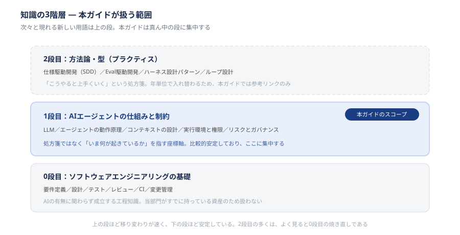

# 章0　はじめに ― 本ガイドの位置づけと読み方

## 0-1. 本ガイドの目的

本ガイドは、当部門におけるAIエージェント（現時点ではClaude Code）の活用を、**個人のスキルに依存しない再現可能な形**にすることを目的とします。

AIエージェントの活用度合いには、現在かなりの個人差があります。この差の多くは「プロンプトが上手いかどうか」ではなく、**エージェントに何を見せ、どんな環境で動かしているか**の差です。つまり、個人の才覚ではなく設計で埋められる差です。

本ガイドは、その設計に必要な共通知識と、当部門としての約束事をまとめたものです。

---

## 0-2. 想定読者

| 読者 | 想定する読み方 |
| --- | --- |
| プロジェクトで開発を担当するメンバー | 章① → 章②（🔴の機能のみ）→ 章③。章④《準備中》は該当箇所を参照 |
| プロジェクトリーダー・管理者 | 章① と 章④《準備中》を中心に |
| これから利用申請を出すメンバー | 章① と 章④《準備中》を必読 |

**章④は現在準備中です。** 公開までの間、章④が扱う判断（業務情報やソースコードをどこまでAIに渡してよいか、メンバーの利用を認めてよいかなど）が必要になった場合は、本ガイドで自己判断せず、**AI推進WG**に相談してください。

前提知識として、当部門で通常求められる開発工程の理解（要件定義、設計、テスト、レビュー、構成管理）を想定しています。AIや機械学習の専門知識は不要です。

---

## 0-3. 本ガイドが扱う範囲 ― 知識の3階層

AIを使った開発をめぐっては、新しい用語が次々と現れています。仕様駆動開発、コンテキストエンジニアリング、ハーネスエンジニアリング、ループエンジニアリング……。

これらを整理するために、本ガイドでは知識を次の3階層で捉えます。**このうち本ガイドが扱うのは、真ん中の1段目だけです。** 以下、図の上の段から順に見ていきます。

### 2段目：方法論・型（プラクティス）

**例**：仕様駆動開発（SDD）、Eval駆動開発、ハーネス設計パターン、ループ設計

「こうやると上手くいく」という処方箋にあたるものです。提唱者がいて、特定のツールと結びついていることも多く、**年単位で入れ替わります**。

→ 本ガイドでは**本文としては扱いません**。章③の末尾（§3-14「次に学ぶとよい領域」）に、参考として一覧のみ掲載します。

### 1段目：AIエージェントの仕組みと制約

**この段が本ガイドのスコープです。** 章①から章④までのすべてが、この1段目を扱います（「1段目＝章①」ではありません）。

**例**：LLM（大規模言語モデル）／エージェントの動作原理、コンテキストの設計、実行環境と権限、リスクとガバナンス

処方箋ではなく、**「いま何が起きているか」を指す座標軸**です。うまくいかないときに「これは指示の問題か、渡した情報の問題か、環境の問題か」を切り分けるための共通言語にあたります。

比較的安定しており、将来ツールが増えても「目的 → 各ツールでの実装」という形で拡張できます。本ガイドはここに集中します。

なお、冒頭に挙げた用語のうち**「コンテキストエンジニアリング」は2つの段にまたがります**。手法名としては2段目ですが、その土台にある「コンテキストとは何で、そこに何が入っているのか」という理解は1段目です。本ガイドが扱うのは後者です。

### 0段目：ソフトウェアエンジニアリングの基礎

**例**：要件定義、設計、テスト、レビュー、CI、変更管理

AIの有無に関わらず成立する工程知識です。**当部門がすでに持っている資産**であり、本ガイドでは扱いません。

ただし、扱わないからといって不要なわけではありません。**2段目の「新しい方法論」の多くは、よく見ると0段目の焼き直しです。**

- 仕様駆動開発 ＝「設計をちゃんと書いてから作れ」
- Eval駆動開発 ＝「テストを先に書け」
- ハーネス設計 ＝「実行環境と権限を管理せよ」

新しいのは**対象が人間ではなくエージェントである**という一点だけです。

### この整理から言えること

本ガイドが伝えたいのは、**「新しい方法論を一から学べ」ではなく「すでに持っている工程知識の適用先が変わる」**ということです。

AIエージェントは、既存の開発プロセスを置き換えるものではありません。設計・レビュー・テストといった工程の**実行者の一部を担うもの**であり、それらの工程そのものは残ります。むしろ、生成速度が上がるぶん、検証工程の重要性は相対的に高まります。

---

## 0-4. 章構成

本ガイドは以下の5章で構成されます。付録はありません。

| 章 | 内容 | 主に答える問い | 状態 |
| --- | --- | --- | --- |
| **章0** | はじめに（本章） | このガイドは何を扱い、何を扱わないのか | 公開中 |
| **章①** | AIエージェントとは何か | 従来のAI利用と何が違うのか | 公開中 |
| **章②** | Claude Code 機能リファレンス | 何ができるのか | 公開中 |
| **章③** | 開発に役立つTips | どう使えば成果が出るのか | 公開中 |
| **章④** | セキュリティ・ガバナンス | 何を守る必要があるのか | 準備中 |

章①と章②は役割が異なります。章①は「AIエージェント一般に共通する仕組み」と「当部門が対象としているAIサービスの性格・用途の一覧」を、章②は「Claude Codeという個別製品の機能」を扱います。**ただし利用の可否は本章 §0-5 を正とします。** 章①の一覧は各サービスがどういう性格のものかを把握するためのもので、可否を示すものではありません。章①を読み終えた時点でClaude Codeの操作方法は分かりませんが、その代わり、どの製品にも当てはまる形で仕組みを理解できます。

なお、章②は11カテゴリの**リファレンス（辞書）**であり、通読を前提としていません。各カテゴリに重要度（🔴 必須／🟡 よく使う／🟢 知っておくと便利）を付けているため、まず🔴の4節だけを読み、残りは必要になった時点で参照してください。

---

## 0-5. 対象とするツールの範囲

当部門で利用できるAIサービスは、用途によって2つに分かれます。**本ガイドが扱うのは開発用途のエージェントのみ**です。

| 用途 | 対象サービス | 状況 | 本ガイドの扱い |
| --- | --- | --- | --- |
| **開発**（コードの生成・改変を伴う作業） | Claude Code（CLI／デスクトップアプリ／IDE拡張） | 利用可 | 章②以降で詳述 |
| **開発** | GitHub Copilot、Codex | 整備中のため**現時点では使用不可** | 追加され次第記載 |
| **開発** | claude.ai（ブラウザ版のClaude） | **使用不可** | 下記のとおり |
| **汎用**（文章作成、調査、定型業務） | ChatGPT、Microsoft Copilot、NotebookLM、satto | 全社的に利用可 | 解説しない（禁止ではない） |

汎用サービスは全社的に利用が認められており、禁止されているわけではありません。本ガイドが扱わないのは、これらが**開発工程に組み込んで使うことを前提としていない**ためです。各サービスの一覧と位置づけは章①を参照してください。

> **GitHub Copilot と Microsoft Copilot は別の製品です。** 名前が似ていますが扱いは逆で、GitHub Copilot は開発用で現時点では使用不可、Microsoft Copilot は汎用で全社的に利用可です。取り違えに注意してください。

**同じClaudeでも、入り口によって扱いが変わります。** Claude Code が利用可で claude.ai が使用不可なのは、判断基準が**インターフェースの形ではなく、どのエンジン・契約下で動作しているか**にあるためです。同じモデルを呼び出していても、当部門が管理する契約・設定の下で動作しているかどうかで扱いが変わります。「Claudeが許可されている」ではなく「Claude Codeが許可されている」と理解してください。

**この表に挙げていない入り口・サービスは、利用可と判断しないでください。** Claude CodeのMobileアプリやSlack連携のように、製品としては存在しても本表に載っていないものについては、AI推進WGに確認してから使ってください。

一方で、**利用が認められているサービスに、業務情報やソースコードをどこまで入力してよいか**は、また別の問題です。これは全社の情報セキュリティ規程および各サービスの契約形態に従います。詳細は章④で扱いますが、章④は準備中です。公開までの間、この判断が必要になった場合は自己判断せず、AI推進WGに相談してください。

---

## 0-6. 本ガイドの改訂方針

この領域は変化が速く、ガイドが陳腐化しやすいという課題があります。そのため、次の方針で運用します。

1. **本文は1段目に限り、2段目は参考リンクにとどめる**
   流行の方法論（2段目）を本文の主張として書き込むと、改訂対象が増え続けます。章③末尾（§3-14）の一覧にとどめておけば、陳腐化しても影響が限定的です。
2. **有効性が確認できたものだけを本文に採り入れる**
   有志が試し、当部門で再現性が確認できた時点で、章③（開発に役立つTips）に社内標準として記述します。
3. **章④は「目的 → 現行ツールでの実装」の二列形式で記述する**
   ツールが増減しても、目的側の記述を維持したまま実装側だけを差し替えられます。

> 本ガイドはMarkdownを正とし、公開用ページはそこから生成しています。記載内容への指摘・追記の提案は、Markdown側への修正提案としてお寄せください。

---

## 0-7. 本ガイドの限界

本ガイドは**当部門における標準的な考え方と約束事**を示すものであり、以下は範囲外です。

- 個別プロジェクトの契約上の制約（顧客との合意事項が優先されます）
- 全社の情報セキュリティ規程（規程が優先されます。本ガイドは規程の範囲内での運用指針です）
- ツールの網羅的なマニュアル（公式ドキュメントを参照してください）

判断に迷う場合は、独断で進めず、**AI推進WG**に相談してください。「判断できないので使わずに止まる」よりも、相談していただくほうが助かります。

---

*最終更新：2026-09-09 ／ 作成：AI推進WG*
