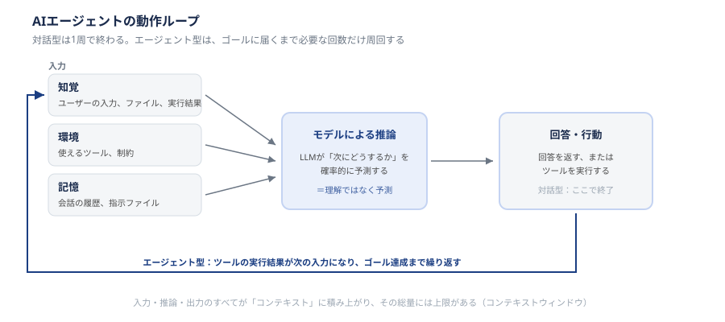

# 章①　AIエージェントとは何か ― 製品を問わず共通する仕組み

## 1-1. この章で扱うこと

生成AIの普及にともない、AIの回答をそのまま受け取り、仕組みを理解しないまま全面的に頼ってしまう場面が増えています。AIの回答が常に正しいとは限らない以上、少なくとも「なぜその回答が返ってきたのか」「どこまで信頼してよいのか」を自分で判断できるだけの土台は持っておきたいところです。

本章は、その土台となる知識を扱います。特定の製品の使い方ではなく、AIエージェントと呼ばれるものが共通して持っている仕組みや、業界で標準化されつつある考え方を、平易な言葉で、かつできる限り一次資料や公的資料に基づいて説明します。本章が依拠した資料は、末尾の §1-8 参考資料にまとめています。

本章が扱うのは、[章0](00_はじめに.md) で整理した知識の3階層のうち**1段目**、つまり「AIエージェントと呼ばれるサービスが共通して利用している仕組みや、標準化されつつあるプロトコル」です。個別のサービスの機能や操作方法は章②以降で扱います。

本章を読み終えた時点では、Claude Codeの具体的な操作方法は分かりません。その代わり、章タイトルの問いである「**AIエージェントとは何をしているものなのか**」に加えて、「**なぜ間違えることがあるのか**」「**なぜ制約があるのか**」を、どのサービスにも当てはまる形で理解できることを目指します。以降の節はこの3つの問いに対応しています。

> 本ガイド全体の章構成と、立場別の読む順番は [章0](00_はじめに.md) にまとめています。

---

## 1-2. AIエージェントとは何か

まず、本ガイドで「AIエージェント」と呼ぶものを定義します。

> **AIエージェント**とは、**ゴールを与えられると、外部のツールを使いながら、途中の手順を自分で計画・実行して、その達成を目指すAIシステム**です。

従来型との違いは、次の3点に集約されます。

1. **受け取るのがゴールであること** — 「どうやるか」ではなく「何を達成したいか」を渡します。手段はAIが決めます
2. **外部に働きかけること** — 文章を返すだけでなく、ファイルを読み書きし、コマンドを実行し、外部サービスを呼び出します
3. **結果を見て次の手を決めること** — 1回で終わらず、実行結果を確認して次の行動を選ぶ、という繰り返し（ループ）で進みます

対比すると次のようになります。

| | 対話型 | エージェント型 |
| --- | --- | --- |
| 人間が渡すもの | 具体的な指示 | ゴール |
| AIが返すもの | 回答（文章） | 実行結果（ファイルの変更、コマンドの実行等） |
| やり取りの形 | 指示1回に対して回答1回 | ゴール1回に対して複数手順を自律実行 |
| 人間の役割 | 手順を考えて指示する | ゴールを決め、結果を検証する |

**重要な注意点が1つあります。** 「対話型／エージェント型」は**動き方の軸**であって、製品を分類するラベルではありません。§1-7 で出てくる「開発向け／汎用」は**用途の軸**で、これとは別のものです。

実際の製品はこの境界をまたぎます。対話型として広まったサービスが後からツール実行の機能を備えることは珍しくなく、境界は年々曖昧になっています。「この製品は対話型だ」と固定的に捉えるのではなく、**いま自分はどちらの使い方をしているか**で考えるほうが実態に合います。

この区別が実務で効いてくるのは、**人間の役割が変わる**点です。エージェント型では、手順を考える手間が減るかわりに、**出てきた結果を検証する責任が相対的に重くなります**。この点は §1-4 であらためて扱います。

---

## 1-3. 登場の歴史と現在地

「AIエージェント」という言葉が急速に一般化したのは、ここ数年のことです。大まかな流れは次のとおりです。

- **2022年〜**：ChatGPTの登場により、対話形式の生成AI（チャットボット）が一般に広まりました。この時期に広まった使い方は、人間が指示し、AIが1回で答えを返す「対話型」が中心でした
- **2024年〜**：AIに外部のツール（ファイル操作、Web検索、コード実行など）を使わせ、複数の手順を自律的にこなさせる「エージェント型」が台頭します。人間がゴールだけを与え、途中の手段はAI自身が計画・実行する、という考え方への転換が起きました
- **2024年11月**：AIエージェントが外部サービスに接続するための標準規格 **MCP（Model Context Protocol）** が公開されました。各社のAIエージェントが同じ形式で外部ツールに接続できるようになり、業界全体でのエコシステム化が進みました（仕組みの説明は §1-5）
- **2025年12月**：作業手順をファイルの形でエージェントに与える **Agent Skills** の形式が、オープン標準として公開されました。現在は20を超えるエージェント製品が同じ形式を採用しています（同じく §1-5）
- **2026年現在**：コーディング作業を自律的に行うエージェント（Claude Code、GitHub Copilot、Codex等）が開発現場に広く浸透しています。同時に、非エンジニア向けにプロンプト（AIへの指示文）の入力すら不要な形でエージェントを提供するサービス（satto等）も登場し、対象読者の裾野が広がりました

現在は、単一のAIが単独で作業する形から、複数のAIエージェントが連携して作業する「マルチエージェント」への移行期にあるとされています。この点は本ガイドの直接のスコープではありませんが、今後の動向として押さえておきたいところです。

---

## 1-4. 推論の仕組み ― なぜ間違えるのか

### まず、モデルは何をしているのか

AIエージェントの中核にあるのは、**大規模言語モデル（LLM）**と呼ばれるものです。これは、膨大な量の文章をあらかじめ読み込んで作られた、**「ここまでの文章に続いて、次にどの語が来やすいか」を計算する仕組み**です。

ここに、後の説明すべてに関わる性質が2つあります。

- **確率で選んでいます。** モデルは意味を理解して論理的に結論を導いているのではなく、確率的にもっともらしい続きを選んでいます。本節の見出しにある「推論」も、AI分野では「論理的に考えること」ではなく「学習済みのモデルを実行すること」を指します。日常語の「推論」とは意味が違うので注意してください
- **学習は事前に終わっています。** モデルを作る作業（学習）は利用開始前に完了しており、**使っているあいだにモデルが賢くなることはありません。** 会話の中で教えたことは、そのやり取りのあいだ入力として渡され続けるだけで、モデル自体には残りません

### エージェントが1回の応答を作るまで

AIエージェントが回答や行動を生成するまでには、大まかに次のような流れがあります。1〜3が入力、4が推論、5が出力にあたります。

1. **知覚**：ユーザーからの入力、ファイルの中身、前回のツール実行結果など、外部の情報を取り込む
2. **環境**：エージェントが置かれた状況。どんなツール（ファイル操作、コマンド実行、外部サービス接続など。詳細は §1-5）が使えるか、どんな制約があるか。使えるツールの一覧も、指示文の一部としてモデルに渡されます
3. **記憶**：これまでの会話や、あらかじめファイルで与えられた指示
4. **モデルによる推論**：1〜3の情報をもとに、LLMが次に何をすべきか、何を答えるべきかを確率的に予測する
5. **回答・行動**：推論結果に基づき、回答を生成する、あるいはツールを実行する

（この1〜3の区分は、本ガイドの説明上の整理です。決まった標準用語ではありません。）

### そして、ここで終わりません

**エージェント型の本質は、この流れが繰り返される点にあります。** 5でツールを実行すると、その実行結果が次の1（知覚）に入り、2〜5が再び動きます。

「ファイルを読む → 中身を見て方針を決める → 修正する → テストを走らせる → 失敗を見て直す」という一連の動きは、すべてこの繰り返しで実現されています。§1-2 で挙げた「結果を見て次の手を決める」がこれです。対話型は1周で終わり、エージェント型は必要な回数だけ周回する、という違いだと捉えてください。

ただし、**無限に周回できるわけではありません。** 周回するたびに情報が積み上がっていくため、§1-6 で扱う上限に達すると打ち切られることがあります。

### なぜ間違えるのか

AIがもっともらしい嘘をつく現象を**ハルシネーション**と呼びます。その原因は、次の3つに整理できます。**どれか1つだけでも誤りは起こります。**

**① 入力の問題**（流れの1〜3）

渡した情報が誤っている、足りない、古い場合です。ユーザーの指示が曖昧だった場合だけでなく、**あらかじめ与えた指示ファイルの記述が古いまま放置されている**場合も含まれます。常設の指示ファイルは、疑いの対象から外れやすいので注意してください。

**② モデルの知識の問題**（流れの4）

モデルが学習していない事柄です。これは2種類あり、**対処が正反対**なので区別してください。

| 種類 | 内容 | 対処 |
| --- | --- | --- |
| **時点**の問題 | 学習データの収集を打ち切った時点（**ナレッジカットオフ**）より後の出来事は知りません | 外部から与えれば解決します。時間が経てば新しいモデルで解消されることもあります |
| **範囲**の問題 | 社内固有の情報や非公開の情報は、そもそも学習データに含まれていません | **時間が経っても解決しません。** 渡すしかありません |

**③ 生成のしかたそのものの問題**（流れの4）

**入力が正確で最新であっても、誤りは生じます。** 冒頭で述べたとおり、モデルは確率的にもっともらしい続きを選ぶ仕組みです。そのため、正しい資料を渡したうえでもなお、実在しない関数名やありえない引数を、自信たっぷりの文体で書くことがあります。

AIが意図的に嘘をついているわけではなく、仕組み上そうなり得る構造になっている、と理解しておくことが重要です。

### ここから導かれる結論

**生成物は検証しなければならない、ということです。**

次の §1-5 では、モデルの知識を外部から補う仕組み（RAGやMCP等）を扱います。これらは原因①②には効きます。しかし、**③には効きません。原因③が残るため、これらの仕組みはハルシネーションを減らしますが、なくしません。** 「社内資料をRAGに入れたから、この回答は検証しなくてよい」という判断は成り立ちません。

§1-2 で触れたとおり、エージェント型では手順を考える手間が減るかわりに、結果を検証する責任が重くなります。AIの回答を無条件に信じるのではなく、検証の手段をあらかじめ用意しておくことが、現実的な対処法になります。[章③](03_開発に役立つTips.md) で扱う「検証ループ（テスト等でAI自身に確認させる）」がなぜ有効なのかも、ここから見えてきます。

なお、流れの1〜3で渡した情報と、4〜5で生成された内容は、すべて**コンテキスト**と呼ばれる同じ入れ物に積み上がっていきます。この入れ物には上限があり、それが §1-6 で扱うコンテキストウィンドウです。

---

## 1-5. 推論を拡張する仕組み

AIエージェントは、モデル単体の知識だけでなく、外部の情報やツールと組み合わせることで、できることの幅を広げています。

代表的なものを4つ挙げますが、**これらは「4つから1つ選ぶ」ものではありません。** 補う対象もレイヤーも異なり、組み合わせて使われます。

| 何を補うか | 名称 | 正体 |
| --- | --- | --- |
| 作業手順・ノウハウを与える | **Agent Skills** | ファイルの形式（オープン標準） |
| 外部システムに繋ぐ道を作る | **MCP** | 接続の規格 |
| 実際に外部から情報を取る／操作する | **ツール**（Web検索、ファイル操作、コマンド実行など） | 個々の機能 |
| 手元の文書群を回答の根拠にさせる | **RAG** | 手法 |

- **Agent Skills**：特定の作業手順やノウハウをファイルの形でエージェントに与え、再利用可能にする仕組みです。オープン標準として公開されており、Claude Code以外の多くのエージェント製品でも同じ形式のものが使えます
- **MCP（Model Context Protocol）**：AIエージェントが外部サービス（社内ツール、SaaS等）に接続するための標準規格です。これにより、エージェントは自身の知識だけでなく、外部の最新データやシステムの操作にアクセスできます
- **ツール利用**：モデル単体では持っていない情報を外部から取得したり、外部に対して操作を行ったりする個々の機能です。Web検索やファイル操作などがこれにあたります。**MCPとは排他ではありません。** MCPは「ツールを繋ぐための共通の作法」であり、個々のツールはMCP経由で提供されることもあれば、製品に最初から組み込まれていることもあります
- **RAG（Retrieval-Augmented Generation）**：あらかじめ用意した文書やデータベースから関連情報を検索し、それを踏まえて回答を生成する手法です。社内資料に基づいた回答をさせたい場合などに使われます。自分たちで文書を用意して構築する場合と、資料を読み込ませて回答させるタイプのサービスに機能として組み込まれている場合があります

これらはいずれも、「モデルの知識だけでは足りない部分を、外部から補う」という共通の発想に基づいています。何か業務で実現したいことがあり、AIエージェント単体では難しそうだと感じたときは、「Skillとして手順化できないか」「MCPで外部システムと繋げられないか」という視点で考えると、解決の糸口になることが多くあります。

**ただし、§1-4 で述べたとおり、これらはハルシネーションの原因①②を減らすものであって、③（生成のしかたそのもの）には効きません。** 外部から情報を補ったからといって、検証が不要になることはありません。

> **MCPは「接続の共通作法」を定めるものです。** 繋ぎたい相手側に、外部から呼び出せる接続口（API等）が必要になります。古いシステムを繋ぎたい場合、まずその接続口を用意する作業が発生することがあり、MCPを使えば無条件に繋がるわけではありません。実現可否の検討では、この点を先に確認してください。

---

## 1-6. 制限する仕組み ― なぜ制約があるのか

AIエージェントには、技術的な制約として、あるいは意図的に、いくつかの「制限」がかけられています。

### コンテキストウィンドウ

AIが一度に参照できる情報量には上限があります。モデルは入力された内容全体を毎回参照して次の語を予測するため、参照範囲が広がるほど計算量が増えます。そのため実装上の上限が設けられています。

**何がこの上限を消費するのか**が実務では重要です。§1-4 の流れの1〜3で渡したもの（これまでの会話、読ませたファイルの中身、あらかじめ与えた指示ファイル、使えるツールの一覧、ツールの実行結果）と、AIが生成した内容のすべてが消費します。つまり、**大きなファイルを1つ読ませるだけでも上限に近づきます。** 会話の往復数だけの問題ではありません。

情報量は「トークン」という単位で数えられます。厳密な換算は言語や内容によりますが、実務上の見積りとしては**おおむね文字数に比例する**と考えておけば足ります。

上限に達したときの挙動は、モデルそのものの性質ではなく**製品側の実装**によって決まります。エラーとして拒否されることもあれば、古いやり取りを自動で要約したり切り捨てたりして、実質的に「忘れられる」こともあります。**長い会話を続けていると最初に伝えた前提が無視されるように見えるのは、多くの場合この後者で、不具合ではありません。** 前者は気づけますが、後者は気づかないまま誤った回答を受け取る可能性があるため、より注意が必要です。

### ガードレール

AIが本来意図しない、あるいは危険な回答・行動をしないようにするための技術的な制約です。モデルの開発元（Anthropic、OpenAI等）があらかじめ組み込んでおり、どのサービスにも共通して存在します。

**ただし、これがあれば会社側の対策が不要になるわけではありません。** 提供元のガードレールが対象としているのは、**利用者が誰であっても共通して危険なこと**です。「自社のどの情報が機密にあたるのか」「どの操作に上長の承認が必要か」「どの外部サービスへの接続が契約上認められているか」といった、会社ごと・案件ごとの事情は、提供元は知り得ません。

つまり、章④（セキュリティ・ガバナンス／準備中）で扱う承認設定や外部接続の制限は、ガードレールの二重化ではなく、**守る対象が違うもの**です。同じ「制限」という言葉を使っていても階層が異なるため、混同しないようご注意ください。

---

## 1-7. 当部門で対象としているAIサービス

当部門・組織がAI活用の対象としているサービスは次のとおりです。用途に応じて棲み分けて捉えると理解しやすくなります。

| サービス | 提供元 | 区分 | 主な用途 |
| --- | --- | --- | --- |
| Claude Code | Anthropic | 開発向け | コーディング支援、自律的なタスク実行 |
| GitHub Copilot | GitHub（Microsoft） | 開発向け | コーディング支援、コードレビュー |
| Codex | OpenAI | 開発向け | コーディング支援 |
| ChatGPT | OpenAI | 汎用 | 文章作成、調査、壁打ち全般 |
| Microsoft Copilot | Microsoft | 汎用 | Office製品との連携、社内文書作業 |
| NotebookLM | Google | 汎用 | 資料に基づく調査・要約 |
| satto | ソフトバンク | 汎用 | プロンプト不要の定型業務自動化 |

> **この表は利用の可否を示すものではありません。** 表に載っていることは「使ってよい」という意味ではなく、可否は [章0](00_はじめに.md) の §0-5 を正としています。可否は状況によって変わるため、正となる記述を一箇所に集約しています。この表は、それぞれのサービスがどういう性格のものかを把握するためのものです。

大きく分けると、「開発向け（コーディングに特化したエージェント）」と「汎用（文章作成・調査・定型業務向け）」の2種類があります。これは**用途の軸**であり、§1-2 の「対話型／エージェント型」という**動き方の軸**とは別のものです。本ガイドの章②以降では、開発向けの中でも先行して整備が進んでいるClaude Codeを深掘りして扱います。

---

## 1-8. 参考資料

本章の記述は、以下の一次資料・公的資料に基づいています。仕様の詳細や最新の状況は、各資料を直接ご確認ください。

**標準規格の一次情報**

- [Model Context Protocol 公式サイト](https://modelcontextprotocol.io/) — §1-3・§1-5 で扱ったMCPの仕様。2024年11月にAnthropicが公開し、その後オープン標準として策定が進んでいます
- [Agent Skills 仕様](https://agentskills.io/specification)（[概要](https://agentskills.io/)） — §1-5 のAgent Skillsの形式仕様。Anthropicが原案を公開し、現在は複数ベンダーが採用するオープン標準です
- [Context windows（Anthropic公式ドキュメント）](https://platform.claude.com/docs/en/build-with-claude/context-windows) — §1-6 のコンテキストウィンドウ。何が上限に含まれるかが具体的に説明されています

**公的資料**

- [AI事業者ガイドライン（総務省・経済産業省）](https://www.soumu.go.jp/main_sosiki/kenkyu/ai_network/02ryutsu20_04000019.html) — 国内でAIを開発・提供・利用する事業者向けの基本的な考え方。AIの出力の不確実性や、利用者側が講じるべき対応の考え方が整理されており、§1-4・§1-6 の背景にあたります。2026年3月31日に第1.2版が公表されました

**学術論文**

- [Retrieval-Augmented Generation for Knowledge-Intensive NLP Tasks](https://arxiv.org/abs/2005.11401)（Lewis et al., NeurIPS 2020） — §1-5 で触れたRAGの原論文

---

## まとめ

本章では、AIエージェントに共通する土台となる知識を扱いました。

- AIエージェントとは、ゴールを与えられ、ツールを使って手順を自分で計画・実行するAIシステムです。従来の対話型と比べ、手順を考える手間が減るかわりに、**結果を検証する責任が重くなります**（§1-2）
- 対話型からエージェント型への移行が2024年以降に進み、MCPやAgent Skillsといった標準規格が整備されてきました（§1-3）
- AIの回答は「知覚した情報」と「モデルの予測」の組み合わせで作られており、入力側・モデル側のどちらの問題でも誤りが生じます（§1-4）
- モデル単体の限界を補うため、Agent Skills・MCP・RAG等の拡張の仕組みがあります（§1-5）
- 一方で、コンテキストウィンドウという技術的な上限があり、また提供元によるガードレールが存在します。ガードレールは会社固有の事情をカバーしないため、会社側の制約が別途必要になります（§1-6）
- 当部門が対象としているAIサービスには開発向けと汎用があります。**個別の利用可否は [章0](00_はじめに.md) の §0-5 が正です**（§1-7）

この理解を踏まえたうえで、章②ではClaude Codeの具体的な機能を、章③（開発に役立つTips）では実践的な開発の工夫を、章④（セキュリティ・ガバナンス／準備中）では利用にあたっての行動原則を扱います。

AIの回答をそのまま信じるのではなく、その仕組みと限界を踏まえて付き合っていく、という姿勢を持って読み進めていただければと思います。
