# 章②　Claude Code 機能リファレンス ― 何ができるのか

## 2-1. この章で扱うこと

[章①](01_AIエージェントとは何か.md) では、AIエージェントに共通する仕組みを扱いました。本章では、その理解を土台に、当部門で先行して整備が進む**Claude Codeの具体的な機能**を扱います。

**本章はリファレンス（辞書）であり、通読を前提としていません。** 各節に重要度を付けていますので、まず🔴の節だけを読み、残りは必要になった時点で該当する節を参照してください。

記述はAnthropicの公式ドキュメント（一次資料）に基づき、あわせて実際の導入事例を出典とともに示しています。特定の使い方を押し付けるものではありません。

---

## 2-2. 全体像

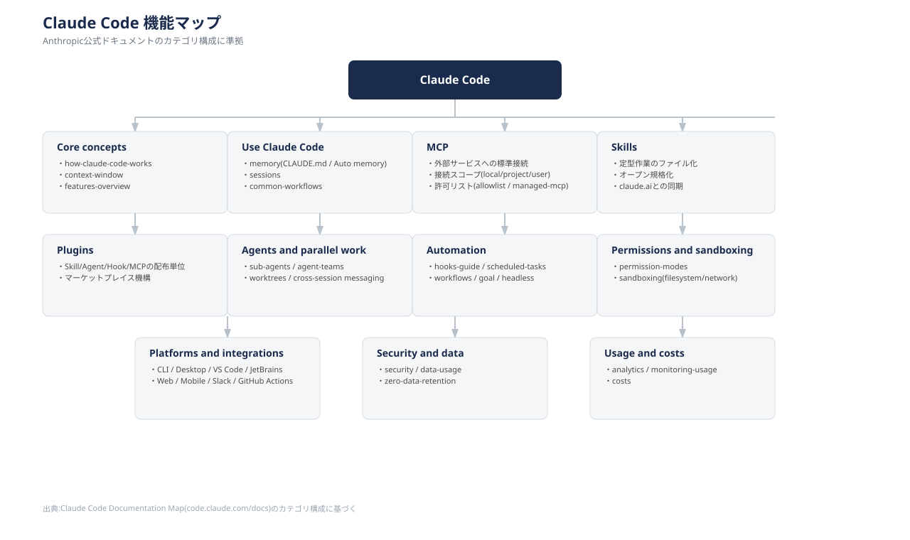

Anthropic公式ドキュメントのカテゴリ構成に準拠し、11カテゴリで構成しています。

| 重要度 | カテゴリ | 節 | 読む目安 |
|---|---|---|---|
| 🔴 必須 | Core concepts（基本概念） | §2-3 | 使い始める前に、仕組みの土台として |
| 🔴 必須 | Use Claude Code（メモリ・セッション・ワークフロー） | §2-4 | 使い始める前に、CLAUDE.mdの基本として |
| 🟡 よく使う | MCP | §2-5 | 外部サービス連携が必要になったら |
| 🟡 よく使う | Skills | §2-6 | 定型作業を繰り返すようになったら |
| 🟢 知っておくと便利 | Plugins | §2-7 | チーム展開を考え始めたら |
| 🟢 知っておくと便利 | Agents and parallel work | §2-8 | 複数タスクを並列で進めたくなったら |
| 🔴 必須 | Automation（Hooks） | §2-9 | 使い始める前に、「確実に守らせる方法」として |
| 🔴 必須 | Permissions and sandboxing | §2-10 | 使い始める前に、安全に使うための土台として |
| 🟡 よく使う | Platforms and integrations | §2-11 | どこから使うか選ぶ時に |
| 🔴 必須 | Security and data | §2-12 | 使い始める前に、章④を理解する前提として |
| 🟡 よく使う | Usage and costs | §2-13 | 導入後、コストや活用状況を把握したくなったら |

**最短ルート**：**この §2-2 と、🔴の5節**を §2-3 → §2-4 → §2-9 → §2-10 → §2-12 の順に読んでください。

§2-9 を🔴に含めているのは、§2-4（CLAUDE.md）と §2-6（Skill）がどちらも「**確実に守らせたいことは §2-9 のHooksで組む**」と結論しており、その答えが §2-9 にしかないためです。§2-4 だけを読むと「CLAUDE.mdに書けば守られる」と誤解したまま使い始めることになります。

> **本章は「Claude Codeに何ができるか」を説明するものであり、「当部門で何を使ってよいか」を定めるものではありません。** 本章に記載があることは、使用が認められていることを意味しません。とくに**どの入り口（CLI／デスクトップ／IDE拡張／Web／Mobile／Slack等）を使ってよいか**は [章0](00_はじめに.md) の §0-5 を正とします。現時点で利用を認めているのは **CLI・デスクトップアプリ・IDE拡張**です。判断に迷う場合はAI推進WGに相談してください。

---

## 2-3. Core concepts（基本概念）

**重要度：🔴 必須**

> **先に一度だけ。** 本章は「Claude Codeに何ができるか」を説明するもので、「当部門で何を使ってよいか」は定めていません。**とくに利用してよい入り口は CLI・デスクトップアプリ・IDE拡張の3つだけです**（Web・Mobile・Slack等は対象外）。可否は [章0](00_はじめに.md) の §0-5 を正とします。判断に迷う場合はAI推進WGに相談してください。

**一言でいうと**：Claude Codeは「考える→ツールを使う→結果を見る」というループを繰り返しながら、限られた枠（コンテキストウィンドウ）の中で作業を進めるエージェントです。

**こんな時に知っておくと役立ちます**

- 長時間・大量のやり取りをした後、Claudeの回答精度が落ちてきたと感じる時
- 大きなコードベースを調査させたら、途中で止まってしまった／おかしな挙動になった時
- 「なぜ急に的外れな回答をし始めたのか」の原因を理解したい時

**何ができるか・使い方**

Claude Codeの土台となる考え方は2つあります。

- **エージェントループ**：指示を受けて即座に1回で答えを返すのではなく、「考える→ツールを使う→結果を見る→また考える」というループを自律的に繰り返します。ファイルを読む、コマンドを実行する、テストを回す、といった一連の行動はすべてこのループの中で行われます（章① §1-4 の図がこの動きにあたります）
- **コンテキストウィンドウ**：章① §1-4 で説明した「知覚した情報」が実際に格納される、限られた枠のことです。上限の性質・何が枠を消費するか・上限に達したときの挙動は章① §1-6 に整理しています。会話・読み込んだファイル・設定ファイル・過去のツール実行結果など、参照できる情報はすべてこの枠の中に収まっている必要があります

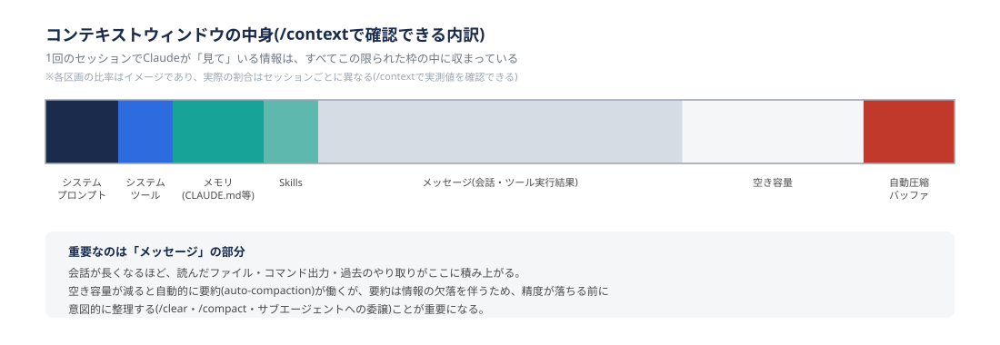

| コマンド | できること |
|---|---|
| `/context` | 現在のコンテキストウィンドウの内訳を確認する |
| `/clear` | 会話を完全にリセットする（別の作業に切り替えるとき） |
| `/compact` | 長くなった会話を要約して圧縮する（流れを保ちたいとき） |

枠が埋まってくると自動的に古いやり取りが要約（auto-compaction）され、空きが回復する仕組みが備わっています。ただしこれは「少しずつ埋まっていく」場合に働くもので、**1回のツール実行結果が一度に枠を超えるような場合には間に合わず、処理が止まることがあります**（後述のケース2）。また要約は情報の欠落を伴うため、精度が落ち始める前に、意図的に `/clear` や `/compact` で整理する習慣が推奨されています。

**事例**

**ケース1：調査作業に会話が占領され、本題の実装精度が落ちる**

- **課題**：「このコードベースの認証まわりを全部調べて」のような調査タスクを本編の会話でそのまま行わせると、大量のファイル読み込み・検索結果がコンテキストウィンドウを占有し、その後の実装作業の精度が落ちます。
- **対応例**：調査だけを別のサブエージェント（独立したコンテキストウィンドウ。§2-8 参照）に切り出し、メイン会話には調査結果の要約だけを戻します。

  ```
  メインセッション
    └─ Explore(認証まわりの調査) を呼び出す
         ⎿ 24 tool uses・48.2k tokens を消費して調査
         ⎿ メインセッションには要約結果だけが返る
  ```

- **効果**：調査で消費される大量のトークンがメインセッションのコンテキストを圧迫しなくなり、後続の実装作業でも精度が落ちにくくなります。
- **参考**：[モデルの性能を引き出すためのClaude Codeコンテキストマネジメント入門](https://caddi.tech/claude-code-context-management-202603)（CADDi Tech Blog）

**ケース2：大規模なコードベースで、曖昧な指示が作業開始前に上限超過を起こす**

- **課題**：数百万行規模のモノレポや長年運用されたレガシーコードに対して、「全部のパターンを探して」のような曖昧な指示を出すと、調査だけでコンテキストウィンドウの上限に達し、作業が始まる前に止まってしまいます。
- **対応例**：対象範囲を明示的に絞り込んでから指示します（対象ディレクトリ・ファイルパターンを先に指定する等）。
- **効果**：Claude Codeは埋め込みベースの検索と異なり毎回最新のコードを直接読むため情報の陳腐化は起きませんが、範囲の絞り込みは別途必要になる、という特性を踏まえた依頼の仕方ができます。
- **参考**：[Claude Code 大規模コードベース運用のベストプラクティス](https://blog.serverworks.co.jp/2026/05/24/190000)（サーバーワークス エンジニアブログ）

**紛らわしい機能との違い**：`/clear` と `/compact` はどちらも「会話を整理する」点で似ていますが、`/clear` は完全リセット（別タスクに切り替える時）、`/compact` は要約して圧縮（同じ作業の流れを保ちたい時）という使い分けになります。

---

## 2-4. Use Claude Code（メモリ・セッション・ワークフロー）

**重要度：🔴 必須**

**一言でいうと**：プロジェクトの前提知識を「メモリ」として持たせ、作業を「セッション」単位で管理する仕組みです。

**こんな時に使います**

- チームメンバーによってAIへの指示の前提や規約遵守がバラバラになっている時
- 前回の作業の続きから再開したい時
- 調査・バグ修正・PR作成のような定型作業を、毎回一から指示するのが面倒な時

**何ができるか・使い方**

- **メモリ**：明示的な指示ファイルである `CLAUDE.md` と、会話から自動的に学習内容を保存する `Auto memory` の2種類があります。**両方とも「コンテキストとして読み込まれるもの」であり、§2-9 で扱うHooksのような強制設定ではない点に注意が必要です。** `CLAUDE.md` は4つのスコープ（管理ポリシー／ユーザー／プロジェクト／ローカル。この順に「広い範囲→具体的な範囲」で読み込まれます）を持ちます。サブディレクトリ単位（`src/frontend/CLAUDE.md` 等）でモジュール固有のルールを設定することも可能です
- **セッション**：1回の作業単位を「セッション」として管理し、名前を付けたり、後から再開したり、途中から分岐（fork）させたりできます
- **共通ワークフロー**：コードベースの理解、バグ修正、リファクタリング、テスト、PR作成といった定型的な作業の進め方が、公式に「型」として整理されています

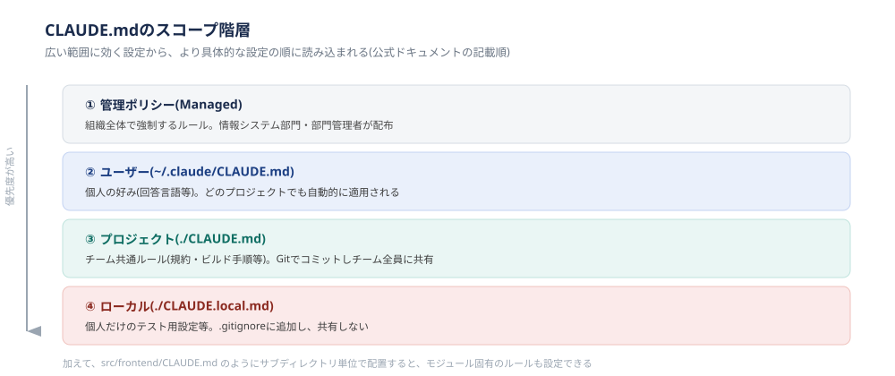

| 書きたい内容 | 置き場所（スコープ） |
|---|---|
| 組織として強制したいルール | 管理設定（managed settings）で配布。個々の利用者は上書きできません |
| 個人の好み（例：日本語で回答してほしい） | `~/.claude/CLAUDE.md`（ユーザー） |
| チーム共通ルール（規約・ビルド／テスト手順） | `./CLAUDE.md`（プロジェクト、Gitでコミット） |
| モジュール固有のルール | `src/frontend/CLAUDE.md` 等（プロジェクトスコープの中の階層） |
| 自分だけの設定（共有したくないもの） | `./CLAUDE.local.md`（`.gitignore` 対象） |

**CLAUDE.mdは1ファイルあたり200行を目安に収めることが公式に推奨されています。** 行数が増えるほどコンテキストを消費し、指示への遵守率が下がるとされているためです。手順が複数ステップにわたる場合や、特定のモジュールにしか関係しない指示は、CLAUDE.mdではなく、**Skill**（§2-6）や**パス限定のルール**（`.claude/rules/`）に移すことが公式に推奨されています。なお `.claude/rules/` の書式は本章では扱っていないため、[公式ドキュメント](https://code.claude.com/docs/en/memory) を参照してください。

> **コラム：CLAUDE.mdの書き方をもっと知りたい場合**
>
> 200行という目安、書くべき内容・書くべきでない内容の基準は、[Anthropic公式ドキュメント「How Claude remembers your project」](https://code.claude.com/docs/en/memory) に基づいています。より実践的なテンプレートや書き方の工夫を知りたい場合は、以下の解説記事も参考になります。
>
> - [CLAUDE.md ベストプラクティス【2026年】設定の書き方20選](https://uravation.com/media/claude-md-best-practices-2026/)（株式会社Uravation）
> - [CLAUDE.mdテンプレ4選｜そのままコピペで使える](https://uravation.com/media/claude-md-templates/)（株式会社Uravation）
>
> 上記2つは第三者（実務コンサルティング会社）による解説記事であり、Anthropic公式ドキュメントではありません。個別の数値・手順の解釈が公式と異なる可能性がある点にご留意ください。

**事例**

**ケース1：メンバーによってAIへの指示がバラバラで、品質にムラが出る**

- **課題**：同じリポジトリを複数人で触っていると、指示の粒度や前提知識が人によって異なり、生成されるコードの規約遵守・品質にムラが出やすくなります。特に一部のメンバーだけがコーディングスタイルを毎回説明し、他のメンバーは何も説明していない、といった状態になりがちです。
- **対応例**：プロジェクト直下のCLAUDE.mdにチーム共通の規約を集約し、モジュールごとにサブディレクトリのCLAUDE.mdで固有ルールを補います。

  ```
  project-root/
  ├── CLAUDE.md              # 共通規約:命名規則・ビルド/テストコマンド・PR手順
  ├── src/
  │   ├── frontend/
  │   │   └── CLAUDE.md      # フロントエンド固有:コンポーネント設計規約
  │   └── api/
  │       └── CLAUDE.md      # バックエンド固有:APIエラーハンドリング方針
  ```

- **効果**：誰がセッションを開始しても同じ前提でAIが動くようになり、規約から外れた提案（想定外のライブラリの利用など）が減るとされています。
- **参考**：[Shopifyが公開しているCLAUDE.md活用事例の紹介記事](https://start-link.jp/hubspot-ai/ai/claude-code-practice/claude-code-team-development)（StartLink社）

**ケース2：要件定義書と実装が徐々に乖離し、整合性確認が属人化する**

- **課題**：要件定義から実装までの工程が長いSI業務では、仕様書と実装が徐々にずれていき、その整合性チェックが特定の担当者の手作業に依存しがちになります。
- **対応例**：仕様書を `/docs/specs/` 配下に正（Single Source of Truth）として置き、CLAUDE.mdにその参照ルールを明記した上で、仕様と実装の差分確認を行うSkillを用意します。

  ```
  .claude/skills/spec-check/SKILL.md
  ---
  name: spec-check
  description: 仕様書と実装コードの整合性を確認する。実装完了後や、仕様との差分を
    確認したいときに使う。
  ---
  以下の手順で仕様との整合性を確認する:
  1. /docs/specs/ から該当する仕様書を読む
  2. 実装されたコードと仕様を比較する
  3. 差分があれば報告する
  4. テストカバレッジを確認する

  使い方: /spec-check auth
  ```

  ※2026年1月、Claude Codeのカスタムスラッシュコマンド（`.claude/commands/`）はSkillsに統合されました。既存の `.claude/commands/` ファイルは引き続き動作しますが、新規に作る場合はSkill形式（`.claude/skills/<name>/SKILL.md`）が公式に推奨されています。

- **効果**：仕様と実装の突き合わせという手作業を半自動化でき、要件定義書を起点に進めるSI業務の進め方に組み込みやすくなります。CLAUDE.mdのオーナーシップをテックリードが持ち、定期的な仕様レビュー会と組み合わせる運用例も紹介されています。
- **参考**：[Claude Code仕様駆動開発ガイド](https://ses-base.com/articles/claude-code-specification-management-guide/)（SES BASE）

いずれも実装例は元記事の紹介内容をもとにした構成イメージです。詳細は各リンク先を参照してください。

**紛らわしい機能との違い**：`CLAUDE.md` と `Auto memory` はどちらも「メモリ」と呼ばれますが、`CLAUDE.md` は人が明示的に書く指示ファイル、`Auto memory` はClaudeが会話から自動的に学習・保存する仕組みという違いがあります。前者は「人が意図して与えるルール」、後者は「会話の中で自然に蓄積される前提知識」という使い分けになります。**ただし、どちらも「説得」の層です。** CLAUDE.mdに「必ず」と書いても必ず守られるわけではないので、確実に守らせたいことは §2-9 のHooksで組んでください。

---

## 2-5. MCP（Model Context Protocol）

**重要度：🟡 よく使う**

**一言でいうと**：Jira・GitHub・Google Drive・Slack・社内DBといった外部サービスに、Claudeが直接アクセスするための標準規格です（規格そのものの説明は章① §1-5）。

**こんな時に使います**

- Jiraのチケット内容やSlackの会話を、毎回コピペしてClaudeに渡している時
- 設計書（Google Drive／Figma）とコードの内容が合っているか、手作業で突き合わせている時
- 複数ツールにまたがる定型対応（問い合わせの一次対応、チケットの棚卸し等）を自動化したい時

**何ができるか・使い方**

MCPサーバーを接続すると、Claude Codeに次のような依頼ができるようになります。

- 「JIRAの課題ENG-4521の内容を実装して、GitHubにPRを作成して」
- 「PostgreSQLデータベースを見て、新機能を使った10人のユーザーのメールアドレスを調べて」
- 「Slackに投稿された最新のFigmaデザインをもとに、メールテンプレートを更新して」

上記は公式ドキュメントが挙げている「できること」の例です。**2つ目のように個人情報を扱う操作は、技術的に可能であっても、当部門で実施してよいかは別の判断になります。** 本番データベースの個人情報をAIに読ませる操作は、案件の契約と全社の情報セキュリティ規程に従ってください。

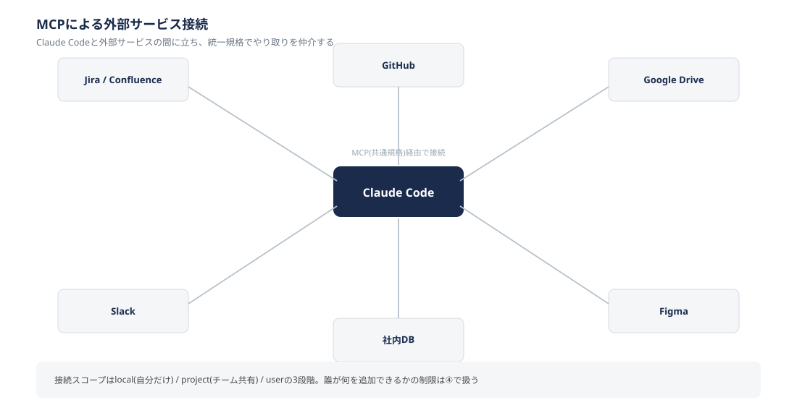

接続はコマンド一つで行えます。MCPサーバーには**ローカル（stdio）**と**リモート（HTTP/SSE）**の2種類があり、性質が異なります。

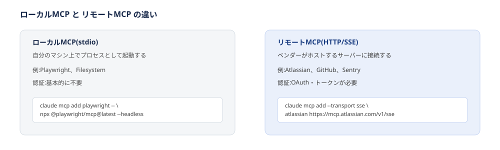

- **ローカルMCP**：自分のマシン上でプロセスとして起動します。Playwright（ブラウザ自動操作）やFilesystemが代表例で、認証は基本的に不要です
- **リモートMCP**：ベンダーがホストしているサーバーに接続します。Atlassian・GitHub・Sentryなどが代表例で、OAuthやトークンによる認証が必要です

```
claude mcp add --transport http sentry https://mcp.sentry.dev/mcp
claude mcp add --transport sse atlassian https://mcp.atlassian.com/v1/sse
```

> **繋ぐ前に確認してください。** 顧客のJira・Google Drive等を繋ぐ場合、その顧客の情報を外部AIサービスに渡してよいかは契約次第です。**技術的に接続できることと、接続してよいことは別問題です。** また、認証情報の発行権限が自分にあるかも先に確認が必要です。詳細は後述の「MCP利用にあたっての注意点」に、案件ごとの可否判定は章④（準備中）にあります。判断に迷う場合はAI推進WGに相談してください。

接続設定は `local`（自分だけ）／`project`（チームで共有、`.mcp.json` をGit管理）／`user`（自分の全プロジェクト共通）の3つのスコープを持ちます。認証トークンは `.mcp.json` に直接書かず、環境変数経由で参照する設計が推奨されています。なお、**誰がどのMCPサーバーを追加してよいかという組織的な制限は、章④（セキュリティ・ガバナンス／準備中）で扱います。**

**MCPサーバーの探し方**

- **公式マーケットプレイス**：`/plugin marketplace add anthropics/claude-plugins-official` で追加できます。Anthropic公式のプラグインに加え、サードパーティ製も多数登録されています
- **公式リファレンスサーバー群**：GitHubの `modelcontextprotocol/servers` で、Filesystem・Git・Postgres等の定番サーバーがメンテナンスされています
- **サードパーティの独立ディレクトリ**：非公式の一覧サイトも存在します。ただしこれらはAnthropic非公式であり、掲載されているサーバー自体の信頼性は個別に確認する必要があります

公式ドキュメントでも、外部コンテンツを取得するMCPサーバーはプロンプトインジェクションのリスクにさらされる可能性があるため、接続前に信頼できるサーバーかどうかを確認するよう注意喚起されています。この点は章④の方針とも関わります。

**MCP利用にあたっての注意点**

- **顧客契約上のデータの扱い**：SI業務では複数の顧客案件を掛け持つことが多いですが、顧客側のJira・Google Drive等をMCP経由で接続する場合、その顧客の情報を外部AIサービスに渡してよいかは契約次第です。**技術的に接続できることと、接続してよいことは別問題であり**、案件ごとの確認が必要になります（章④の「案件ごとの可否判定」の対象）。
- **認証情報を入手できる権限があるか**：リモートMCPの多くはOAuthやAPIキーでの認証が必要ですが、その発行権限自体が組織的に制限されている場合があります（情報システム部門の承認が必要、顧客側の管理者しか発行できない等）。「繋げる技術があるか」の前に「認証情報を入手する権限が自分にあるか」を確認する必要があります。
- **Git操作をどこまで自動化してよいか**：MCP経由でPR作成だけでなく、pushやマージまで自動化することも技術的には可能です。ただし「どこまで人の承認なしに実行させるか」は組織として決めるべき論点であり、後述のケース2のように実装承認を必ず人が行う設計にしている事例もあります。この点は §2-10 のPermission設定と、章④の方針と合わせて検討してください。
- **トークン消費とコンテキスト圧迫**：MCPサーバーを接続すると、ツール定義がコンテキストウィンドウに読み込まれます。1サーバーあたり10〜20個程度のツールを持つことが多く、複数接続すると影響が大きくなります。ある実測例では、MCPサーバーを5つ接続しただけで会話開始前に約55,000トークン（200Kウィンドウの約27%）が消費されたと報告されています。この数値は接続するサーバーの種類・数に依存するため、あくまで一例です（[出典](https://qiita.com/emi_ndk/items/71baa462e6e06bf614cb)）。対策は2つあります。
  - **Tool Search**：複数の記事が2026年1月中旬のリリースと報告している機能で、起動時に全ツール定義を読み込まず、必要なタイミングで検索・ロードする方式に切り替えられます。数万トークンの消費を数千トークン程度まで削減できたという報告があります（[出典](https://qiita.com/YasuhiroKawano/items/c422054110656a58c3c6)）。ただしAnthropic公式のリリースノートそのものは未確認のため、正確な提供開始時期は公式ドキュメントで別途ご確認ください
  - **Skillとの組み合わせ**：MCPの生の実行結果を直接Claudeに返すのではなく、Skill経由でコード実行を挟み、大量の中間結果（取得した文書全文等）はコンテキストに載せず、最終的な要約だけを返す設計にする方法もあります（[出典](https://dev.classmethod.jp/articles/claude-code-skills-mcp-token-reduction/)）

**事例**

**ケース1：問い合わせチケットの一次対応と棚卸しが手作業で属人化している**

- **課題**：JIRAに起票される問い合わせの一次対応（内容の分類、定型対応の判断、必要な情報の確認）や、更新が止まっているチケットの棚卸しが、手作業に頼っており担当者の負荷になっていました。
- **対応例**：Atlassian MCPサーバーを接続し、起票されたチケットを自動分析させます。定型対応で済むものと個別対応が必要なものを分類し、不足情報があればコメントで追記を依頼、2ヶ月以上更新のないチケットは自動検出して状況確認のコメントを投稿する、という運用を構築しています。
- **効果**：対応漏れ・遅延の防止、テンプレートベースの対応による品質の均一化に加え、プロンプトやテンプレートをGitで一元管理することで、新しいメンバーへのナレッジ共有もしやすくなったと報告されています。
- **参考**：[Claude Code + MCPサーバーでJIRAの一次対応と棚卸しを自動化した話](https://zenn.dev/mixi/articles/dc2f1948f5aec3)（mixi）

**ケース2：チケットの要件からPR作成までの往復に時間がかかる**

- **課題**：Jiraのチケットに書かれた要件を確認し、関連するFigmaのデザインを見ながら実装し、決まったフォーマットでPRを作成する、という一連の作業を毎回人手で行っていました。
- **対応例**：JiraとFigmaのMCPサーバーを接続し、チケット番号を渡すだけで「ブランチ作成→Jiraからチケット内容取得→Figmaからデザイン取得→実装→PR作成」まで一気通貫で行うSkillを用意しています。

  ```
  .claude/skills/plan/SKILL.md
  ---
  name: plan
  description: Jiraのチケット番号から実装計画を立てて実装を行う。チケット対応を
    始めるときに使う。
  ---
  1. ブランチを作成する(masterから派生、feature/xxxxの命名規則)
  2. Jiraからチケット内容を取得する
  3. チケットにFigmaのリンクがあれば、デザインを取得して実装に反映する
  4. 実装の承認をユーザーに必ず取ってから作業を開始する
  5. 決まったテンプレートに沿ってPRを作成する

  使い方: /plan <jira_ticket>
  ```

  ※元記事執筆時点ではカスタムスラッシュコマンド（`.claude/commands/`）形式で実装されていましたが、2026年1月の統合以降はSkill形式が公式推奨のため、上記はSkill形式に置き換えています。

- **効果**：要件確認からPR作成までの往復作業が削減されました。**実装承認を必ず人が行う設計にしている点が、自動化と品質担保の両立という観点で参考になります。**
- **参考**：[Claude CodeとJiraをAtlassianリモートMCPで連携して開発効率を向上させる](https://zenn.dev/tsukulink/articles/113df4a73703a3)（ツクリンク）

**ケース3：実装後の動作確認（ブラウザでの手作業テスト）がボトルネックになっている**

- **課題**：機能改善やバグ修正の実装自体はAIで短時間に進むようになった一方、実際にlocalやステージング環境をブラウザで操作して修正が効いているか確かめる動作確認は手作業のまま残り、ボトルネックになっていました。
- **対応例**：ローカルMCPであるPlaywright MCPをブラウザ自動操作ツールとして接続し、GitHubのissue URLを渡すだけでClaude Codeがブラウザを操作して動作確認を行い、結果をレポートにまとめる仕組みを構築しています。あらかじめテストコードを書くのではなく、確認手順を自然言語の計画として持たせている点が特徴です。

  ```
  claude mcp add playwright -- npx @playwright/mcp@latest --headless
  ```

  ```
  指示例:
  「issue #1234 の修正内容を確認して。
    ステージング環境で該当画面を操作し、修正が反映されているか確認してレポートして」
  ```

- **効果**：動作確認が「面倒な手作業」から「AIが作ったレポートを確認するだけの軽いレビュー」に変わったと報告されています。
- **参考**：[Claude Code と Playwright MCP を用いたE2Eテスト自動化スキルの構築](https://recruit.group.gmo/engineer/jisedai/blog/claude-code-playwright-e2e-test-automation/)（GMOインターネットグループ）

**紛らわしい機能との違い**：MCPは万能ではなく、既存のCLIツール（`gh`・`aws`・`kubectl` 等）で十分なケースも多いという指摘があります。GitHubの操作なら `gh` コマンドで足りることが多く、わざわざMCPサーバーを導入する必要はない場合があります。MCPの実行結果もコンテキストウィンドウを消費するため、「接続できるから繋ぐ」のではなく、既存のCLIでは代替できない連携（Slack・Jira・Notion等、チームで使う外部サービスとのやり取り）に絞って使うのが実践上のポイントとされています。実際、ブラウザ操作についても、Playwright MCPの代わりに軽量な「Playwright CLI」を使ってトークン消費を抑える、という選択をしている事例もあります。

---

## 2-6. Skills

**重要度：🟡 よく使う**

**一言でいうと**：繰り返し行う手順・ノウハウをファイル化し、Claude Codeに再利用可能な形で覚えさせる仕組みです（規格そのものの説明は章① §1-5）。

**こんな時に使います**

- 同じ指示・チェックリストを毎回チャットに貼り付けている時
- エンジニア以外のメンバーを含むチームで、意識しなくても自然に手順・ルールを守ってほしい時
- CLAUDE.mdの一部が「常に守るべき事実」ではなく「複数ステップの手順」に肥大化してきた時（§2-4 で扱った200行の目安を超えそうな場合等）

**何ができるか・使い方**

Skillは `SKILL.md` というファイル1つで構成されます。frontmatter（YAML）で「いつ使うか」を、本文で「何をするか」を定義します。

```
~/.claude/skills/summarize-changes/SKILL.md
---
description: 未コミットの変更を要約し、リスクを指摘する。
  「何を変えた?」と聞かれたときや、コミットメッセージを考えたいときに使う。
---
git diff HEAD の内容を2〜3行で要約し、エラーハンドリング漏れや
ハードコードされた値など気になる点があれば指摘する。
```

置き場所によって使える範囲が変わります。

| 置き場所 | 適用範囲 |
|---|---|
| `~/.claude/skills/<name>/SKILL.md` | 自分の全プロジェクト |
| `.claude/skills/<name>/SKILL.md` | このプロジェクトのみ（Gitで共有可能） |
| Plugin内の `skills/` | プラグインが有効な範囲 |
| Enterprise（管理設定） | 組織全体 |

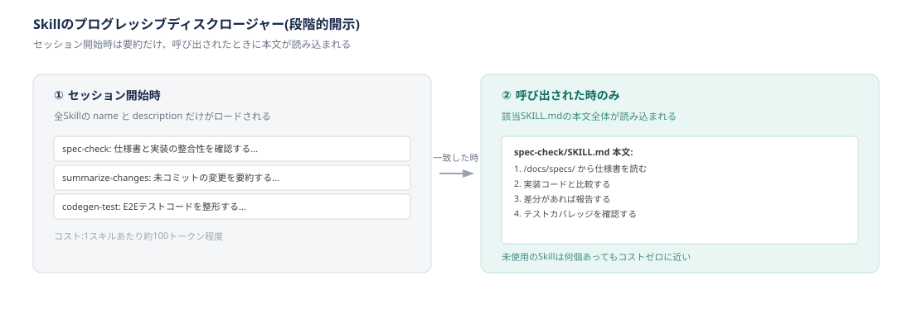

**プログレッシブディスクロージャー（段階的開示）**が設計の核になっています。読み込まれるのは全Skillの `name` と `description` だけで（第三者の実測では1つあたり概ね100トークン程度とされています）、本文全体は実際に使われるときに初めて読み込まれます。この一覧はセッション中ずっとコンテキストに載っているため、§2-7 の「毎ターン読み込まれる」という表現も同じことを指しています。

ただし、この一覧表示にも上限があります。**Skill一覧が使えるコンテキストの予算は、モデルのコンテキストウィンドウの1%程度**と公式に定められており、Skillの数が増えて予算を超えると、**利用頻度の低いSkillから順に説明文が省略・削除されます。** つまり「登録数に上限なく安全」ではありません。大量のSkillを運用する場合は `/doctor` コマンドで一覧のコンテキストコストを確認し、優先度の低いものは `skillOverrides` で簡略表示に切り替える、といった運用上の調整が必要になります。

主なfrontmatterオプション：

| フィールド | 用途 |
|---|---|
| `description` | いつ使うかをClaudeが判断する材料（唯一の推奨フィールド） |
| `disable-model-invocation: true` | Claudeが勝手に実行せず、`/name` で明示的に呼んだ時だけ実行（削除・デプロイ等、副作用のある操作向け） |
| `allowed-tools` | このSkill実行中、指定ツールを承認なしで使わせる。**Permission（§2-10）を実質的に迂回する設定です。** 何を承認なしにするかは慎重に決め、破壊的な操作を含めないでください |
| `context: fork` | サブエージェントとして実行させる。**ただし fork は親の会話履歴を引き継ぐ起動方法です**（§2-8）。履歴を渡したくない場合は通常のサブエージェント委任を使ってください |

**事例**

**ケース1：非エンジニアを含む開発チームで、Gitの作法を自然に守ってほしい**

- **課題**：プロダクトオーナーやUXデザイナーもAIで成果物（コード・設計ドキュメント）を作る時代になり、Gitでの管理に巻き込みたいものの、全員にGit/GitHubの作法を意識させるのは負担が大きくなります。
- **対応例**：`/d`（developから命名）という独自Skillを作成し、ブランチ作成・コミット・PR作成の一連の流れをこのSkillに集約しています。作業者は開発フローを意識せず、Skillを使うだけで自然にルールを守れる設計です。
- **効果**：エンジニア以外のメンバーも含めて、正しい作法でのGit運用が定着したと報告されています。
- **参考**：[エンジニア以外のメンバーとともに開発ワークフローを回すClaudeスキル](https://techblog.insightedge.jp/entry/git-friendly-vibe-coding-skill)（Insight Edge Tech Blog）

**ケース2：QAメンバーのE2Eテスト作成における定型作業を自動化したい**

- **課題**：Playwright Codegenで記録した操作をテストコードとして整形する際、Inspectorからコードをコピーし、Claude Codeに貼り付けて整形を依頼する、という手作業が毎回発生していました。
- **対応例**：`/codegen-test` というSkillを作成し、ログインからコード整形までの一連の作業をコマンド1つに集約しています。
- **効果**：手作業だった複数ステップが1コマンドで完結するようになりました。
- **参考**：[Playwright CodegenとClaude CodeでE2Eテスト作成をノーコード化する](https://tech.kickflow.co.jp/entry/2026/02/24/101002)（kickflow Tech Blog）

**紛らわしい機能との違い**：Skill・Subagent・CLAUDE.md・Hooksはいずれも「Claudeの振る舞いを変える仕組み」ですが、役割が異なります。

| 機能 | 役割 | 該当節 |
|---|---|---|
| CLAUDE.md | プロジェクト全体で常に参照する事実 | §2-4 |
| Skill | 特定タスクの手順・専門知識をオンデマンドで読み込む | 本節（§2-6） |
| Subagent | 独立したコンテキストで並列作業させる | §2-8 |
| Hooks | イベント発生時に強制的に実行する。Claudeの判断に依存しない | §2-9 |

§2-4 で述べたとおり、CLAUDE.mdは「強制ではなくコンテキスト」です。この性質はSkillにも当てはまります。**Skillを実行するかどうかも最終的にはClaudeの判断に依存するため、絶対に実行させたい処理はSkillではなくHooks（§2-9）で組む必要があります。**

---

## 2-7. Plugins

**重要度：🟢 知っておくと便利**

**一言でいうと**：Skill・Subagent・Hooks・MCPサーバーなど複数の拡張機能をひとまとめにして配布する単位です。

**こんな時に使います**

- チームに同じSkill・Hooks・MCP設定を配りたいが、個別にコピペするのは非効率な時
- 複数のプロジェクト（あるいは複数リポジトリ）で同じ拡張機能を使い回したい時
- 属人化していた運用ノウハウを、チーム全体が使える形にまとめたい時

**何ができるか・使い方**

Pluginは `.claude-plugin/plugin.json`（メタ情報）を持つディレクトリで、その中に `skills/`・`agents/`・`hooks/`・`.mcp.json` を自由に組み合わせて格納できます。

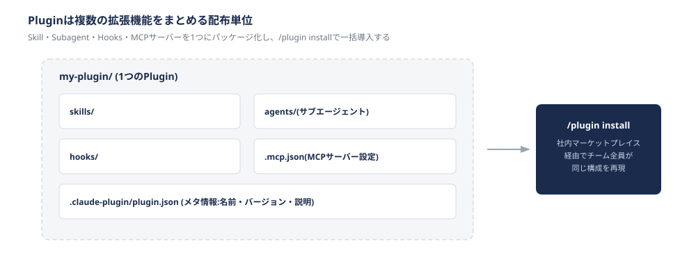

配布は「マーケットプレイス」という仕組みを介します。マーケットプレイスは複数のPluginをまとめたカタログで、`.claude-plugin/marketplace.json` にどのPluginがどこにあるかを列挙します。利用者は次の2ステップで導入できます。

```
/plugin marketplace add <組織>/<マーケットプレイスのリポジトリ>
/plugin install <plugin名>@<マーケットプレイス名>
```

マーケットプレイス自体はPluginの中身を持たず「目次」の役割に徹します。Plugin本体を同じリポジトリに置く構成、別リポジトリに分ける構成のどちらも可能で、開発チームごとに権限を分けたい場合は後者が向いています。

管理設定（managed settings）を使うと、特定のPluginを強制有効化して個々のユーザーが無効化できないようにしたり、「Anthropic公式マーケットプレイスからしかインストールできない」という制限をかけることもできます。これは章④（セキュリティ・ガバナンス／準備中）で扱う「未承認のツールを勝手に追加させない」という考え方を、Plugin単位で実現する手段になります。

**事例**

**ケース1：属人化した運用ノウハウを、チーム全体が使える形にしたい**

- **課題**：複数のプロダクトを少人数で運用する中で、体制変更が重なり、一部のメンバーの頭の中にしかなかった運用・調査のノウハウを、チーム全体が使える形に落とし込む必要が出てきました。障害対応のように「何がどう起きるか事前に特定できない」性質の知識は、通常のRunbook（手順書）には落とし込みにくいという課題もありました。
- **対応例**：各プロダクトの運用・調査ノウハウをClaude Codeのプラグインとして固め、社内向けのマーケットプレイスを構築しています。担当者は `/plugin install` 一つで、そのノウハウを受け取れる状態になります。
- **効果**：属人化していた調査ノウハウを、コマンド一つでチーム全員が再現できる状態にできたと報告されています。
- **参考**：[Claude CodeのPlugin Marketplaceで、運用の属人化を防ぐ](https://techblog.olta.co.jp/entry/2026/07/22/071625)（OLTA TECH BLOG）

**ケース2：複数リポジトリにまたがる開発チームに、Skillをどう展開するか**

- **課題**：開発環境がモノレポではなく複数のリポジトリに分かれているため、Skillを各リポジトリに直接配置すると、更新のたびに全リポジトリへの反映が必要になり、同期が破綻するおそれがありました。
- **対応例**：Skillを個別リポジトリに直接置くのではなく、Marketplace経由でPluginとして配布する方式を採用しています。チーム展開するSkillは強制ではなく「Starter Kit（任意で使える出発点）」という位置づけにしている点が特徴です。
- **効果**：アナウンスや勉強会での紹介だけでチームへの浸透が進んだと報告されています。Skillを修正した際もPRをマージするだけで各自の環境に自動反映されるため、改善のたびに個別周知する必要がなくなりました。
- **参考**：[Claude Code Marketplaceを使ったSkillのチーム展開とPlugin化の恩恵](https://dev.henry.jp/entry/claude-code-marketplace)（株式会社ヘンリー エンジニアブログ）

**紛らわしい機能との違い**：SkillとPluginは「配布できる」という点で混同しやすいですが、Skillは単機能（1つの手順・知識）、Pluginは複数のSkill・Agent・Hooks・MCPをまとめた「セット」です。1つのSkillだけを配りたいならSkillを直接共有すれば十分ですが、複数の拡張機能をまとめて「標準環境」として配りたい場合にPluginが向きます。なお、有効化したPluginが持つSkill・Agent・Hooksは毎ターンコンテキストウィンドウに読み込まれるとされ（[出典](https://uravation.com/media/claude-code-plugins-complete-guide-2026/)）、大量に有効化するとトークン消費が増える点は、MCP（§2-5）と同様の注意が必要です。

---

## 2-8. Agents and parallel work（サブエージェント・並列作業）

**重要度：🟢 知っておくと便利**

**一言でいうと**：メインの会話とは別の独立したコンテキストでタスクを実行させ、専門特化と並列処理を可能にする仕組みです。

**こんな時に使います**

- コードレビューを複数の観点（スタイル・セキュリティ・テストカバレッジ）で行いたいが、1つのエージェントに全部詰め込むと見落としが増え、トークン消費も激しくなる時
- 大量のファイル調査でメインの会話のコンテキストを汚したくない時
- 計画役・実装役・レビュー役のように役割を分けて進めたい時

**何ができるか・使い方**

組み込みのサブエージェント（Explore、Plan、general-purpose）に加え、`.claude/agents/<name>.md` に独自のサブエージェントを定義できます。frontmatterで名前・説明・使えるツール・使用モデルを指定し、本文がそのサブエージェント専用のシステムプロンプトになります。

```
.claude/agents/security-scanner.md
---
name: security-scanner
description: コード変更に脆弱性パターンがないか確認する。PRレビュー時に使う。
tools: Read, Grep, Glob
model: sonnet
---
以下の観点で脆弱性を確認する:
1. SQLインジェクションの可能性
2. 認証・認可の抜け漏れ
3. 機密情報のハードコード
```

サブエージェントは親の会話履歴を引き継ぎません（forkという特殊な起動方法を除きます）。親から渡されるのは、委任時のタスク内容と、CLAUDE.mdの階層（管理ポリシー・ユーザー・プロジェクト・ローカルの全レベル）だけです。組み込みのExploreとPlanは、速度を優先してCLAUDE.mdとgitの状態確認を省略する設計になっています。

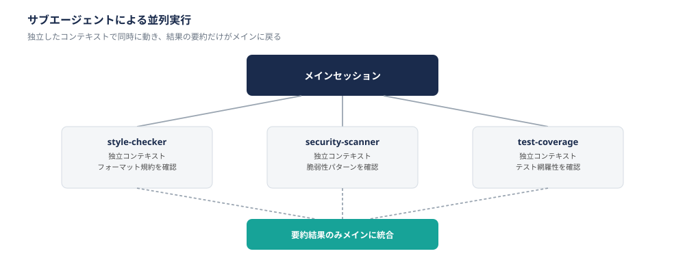

独立したタスクは1つのメッセージ内で複数同時に起動でき、全体の所要時間は最も遅いサブタスクの時間で済みます。「Agent teams」という発展形もあり、複数のClaude Codeインスタンスが対等な「チームメイト」として役割分担しながら協調します（本ガイド作成時点ではベータ機能です）。

**事例**

**ケース1：コードレビューの所要時間を短縮したい**

- **課題**：1つのエージェントに全チェック項目を含むコードレビューを依頼していたところ、トークン消費が激しく、観点が多すぎて重要な問題を見落とすことがありました。
- **対応例**：従来メインエージェントで行っていたコードレビューを、3つの専門サブエージェントに分割して並列実行する構成に変更しています。
- **効果**：処理を並列化したことで、順次処理していた工程のリードタイムが短縮されました。
- **参考**：[Claude Codeのサブエージェントでコードレビューの並列実行する](https://qiita.com/y-hirakaw/items/ad3f7c36a6ae92843e2d)（Qiita）

**ケース2：公式が採用する観点別並列レビューの構成を、自社のCIに取り入れる**

- **課題**：claude-code-action（GitHub Actions連携）でのコードレビューを、汎用的なデフォルト設定のまま使っており、レビューの質・スピードに改善の余地がありました。
- **対応例**：Anthropic自身が運用しているワークフローを参考に、観点ごとの並列レビューという構成を取り入れています。
- **効果**：公式の構成を模倣したことで、コードレビューの質とスピードが改善したと報告されています。プロジェクト固有のルール（命名規則やアーキテクチャ制約）をプロンプトやカスタムMCPに組み込み、さらに特化したレビュアーへ育てていく方向性も示されています。
- **参考**：[本家に学ぶ Claude Code Actionのサブエージェント並列レビュー](https://zenn.dev/genda_jp/articles/70aa9a74ac1e62)（Zenn）

**紛らわしい機能との違い**：Skill・Subagent・Agent Teamsはいずれも「タスクを分けて処理する」点で似ていますが、**コンテキストの独立度**が異なります。Skillはメインの会話の中で本文が読み込まれるだけで実行主体はメインのまま、Subagentは完全に独立したコンテキストで実行され結果だけが戻り、Agent Teamsは複数のサブエージェントが対等な「チームメイト」として協調します。用途に迷ったら、「メインの流れの一部として知識を使いたいか（Skill）」「メインから切り離して専門作業を任せたいか（Subagent）」で判断するとよいでしょう。

---

## 2-9. Automation（Hooks・定期実行・自律継続）

**重要度：🔴 必須**

**一言でいうと**：特定のイベントや条件で処理を確実に発火させる仕組み群です（Hooks・Scheduled tasks・Goal・Headless mode）。

**こんな時に使います**

- 「編集後に必ずフォーマッタを実行して」とCLAUDE.mdに書いても、時々忘れられる時
- 定期的に同じチェックを走らせたい時（夜間バッチ、定期レポート等）
- CIパイプラインからClaude Codeを呼び出したい時
- 条件を満たすまで自律的にセッションを継続させたい時

**何ができるか・使い方**

まず理解しておきたいのは、**Claude Codeには「守ってほしいこと」を実現する手段が3段階ある**という点です。

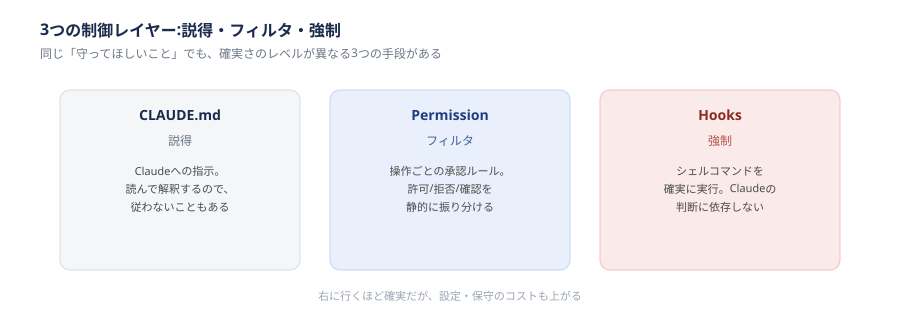

- **CLAUDE.md（説得）**：Claudeが読んで解釈する指示。柔軟ですが、複雑な状況では従われないこともあります
- **Permission（フィルタ）**：操作ごとに許可・拒否・確認を振り分ける静的なルールです（§2-10）
- **Hooks（強制）**：シェルコマンドを確実に実行します。Claudeがどう判断したかに関係なく、決まった処理が必ず走ります

**Hooks**は30種類以上のイベント（PreToolUse、PostToolUse、UserPromptSubmit、Stop、SessionStart等）ごとに、シェルコマンド・HTTPエンドポイント・別のLLM呼び出しを登録できます。イベントの種類は追加されていくため、最新の一覧は[公式リファレンス](https://code.claude.com/docs/ja/hooks)でご確認ください。

```
.claude/settings.json
{
  "hooks": {
    "PostToolUse": [{
      "matcher": "Write|Edit",
      "hooks": [{ "type": "command", "command": "npx prettier --write \"$CLAUDE_TOOL_INPUT_FILE_PATH\"" }]
    }]
  }
}
```

`PreToolUse` で終了コード2を返すとツール実行そのものをブロックできます。**この拒否は `bypassPermissions` モードでも突破できないため、「利用者が自分では回避できない制御」を管理者側が仕込む手段になります**（章④のガードレール設計と直結します）。

その他の自動化機能：

| 機能 | できること |
|---|---|
| `/loop` | 決まった間隔、またはClaudeが選んだ間隔でプロンプトを繰り返し実行する |
| `/goal` | 条件を満たすまで自律的にセッションを継続させる |
| Headless mode（`-p` フラグ） | 対話なしでClaude Codeを実行。CI/CDやスクリプトからの呼び出しに使う |

**事例**

**ケース：自動フォーマット・レビューをClaude自身の判断に依存させたくない**

- **課題**：「編集後は必ずPrettierとlintを実行して」という指示をCLAUDE.mdに書いても、Claudeがそれを毎回確実に実行するとは限りません。同様に、コードレビューのような検証作業も、Claudeの判断任せにすると省略されることがあります。
- **対応例**：Anthropicが提供する `security-guidance` という公式プラグインは、Hooksの仕組みを使い、コードの編集の都度、別モデルによるレビューを走らせて結果をセッションにフィードバックするという構成を採用しています。これは「Claudeにレビューさせる」のではなく「Hooksで確実にレビューを挟む」という設計思想の実例です。
- **効果**：Claudeの判断に依存せず、決まった検証プロセスを毎回確実に通す運用が実現できます。
- **参考**：[Automate actions with hooks](https://code.claude.com/docs/en/hooks-guide)（Anthropic公式ドキュメント。同ページ内で `security-guidance` プラグインとの統合例が紹介されています）

**紛らわしい機能との違い**：CLAUDE.md・Permission・Hooksはいずれも「Claudeの振る舞いを制約する」ものですが、確実性の強さが異なります（上図参照）。章④（セキュリティ・ガバナンス／準備中）で「絶対に守らせたいルールは何で実現するか」を考える際は、この3層のどこに置くべきかがそのまま設計の要点になります。なお、Skill（§2-6）は「説得」に近く、Hooksのような強制力は持ちません。

---

## 2-10. Permissions and sandboxing（権限・サンドボックス）

**重要度：🔴 必須**

**一言でいうと**：どの操作を自動実行してよいかを定める「Permission」と、Bashコマンドが触れてよいファイル・通信先をOSレベルで制限する「Sandbox」の2つの仕組みです。

**こんな時に使います**

- 承認プロンプトが多すぎて開発のテンポが悪い時
- 認証情報や機密ファイルにAIが不用意にアクセスしないようにしたい時
- 未知のnpmパッケージ経由の攻撃（サプライチェーン攻撃）から開発環境を守りたい時

**何ができるか・使い方**

まず両者の適用範囲の違いを正確に理解する必要があります。

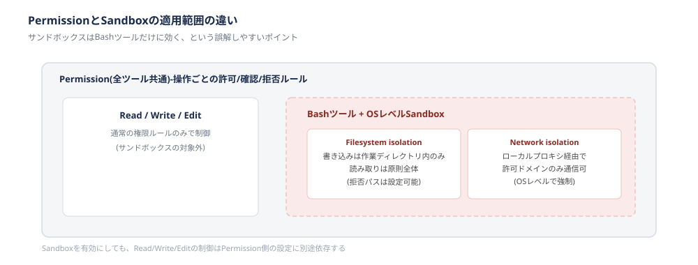

- **Permission**：`default`（都度確認）／`acceptEdits`／`plan` 等のモードと、`allow`／`ask`／`deny` ルールで、**全ツール**の操作可否を制御します
- **Sandbox**：OSレベルの隔離機能で、**Bashツールのみ**に適用されます。`Read`・`Write`・`Edit` といった標準ツールはサンドボックスの対象外で、通常のPermissionルールのみで制御されます

> **`bypassPermissions`（および `--dangerously-skip-permissions`）は、承認をすべて省略するモードです。** 承認プロンプトの多さへの対処としてこれを選ばないでください。名前のとおり危険であり、当部門では業務利用時の使用を想定していません。承認の多さを解消する正しい手段は、この節で扱うSandboxによる境界の定義です（後述の事例1）。<br>なお、Hooksの `PreToolUse` による拒否は `bypassPermissions` でも突破できません（§2-9）。管理者が確実に止めたい操作はHooksに置きます。

Sandboxが提供する隔離は2種類あります。

- **Filesystem isolation**：書き込みは作業ディレクトリ内のみ許可、読み取りは原則コンピュータ全体に及びますが拒否パスを設定できます
- **Network isolation**：ローカルのプロキシを経由させ、許可したドメイン以外への通信をOSレベルで遮断します

```
{
  "sandbox": {
    "enabled": true,
    "network": { "allowedDomains": ["registry.npmjs.org", "github.com"] },
    "filesystem": { "denyRead": ["~/.ssh", "~/.aws"] }
  }
}
```

> **この設定だけでは認証情報を守れません。** 上の `denyRead` が効くのは**Bashツール経由の読み取りだけ**です。Claudeは `Read` ツールでも同じファイルを読めるため、`~/.ssh` や `~/.aws` を本当に読ませたくない場合は、**Permissionの `deny` ルールでも同じパスを塞ぐ必要があります。** 「Sandboxを有効にしたから機密ファイルは安全」という理解は誤りです。この節の冒頭に挙げた「認証情報や機密ファイルにAIが不用意にアクセスしないようにしたい」という目的は、SandboxとPermissionの両方を設定して初めて達成されます。
>
> Permission側は次のように書きます（書式は[公式ドキュメント](https://code.claude.com/docs/en/iam)で最新を確認してください）。
>
> ```
> {
>   "permissions": {
>     "deny": ["Read(~/.ssh/**)", "Read(~/.aws/**)"]
>   }
> }
> ```

Sandboxを有効にすると、その境界の中で完結する操作は承認プロンプトなしで自動実行できるようになります。Anthropicの発表によれば、社内利用ではこの仕組みにより承認プロンプトが84%削減されたとされています。

**事例**

**ケース1：承認疲れとセキュリティ確保の両立**

- **課題**：Claude Codeにコードベースへの広いアクセスを与えると、特にプロンプトインジェクションが発生した場合にリスクがあります。一方で、操作のたびに全て承認を求めると、開発者が確認作業に疲弊し、結局 `--dangerously-skip-permissions` のような全許可オプションに流れてしまう懸念があります。
- **対応例**：あらかじめ触れてよい範囲（ファイルシステム・通信先）をOSレベルで定義しておき、その境界内であれば自動実行を許可する、という設計をAnthropicが導入しています。
- **効果**：安全性を確保しながら、承認プロンプトの数を大きく減らせたと報告されています。
- **参考**：[Anthropic Adds Sandboxing and Web Access to Claude Code for Safer AI-Powered Coding](https://www.infoq.com/news/2025/11/anthropic-claude-code-sandbox)（InfoQ）

**ケース2：実際に試すと見えてくる注意点**

- **課題**：Sandboxを有効にした状態で未許可のドメインへの通信が発生すると、ブロックされて処理が止まります。
- **実際の挙動**：試した開発者によれば、通信がブロックされた際に表示される画面が「Sandboxing機能を無効にしますか」という選択肢を提示してくるとのことです。**安全のために導入した機能が、詰まった瞬間に「無効化」という抜け道を提示してくる設計になっている点は、運用上注意が必要です。**
- **参考**：[Trying Claude Code's Sandboxing Feature: Network Isolation](https://zenn.dev/tomioka/articles/120252fdaedec3?locale=en)（Zenn）

**紛らわしい機能との違い**：[章③](03_開発に役立つTips.md) の §3-7 で扱うDevContainerと、本節のSandboxはどちらも「隔離」ですが、実現方法とカバー範囲が異なります。DevContainerはDockerによるコンテナ隔離で、仮想化のオーバーヘッドがある一方、OS全体・言語ランタイムごと隔離できます。Sandboxは追加ソフトウェア不要のOSネイティブ機能ですが、対象はBashツールに限られます。両者は排他ではなく、DevContainerの中でさらにSandboxを有効にする、という組み合わせも可能です。

---

## 2-11. Platforms and integrations（利用環境・外部連携）

**重要度：🟡 よく使う**

**一言でいうと**：CLI・デスクトップアプリ・IDE拡張・Web・モバイルなど、複数の入り口から同じClaude Codeエンジンを使える仕組みです。

**こんな時に使います**

- ターミナル操作に慣れていないメンバーにも使ってもらいたい時
- 移動中や外出先から、進行中のセッションの状況を確認・指示したい時
- GitHubのIssue・PRやSlackと連携させたい時

**何ができるか・使い方**

**Claude Codeはどの入り口から使っても同じエンジンが動いており、CLAUDE.md・Auto memory・設定は共有されます。** これは公式ドキュメントにも明記されている仕様です。

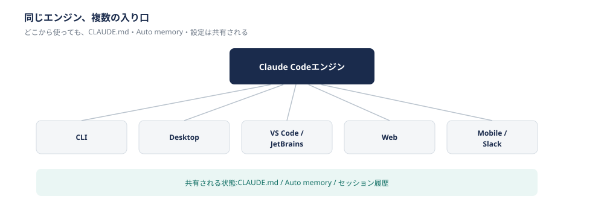

| 入り口 | 特徴 |
|---|---|
| CLI | 最も機能が揃った基本形。スクリプト化やAgent SDKの利用はCLI限定 |
| Desktop | GUIアプリ。差分レビューや複数セッションの並行管理に向く |
| VS Code / JetBrains拡張 | IDE内で使える。ただし `--worktree` 等CLI限定の機能は一部使えない |
| Web | ブラウザから起動。ローカル環境がなくても使える |
| Mobile | 進行中のセッションの確認・プッシュ通知の受け取りが可能 |
| Slack / Chrome拡張 | チャットやブラウザ操作と連携 |

> **この表は製品が提供している入り口の一覧であり、当部門で使ってよい入り口の一覧ではありません。** [章0](00_はじめに.md) の §0-5 では、現時点で利用を認めているのは **CLI・デスクトップアプリ・IDE拡張** としています。Web・Mobile・Slack・Chrome拡張については、この表に載っているからといって使ってよいことにはなりません。利用可否は章0 §0-5 を正とし、判断に迷う場合はAI推進WGに相談してください。

迷ったら「まずCLIをプロジェクトディレクトリ内で使ってみて、GUIが良ければDesktopに切り替える」というのが公式の案内です。

**事例**

**ケース：1人で複数プロジェクトを並行運用する**

- **課題**：少人数の体制で複数のWebサイト・システム基盤を同時に進行させる必要があり、実装待ちで手が止まる時間を減らしたいという状況でした。
- **対応例**：調査専用（Explore）・計画専用（Plan）・実装用にAgentツールを役割ごとに使い分け、CLIを軸にしながら複数プロジェクトを並行して進めています。1ヶ月間で4つのプロジェクトを並行運用し、合計435件のコミットを行ったと報告されています。
- **効果**：実装自体はほぼ全てClaude Code経由で行われ、対話・方針決定・レビューに使う時間は必要なものの、実装待ちで手が止まる時間が大きく減りました。
- **参考**：[Claude Codeで、1人で4プロジェクト並行運用の記録](https://netsujo.jp/blog/claude-code-1month-record)（Netsujo株式会社）

**紛らわしい機能との違い**：「どの入り口を使うか」という利便性の話と、「使ってよいか」という可否の話は別のものです。入り口の選択は利便性の問題ですが、**どの入り口を使うにせよ、同じエンジン・同じ設定である以上、章④（セキュリティ・ガバナンス／準備中）で定める行動原則（機密情報の扱い、承認フロー等）は等しく適用されます。** また、そもそもどの入り口が使用を認められているかは章0 §0-5 の管轄です。

---

## 2-12. Security and data（セキュリティ・データ取り扱い）

**重要度：🔴 必須**

**一言でいうと**：Claude Codeに標準搭載されているセキュリティ保護機構と、データの学習利用・保持に関する公式ポリシーです。

**こんな時に使います**

- 外部ファイル（README、PRの説明等）経由のプロンプトインジェクションが心配な時
- 顧客との契約上、データがどう扱われるかを説明する必要がある時
- Enterprise移行の判断材料としてZDRの適用範囲を確認したい時

**何ができるか・使い方**

Claude Codeには標準でいくつかの防御機構が組み込まれています。

- **権限システム**：機微な操作は明示的な承認を要求します
- **文脈を見た判断**：リクエスト全体を分析し、有害な指示が紛れていないか検知します
- **入力のサニタイズ**：コマンドインジェクションを防ぐ処理です
- **Web fetch専用の分離コンテキストウィンドウ**：Web取得内容が悪意ある指示を含んでいても、メインの判断に直接影響しにくい設計です
- **信頼確認**：初めて開くコードベースや新規MCPサーバーの追加時に確認を挟みます
- **コマンドインジェクション検知・fail-closedマッチング**：未知のコマンドは既定で承認必須にします
- **認証情報の安全な保管**：APIキー等はmacOSではKeychain、Windows/Linuxではファイル権限で保護します

**ただし、これらの保護は万能ではありません。** ある実測（第三者による報告）では、コーディング作業のみの環境ではプロンプトインジェクションの成功率はほぼゼロですが、MCPサーバー・Web取得・ブラウザ操作を組み合わせる構成では、対策を講じても数%の成功率が残るとされています。

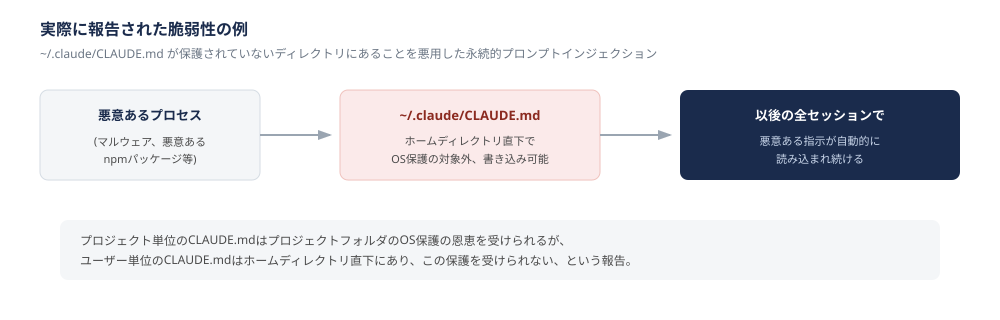

**データの取り扱い**については、Team/Enterpriseプランでは組織が明示的に同意しない限りモデルの学習に利用されません。一方でローカルのセッション記録は `~/.claude/projects/` 配下に平文で保存され、既定では30日間保持されます。**ZDR（Zero Data Retention）**はEnterpriseプランで組織単位のリクエストにより有効化できますが、標準のTeam/Enterprise UIは対象外です。

**事例**

**ケース1：グローバルなCLAUDE.mdの置き場所を悪用した永続的プロンプトインジェクション**

- **課題**：プロジェクト単位のCLAUDE.md（`./CLAUDE.md`）は、プロジェクトフォルダに対するOSレベルの保護（macOSのTCC等）の恩恵を受けられます。一方、ユーザー単位のCLAUDE.md（`~/.claude/CLAUDE.md`）はホームディレクトリの直下にあり、この種の保護の対象外であることが報告されました。
- **実際の指摘**：同じユーザー権限で動作する何らかのプロセス（悪意あるnpmパッケージ等）が `~/.claude/CLAUDE.md` を書き換えると、以後の全セッションで悪意ある指示が自動的に読み込まれ続ける、という持続的な攻撃が成立し得ます。
- **参考**：[Security: ~/.claude/CLAUDE.md is writable by any user-level process](https://github.com/anthropics/claude-code/issues/21674)（GitHub Issue）

**ケース2：金融業界における採用判断**

- **課題**：金融業界は特に厳格なセキュリティ要件が求められ、生成AIの業務導入には慎重な判断が必要とされます。
- **対応**：みずほフィナンシャルグループでは、グループ全体で約3万人の従業員がClaudeを業務に活用していると報告されています。データプライバシーポリシーと法人向けセキュリティ機能が採用の決め手になったとされています。
- **参考**：[Claude業務活用ガイド｜企業導入の始め方と成功事例【2026年版】](https://aibrainpartners.jp/blog/claude-gyoumu-katsuyou-kigyou-guide/)

**紛らわしい機能との違い**：本節は**Claude Code製品自体に標準で組み込まれている保護機構とAnthropicのデータポリシー**を扱っています。これに対し章④（セキュリティ・ガバナンス／準備中）は、**それを踏まえた上で当部門が独自に追加する行動原則・設定**を扱います。本節が「土台」、章④が「その上に部門として積み増す部分」という関係です。この区別は、章① §1-6 で述べた「提供元のガードレール」と「会社固有の制約」の違いと同じ構造です。

---

## 2-13. Usage and costs（利用状況・コストの可視化）

**重要度：🟡 よく使う**

**一言でいうと**：個人のセッションからチーム全体、組織のSIEM連携まで、利用状況とコストを異なる粒度で可視化する仕組みです。

**こんな時に使います**

- 想定よりコストがかさんでいないか確認したい時
- チームの導入状況・活用度合いを把握したい時
- コスト超過を防ぐための予算上限を設定したい時

**何ができるか・使い方**

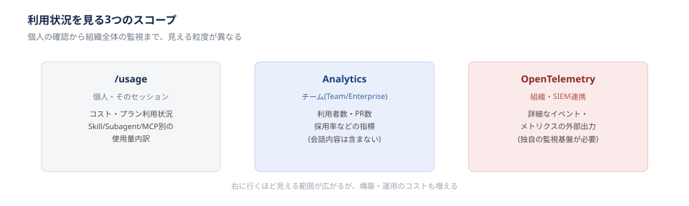

- **`/usage`**（`/cost`・`/stats` という別名でも呼べます）：現在のセッションのコスト・プラン利用状況・アクティビティを表示します。Pro/Max/Team/Enterpriseでは、Skill・Subagent・Plugin・MCPサーバーごとの使用量内訳まで確認できます
- **Analytics**（Team/Enterprise）：利用者数・PR数・採用率といったチーム指標を可視化しますが、会話内容までは含まれません
- **OpenTelemetry（OTel）**：より詳細な監視やSIEM連携が必要な場合の選択肢です。独自の監視基盤の構築が前提になります

コストの目安として、Anthropicの公式ドキュメントでは、企業導入において開発者1人あたり平均で1日あたり約13ドル、月額150〜250ドル程度とされ、90%のユーザーは1日あたり30ドル未満に収まるとされています。想定外に高額になるケースの多くは、クリアされないまま長く続いたセッションや、既定モデルをOpusのままにしていることが原因とされています。

コスト削減の基本的な考え方は、これまでの節で扱った内容の延長線上にあります。コンテキストを溜め込みすぎない（§2-3）、CLAUDE.mdは簡潔に保つ（§2-4）、大量の出力が予想される作業はサブエージェントに逃がす（§2-8）、といった工夫がそのままコスト削減にもつながります。

**事例**

**ケース：コストの見える化により、予算計画を立てやすくする**

- **課題**：AIエージェントの導入初期は、実際にどの程度のコストがかかるか見積もりにくく、稟議や予算計画を立てる材料が不足しがちです。
- **対応例**：公式に示されている平均値（1日あたり約13ドル、月150〜250ドル）を目安に、小規模なパイロットチームでまず `/usage` を使って自社での実測値を集め、そこから全体展開時の予算を試算します。
- **効果**：勘に頼らず、実測データに基づいた予算計画を立てられます。
- **参考**：[Manage costs effectively](https://code.claude.com/docs/en/costs)（Anthropic公式ドキュメント）

**紛らわしい機能との違い**：「利用状況を見る」という点で、Analyticsと監査ログは混同されやすいですが、目的も見える範囲も異なります。Analyticsは主に生産性・コストの可視化を目的とした指標であり、「何を生成したか」という内容込みの追跡は含みません（内容込みの監査ログはEnterprise限定機能です）。監査・ログ保全をどこまで求めるかという方針は、章④（セキュリティ・ガバナンス／準備中）で扱います。

---

## まとめ

本章では、Anthropic公式ドキュメントのカテゴリ構成に沿って、Claude Codeの機能を11分野にわたって整理しました。各節は「一言でいうと→こんな時に使うか→何ができるか・使い方→事例→紛らわしい機能との違い」という共通フォーマットで統一し、実例はできる限り実名の企業・技術ブログを一次情報源とともに示しています。

- **Core concepts・Use Claude Code**（§2-3・§2-4）は、章①で学んだ抽象的な仕組み（コンテキストウィンドウ、記憶）が、Claude Codeでは具体的にどう実装されているかを示しました
- **MCP・Skills・Plugins**（§2-5〜§2-7）は、Claude Codeを拡張する3つの手段であり、それぞれ「外部サービスとの接続」「手順・知識の再利用」「複数機能のパッケージ配布」という異なる役割を持ちます
- **Agents and parallel work・Automation**（§2-8・§2-9）は、作業を効率化・自動化する仕組みです。特にHooksは「説得・フィルタ・強制」という3層構造の中で最も確実性が高い手段として、章④のセキュリティ設計と直結します
- **Permissions and sandboxing・Security and data**（§2-10・§2-12）は、Claude Codeが標準で備えている防御機構とデータポリシーです。章④はこれを土台とした上で、当部門が追加する行動原則を扱います
- **Platforms and integrations・Usage and costs**（§2-11・§2-13）は、どこから使い、どう可視化するかという運用面を扱いました

なお、本章に登場する機能はいずれも「Claude Codeという製品が備えているもの」です。**そのうち当部門で使ってよいものの範囲は [章0](00_はじめに.md) の §0-5 を正とします。** 本章に記載があることは、使用が認められていることを意味しません。

[章③](03_開発に役立つTips.md)（開発に役立つTips）では、これらの機能を実際の開発現場でどう組み合わせて使うかを扱います。章④（セキュリティ・ガバナンス／準備中）では、本章で触れた「紛らわしい機能との違い」や §2-12 の内容を土台に、当部門としての行動原則を具体的に定めます。
