# 章③　開発に役立つTips ― どう使えば成果が出るのか

## 3-1. この章が扱うもの

[章①](01_AIエージェントとは何か.md) ではAIエージェントに共通する仕組みを、[章②](02_Claudeの機能一覧.md) ではClaude Codeの機能を扱いました。本章が扱うのは、**その機能を実際の開発でどう使うか**という実践知です。

章②が「何ができるか」の辞書だったのに対し、本章は「**どう使えば成果が出るか**」を扱います。機能そのものの説明は章②に置き、本章では繰り返しません。ただし §3-10 の Git worktree と §3-11 の Plan Mode は、章②に対応する節がないため、本章で機能の説明から扱っています。

**この章の性格**

- **通読する必要はありません。** 9つのTipsを並べた辞書であり、必要になったものだけ読めばよい構成です
- **章①・章②を読んでいることを前提とします。** 特に §2-3（コンテキストウィンドウ）、§2-4（CLAUDE.md）、§2-6（Skills）、§2-8（サブエージェント）、§2-9（Hooks）、§2-10（Permission・Sandbox）への参照が多くなります
- **Claude Code前提で書いています。** GitHub Copilot・Codexの整備が進んだ段階で、対応する記載を追加します

**各節の書式**

- **なぜ効くか** ── その工夫が効く理由。章①・章②で扱った仕組みのどこに由来するか
- **進め方** ── 具体的な手順とClaudeへの指示例
- **当部門での実例／注意点** ── 実際にやってみて分かったこと、つまずきどころ

**最初の一歩**

| 状況 | まず読むところ |
| --- | --- |
| すでに使っていて詰まっている | **§3-13の早見表**で自分の症状を探す |
| これから使い始める | **§3-3**（コンテキスト）と **§3-9**（CLAUDE.mdとhooks） |
| 定型作業を繰り返している | **§3-4**（Skill） |
| 生成量が増えてきた | **§3-8**（検証ループ）── ここが最優先 |
| チームに広げたい | **§3-4** と **§3-9** をチームの標準として整える |

**この章が扱わないもの**

[章0](00_はじめに.md) の方針に沿い、**特定の方法論・型（仕様駆動開発、Eval駆動開発など）を本文の主張としては扱いません。** 本文は素の実践知として記述し、「これは世の中では○○と呼ばれている型の一部である」という対応関係は注記として示します。一覧は末尾の §3-14「次に学ぶとよい領域」にまとめています。

理由は2つあります。方法論は年単位で入れ替わるため本文に書き込むと改訂対象が増え続けること、そして**名前を覚えることと使えるようになることは別**だからです。

---

## 3-2. 全体像：9つのTipsと、開発工程のどこで使うか

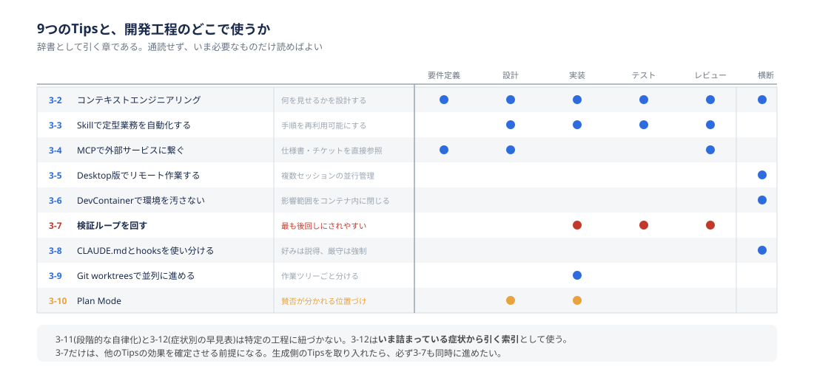

**3つに分類すると見通しがよくなります**

9つのTipsは、次の3つのどれに効くかで整理できます。うまくいかないときは、いきなり指示の言い回しを変えるのではなく、この3つのどれの問題かを先に切り分けてください。

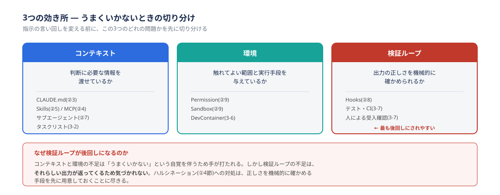

| 効き所 | 問い | 該当するTips |
| --- | --- | --- |
| **コンテキスト** | 判断に必要な情報を渡せているか | §3-3（コンテキスト設計）、§3-4（Skill）、§3-5（MCP） |
| **環境** | 触れてよい範囲と実行手段を与えているか | §3-6（Desktop）、§3-7（DevContainer）、§3-10（worktree） |
| **検証ループ** | 誤りに気づいて直す循環が回っているか | §3-8（検証ループ）、§3-9（CLAUDE.mdとhooks）、§3-11（Plan Mode） |

この9つに続く §3-12（段階的に自律化する）は、個別のTipsではなく**3つすべての整備状況をふまえて「どこまで任せるか」を決める話**です。9つを一通り見たあとに読んでください。

**用語の整理：「検証ループ」と「検証手段」**

本章では次のように使い分けます。混同しやすいので先に固定しておきます。

- **検証ループ** ── **生成 → 検証 → 修正**を回す仕組みそのもの
- **検証手段** ── そのループの「検証」に何を置くかの選択肢。型チェックからE2Eテスト、人の受入確認まで段階があります（§3-8の表）

**工程ごとの任せやすさ**

Tipsを使う前に、そもそもエージェントに任せやすい工程とそうでない工程があります。分かれ目は**アウトプットが機械的に検証できるかどうか**です。

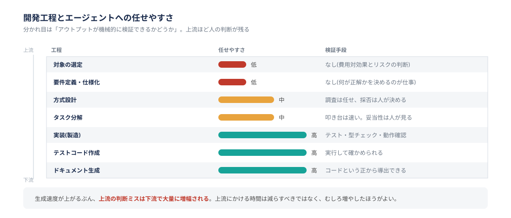

| 工程 | 任せやすさ | 理由 |
| --- | --- | --- |
| 実装（製造） | 高 | テストの成否・型チェック・動作確認で機械的に検証できる |
| テストコード作成 | 高 | 正解が存在し、実行して確かめられる |
| ドキュメント生成 | 高 | コードという正がすでにあり、そこから導出できる |
| 方式設計・タスク分解 | 中 | 調査と整理は任せられるが、採否の判断は人が持つ |
| 要件定義 | 低 | 何が正解かを決めること自体が仕事であり、検証手段がない |
| 受入確認 | 低 | 「正しさ」の基準が要件定義書の外にある |

**上流工程ほど人間の判断が残り、下流工程ほどエージェントに寄せられます。** そして生成速度が上がるぶん、上流の判断ミスが下流で大量に増幅されるため、**上流にかける時間は減らすべきではなく、むしろ増やしたほうがよい**と考えてください。

**§3-8だけは他と性格が違います**

9つのうち**§3-8（検証ループ）だけは、他のTipsの効果を確定させる前提**にあたります。生成側のTipsを取り入れて生成量が増えても、検証手段が弱いままなら、通ってはいけないものが通る確率が上がります。生成側の工夫を1つ取り入れたら、必ず §3-8 も同時に進めてください。

---

## 3-3. コンテキストエンジニアリング

**なぜ効くか**

[章0](00_はじめに.md) で述べたとおり、AIエージェントの活用度合いの個人差は、プロンプトの上手さではなく**エージェントに何を見せ、どんな環境で動かしているか**の差です。

コンテキストウィンドウには上限があります（§1-6、§2-3）。会話・読み込んだファイル・設定ファイル・過去のツール実行結果は、すべてこの限られた枠の中に収まっている必要があります。枠が埋まってくると自動的に古いやり取りが要約されますが、**要約は情報の欠落を伴います。** ここを意識的に設計することが、この章のすべてのTipsの土台になります。

やることは4つあります。

### （1）会話を意識的に整理する

精度が落ち始める前に、意図的に整理する習慣をつけてください。

| コマンド | 使いどころ |
| --- | --- |
| `/context` | 現在の内訳を確認する。何が枠を食っているかが分かる |
| `/clear` | 別の作業に切り替えるとき。完全リセット |
| `/compact` | 同じ作業の流れを保ちたいとき。要約して圧縮 |

「精度が落ちてきた」と感じてから対処するのでは遅すぎます。**作業の切れ目で `/clear` する**のを習慣にしてください。

### （2）調査をサブエージェントに逃がす

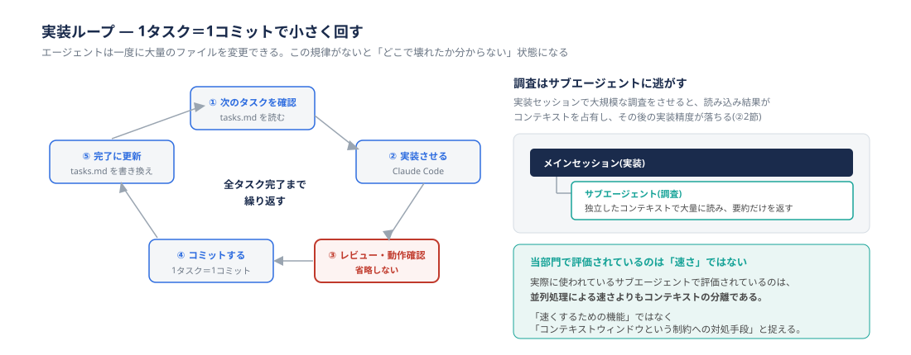

実装セッションで大規模な調査をさせると、大量のファイル読み込み結果がコンテキストウィンドウを占有し、その後の実装精度が落ちます。調査は独立したコンテキストを持つサブエージェント（§2-8）に切り出し、メインには要約だけを戻します。

```
メインセッション(実装)
  └─ サブエージェントに調査を依頼
       ⎿ 独立したコンテキストで大量のファイルを読む
       ⎿ メインには要約結果だけが返る
```

**当部門での実例：評価されているのは「速さ」ではありません**

当部門でもサブエージェントは実際に使われており、**評価されているのは並列処理による速さよりもコンテキストの分離**です。調査で消費されるトークンが実装セッションを圧迫しなくなるため、長い作業でも精度が落ちにくくなります。

この観点は、サブエージェントを「速くするための機能」と捉えていると見落としやすくなります。**コンテキストウィンドウという制約への対処手段**として捉えるほうが、使いどころを判断しやすくなります。

### （3）上流の成果物を「エージェントが読む文書」として書く

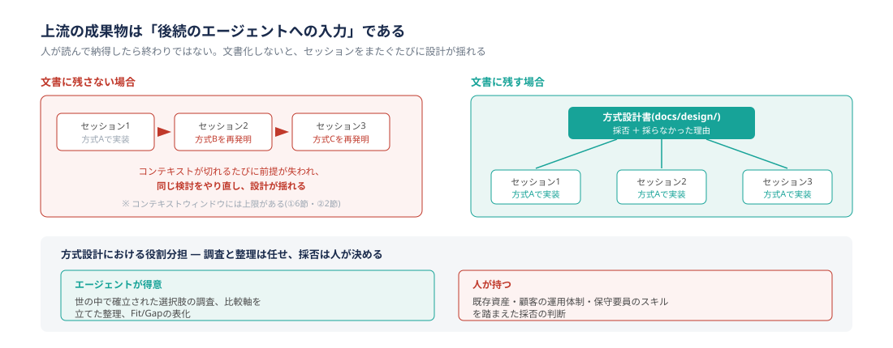

要件定義書・方式設計書は、人が読んで納得したら終わりではありません。**後続のセッションが読む入力**になります。ここを文書化しておかないと、コンテキストが切れるたびに前提が失われ、セッションをまたぐたびに設計が揺れます。

書くときに意識したいのは次の3点です。

- 図で説明した内容は、**本文にも文字で書く**（画像はエージェントには読めないことがあります）
- 「別紙参照」「前回同様」といった参照は、**リンク先のパスを明記する**
- **用語の揺れをなくす**（同じものを2つの呼び方で書かない）

方式設計書には、採用した方式だけでなく**採らなかった方式とその理由**を残してください。後続のセッションが同じ検討をやり直すのを防げます。

**完了条件・品質基準は数値で書く**

「正しく動くこと」ではエージェントに使えません。**機械的に判定できるか**を書式の条件にしてください。

| 悪い書き方 | 数値で書いた例 |
| --- | --- |
| 十分に速いこと | 一覧APIの応答時間が95パーセンタイルで500ms以内 |
| テストを充実させる | 新規追加した分岐のテストカバレッジが80%以上 |
| エラーを適切に扱う | 想定する4つの例外パターンすべてにテストがあり、いずれもログにエラーコードを出力する |
| 精度が高いこと | 既存の判定結果100件と突き合わせ、不一致が3件以内 |

**曖昧さを見つけさせるのはエージェントに任せられます**

要件定義そのものは人の仕事ですが、**書かれていない箇所を指摘させる**のは有効です。

```
この要件定義書を読んで、実装に入るには情報が足りない箇所を挙げてほしい。
出力形式:
- 箇所(該当する見出し・行)
- 何が決まっていないか
- 決まっていないまま実装すると何が起きるか
推測で補完はしないこと。曖昧な点はそのまま曖昧だと指摘してほしい。
```

最後の一文が重要です。これを書かないと、エージェントは足りない部分を推測で埋めた「よくできた要件定義書」を返してきてしまい、曖昧さが見えなくなります。

人間の開発者も書かれていない部分を経験で埋めますが、違いがあります。**エージェントは確率的に埋め、しかも埋めたことを報告しません。**

### （4）タスクリストを作業記憶として使う

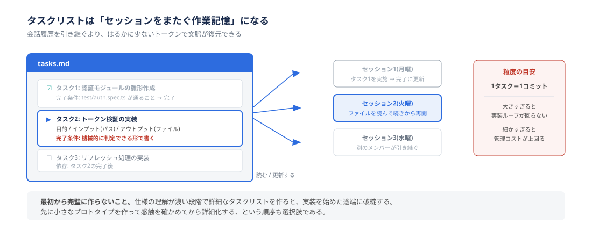

長い作業は必ずセッションをまたぎます。そのとき**何が終わって何が残っているか**が失われます。タスクリストをファイルとして残すと、新しいセッションはそれを読むだけで続きから再開できます。会話履歴を引き継ぐより、はるかに少ないトークンで文脈が復元できます。

各タスクには次の4つを持たせてください。

| 項目 | なぜ必要か |
| --- | --- |
| 目的 | 判断に迷ったときの拠り所になる |
| インプット | 何を読めばよいか。ファイルパスまで書く |
| アウトプット | 何を作るか。ファイル単位で書く |
| **完了条件** | **機械的に判定できる形で書く**（上の品質基準の表を参照） |

```
方式設計書(docs/design/xxx.md)をもとに、実装タスクを分解して docs/tasks/<機能名>.md に
書き出してほしい。

各タスクには以下を持たせること:
- 目的
- インプット(ファイルパスを明記)
- アウトプット(ファイル単位)
- 完了条件(テストの成否など、機械的に判定できる形で)

書式: Markdownのチェックボックス(- [ ])で1タスク1項目とし、完了時は - [x] に変える。
粒度の目安: 1タスクが1コミットに収まること。
依存関係がある場合は順序を明示すること。
```

**置き場所と運用ルール**

決めずに始めると散らばります。当部門では次を推奨します。

| 項目 | 推奨 | 理由 |
| --- | --- | --- |
| 置き場所 | リポジトリ内の `docs/tasks/` 配下 | 設計書と並び、エージェントがパス指定で読める |
| Git管理 | **コミットする** | 進捗が履歴に残り、他のメンバーが引き継げる |
| 更新の担い手 | **エージェントに更新させ、人がコミット時に確認する** | 人が別途更新すると必ず忘れる |
| 書式 | Markdownのチェックボックス | エージェントが読み書きしやすく、人も差分が読める |
| 書いてはいけないもの | 認証情報、顧客固有の機密情報 | コミットされ、以降すべてのセッションから読めるようになる（章④参照） |

**タスクリストを使って小さく回す**

タスクリストを参照しながら、**1タスクずつ**次のループを繰り返します。括弧内は担い手です。

```
① タスクリストで次のタスクを確認する          (エージェント)
② 実装させる                                (エージェント)
③ 出力をレビューし、動作を確認する            (人)
④ タスクリストの完了ステータスを更新する       (エージェント)
⑤ コミットする                              (人／④の更新も一緒にコミットする)
   ↓
①に戻る(全タスク完了まで)
```

**「1タスク＝1コミット」を規律として守ってください。** エージェントは一度に大量のファイルを変更できるため、この規律がないと「どこで壊れたか分からない」状態に容易に陥ります。

③と④を人が持つのが要点です。**エージェントにコミットまで任せると、レビューを通っていない変更が履歴に入ります。**

**注意点**

タスクリストを最初から完璧に作ろうとしないでください。仕様の理解が浅い段階で詳細なタスクリストを作ると、実装を始めた途端に破綻します。要件が固まっていなければ、**先に小さなプロトタイプを作って感触を確かめてから詳細化してください。**

---

## 3-4. Skillで定型業務を自動化する

**なぜ効くか**

同じ手順を毎回プロンプトで説明していると、説明の粒度が人によって・回によってばらつきます。Skill（§2-6）は手順をファイル化して再利用可能にする仕組みで、**説明の手間が減るだけでなく、誰が使っても同じ手順が走る**ようになります。

Skillの効き所は、個人の時短よりも**チーム内での手順の統一**にあります。

> **補足**：2026年1月、カスタムスラッシュコマンド（`.claude/commands/`）はSkillsに統合されました。既存のファイルは引き続き動作しますが、新規に作る場合はSkill形式（`.claude/skills/<name>/SKILL.md`）が公式に推奨されています（§2-4）。

**進め方：何をSkillにするか**

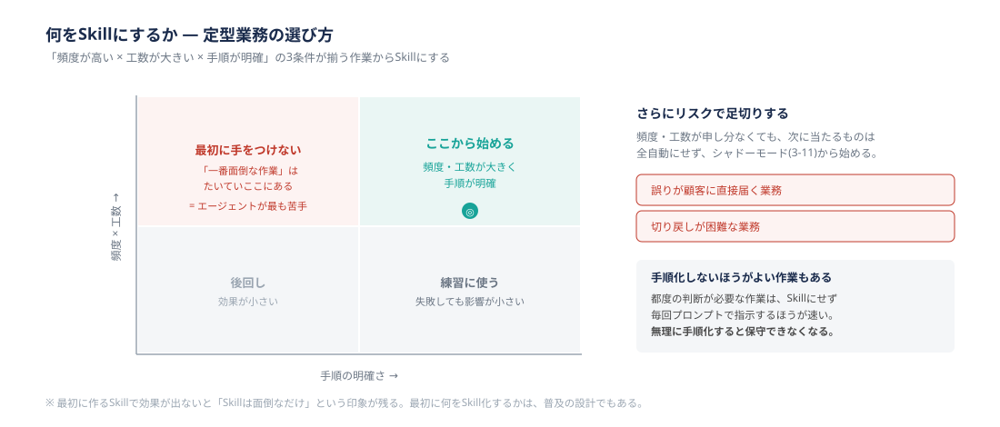

**「頻度が高い × 工数が大きい × 手順が明確」**の3条件が揃う作業から作ってください。

| 観点 | 判断の目安 |
| --- | --- |
| 頻度 | 週1回以上あるものを優先。月1回未満は作る手間が回収できない |
| 工数 | 1回あたり半日以上、または月合計で2人日以上かかっているもの |
| 手順の明確さ | **手順を人に説明できるか。** 説明できない作業はSkillにできない |

目安の数値は当部門の暫定値です。最初の1〜2件を作った実感で置き換えていく前提で使ってください。

**Skillにしないほうがよい作業もあります**

都度の判断が必要な作業を無理に手順化すると、条件分岐だらけのSKILL.mdになり、保守できなくなります。**毎回プロンプトで指示したほうが速い作業は、Skillにしないでください。**

**Skillの効き方：プログレッシブディスクロージャー**

Skillは、セッション開始時には `name` と `description` だけが読み込まれ、実際に使われるときに初めて本文全体が読み込まれます（§2-6）。このため、1つのSkillが長い手順を持っていても、使われない限りコンテキストへの負担は小さく済みます。

**ただし「登録数に上限なく安全」ではありません。** §2-6 のとおり、Skill一覧に使えるコンテキストの予算はコンテキストウィンドウの1%程度と定められており、Skillの数が増えて予算を超えると、**利用頻度の低いSkillから順に説明文が省略・削除されます。** 説明文が削られたSkillは呼び出されなくなります。数が増えてきたら `/doctor` で一覧のコンテキストコストを確認してください（§2-6）。

ここから実務上の含意が2つ出てきます。

- **`description` が呼び出しの成否を決めます。** 「いつ使うか」を書いてください。「〜したいとき」「〜の確認が必要なとき」という書き方が効きます
- **長い手順を書いてもコストになりにくいです。** CLAUDE.mdに書けない長い手順の置き場所として適しています（§3-9参照）

**当部門での実例：概要設計のClaude Code一本化**

- **課題**：概要設計の工程が担当者ごとの進め方に依存しており、成果物の粒度・品質にばらつきが出ていました。工数も大きく、頻度も高い工程です
- **対応**：概要設計をClaude Codeに一本化する方針とし、勉強会Vol.3の場でモブプログラミング形式（複数人で1つの画面を見ながら進める形式）で実際に回しました。方式設計→タスク分解→実装ループという流れを、参加者全員が同じ手順で追える形にしています
- **効果**：手順が言葉と文書になったことで、個人の進め方に依存していた部分が共有可能になりました。**AI活用の価値は「個人の生産性」より「チーム品質の均一化」にある**という当部門の見立ては、この実践から出てきたものです
- **この実例の限界**：根拠はモブプログラミング1回の観察であり、定量的な効果測定は行っていません。**当部門の仮説として読んでください**

> **一本化してよい範囲について。** 上の実例では方式設計からタスク分解、実装ループまでを通して回していますが、**標準として一本化してよいのは、現時点では概要設計・タスク分解までです。** 実装工程まで広げるには、検証手段を段階2以上に上げることが前提になります。理由は §3-8 の「なぜ段階1のまま概要設計の一本化を進めているのか」で説明しています。

**注意点**

Skillは**説得の層**であり、hooksのような強制力を持ちません（§3-9参照）。「Skillにしたから必ずこの手順で走る」わけではありません。確実に走らせたい処理はhooksに置いてください。

チームに配る場合、複数のSkillをまとめてPlugin（§2-7）として配布すると、更新のたびに個別周知する必要がなくなります。

> **用語注**（部門外の読者向け）
>
> - **勉強会Vol.3** ── 当部門の開発チームが実施している定例勉強会の第3回。テーマはMCP・Hooksのハンズオンと、概要設計一本化のモブプログラミング
> - **Issue #1〜#4** ── 同勉強会で洗い出した自動化候補の管理番号（本章 §3-8・§3-12 に登場）
> - **AAP／Job搭載** ──（※正式名称と補足を要確認）
> - **GR PMO** ──（※正式名称と補足を要確認）

---

## 3-5. MCPで外部サービスに繋ぐ

**なぜ効くか**

設計書がGoogle Driveにあり、チケットがJiraにあり、コードがGitHubにある。この状態で「仕様書とコードが合っているか確認して」と頼むには、毎回コピペで内容を渡す必要があります。**コピペした瞬間に、それは最新ではなくなります。**

MCP（§2-5）は、エージェントが外部サービスに直接アクセスするための標準規格です。効くのは、**人手の突き合わせ作業が発生している箇所**です。

**進め方：使いどころ**

| 使いどころ | 何が変わるか |
| --- | --- |
| 仕様書とコードの突き合わせ | 設計書を都度取得して比較させられる。手作業の照合が減る |
| チケット起点の実装 | 「この課題の内容を実装してPRを作って」が1回の指示で通る |
| 障害調査 | エラー監視サービスの情報を直接読ませ、該当コードまで辿らせる |
| 問い合わせの一次対応 | 複数ツールにまたがる定型対応を1セッションで完結させる |

接続の手順とスコープ（`local`／`project`／`user`）は §2-5 を参照してください。

**当部門で先に確認すべきこと**

MCPは、他のTipsと違って**技術的な話で終わりません。** ここだけは先に確認が必要です。

| 確認事項 | なぜ必要か |
| --- | --- |
| **案件ごとのAI利用可否** | 顧客側のJira・Google Driveを繋ぐ場合、その顧客の情報を外部AIサービスに渡してよいかは契約次第です。**技術的に接続できることと、接続してよいことは別問題です**（章④で扱います） |
| **どのMCPサーバーを追加してよいか** | 個別の接続には認証情報が必要ですが、「何を追加登録できるか」自体の制限が本質的な対策になります。管理設定による許可リスト運用（章④で扱います） |
| **サーバー自体の信頼性** | 外部コンテンツを取得するMCPサーバーはプロンプトインジェクションの経路になりえます。公式もこの点を注意喚起しています（§2-5） |

**注意点**

有効にしたMCPサーバーのツール定義は、**会話が始まる前からコンテキストウィンドウに載り続けます。** 使っていないサーバーを繋いだままにしておくと、それだけで枠を消費します（§2-5）。基本は「使う案件で繋ぎ、使わなくなったら外す」です。

なお §2-5 では、起動時に全ツール定義を読み込まず必要なときに検索・ロードする **Tool Search** という機能も紹介しています。多くのサーバーを繋いだまま使いたい場合は、こちらも選択肢になります。

認証トークンは `.mcp.json` に直接書かず、環境変数経由で参照してください。`.mcp.json` をGit管理する場合は特に注意が必要です。

---

## 3-6. Desktop版でリモート作業する

**なぜ効くか**

**Claude Codeはどの入り口から使っても同じエンジンが動いており、CLAUDE.md・Auto memory・設定は共有されます**（§2-11）。したがって入り口の選択は、機能の違いではなく**作業スタイルの違い**として選べます。

CLIが最も機能が揃った基本形ですが、次のような場面ではDesktop版・Mobileが効きます。

**進め方：入り口の使い分け**

| 場面 | 向いている入り口 |
| --- | --- |
| 通常の開発 | **CLI**。スクリプト化やAgent SDKの利用はCLI限定 |
| 複数セッションの並行管理 | **Desktop**。どのセッションが何をしているか一覧で見える |
| 差分のレビュー | **Desktop**。GUIで差分が読める |
| ターミナルに不慣れなメンバー | **Desktop**。導入の障壁が低い |
| 移動中・外出先での進捗確認 | **Mobile**。プッシュ通知で完了を受け取れる（※利用可否は下記を確認） |

> **利用が認められている入り口は限られています。** [章0](00_はじめに.md) の §0-5 では、現時点で利用を認めているのは **CLI・デスクトップアプリ・IDE拡張** です。Mobileについては上記の表に挙げていますが、使ってよいかどうかは章0 §0-5 を正としてください。判断に迷う場合はAI推進WGに相談してください。

**長い作業を投げて離れる**

Desktop版が効くのは、**エージェントの作業時間が人の待機時間より長くなったとき**です。大きなリファクタリングや広範囲の調査を投げたあと、CLIの前で待つ必要はありません。完了通知を受けて、結果だけ確認すればよくなります。

この使い方をする場合、**離れている間に承認プロンプトで止まらないように**しておく必要があります。触れてよい範囲を先に定義しておくこと（§3-7、§2-10）が前提になります。

**注意点**

入り口をどれにしても、**章④で定める行動原則は等しく適用されます。** 同じエンジン・同じ設定である以上、「Desktopだから」「Mobileだから」という例外はありません。

特に注意したいのは、Desktop版・Mobileは**貸与端末以外からも使えてしまう**という点です。これは技術的な制約ではなく行動原則で担保している領域であり、章④で扱います。

IDE拡張（VS Code / JetBrains）は、`--worktree` 等のCLI限定機能が一部使えません（§2-11）。§3-10 のworktree運用をするならCLIを使ってください。

---

## 3-7. DevContainerでコンテナ環境で開発する

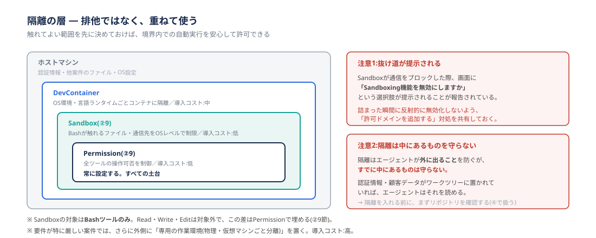

**なぜ効くか**

§2-10 で見たとおり、Permissionを厳しくすると承認プロンプトが増えて開発のテンポが落ちます。緩めると、プロンプトインジェクションや誤操作の影響範囲が広がります。この緊張関係を「毎回どちらかを我慢する」形で扱っていると、最終的に全許可オプションに流れがちです。

解決の方向は、**あらかじめ触れてよい範囲を決めておき、その中では自由に動かす**ことです。境界を先に引いておけば、境界内での自動実行を安心して許可できます。

もう1つ、当部門では**ホスト端末への追加インストールを避けたい**という事情があります。Claude Codeは作業に必要なツールを自分でインストールしようとすることがあり、ホスト側の資産管理と衝突します。DevContainerを使えば、**ホストは統制を維持したまま、コンテナ内では必要なツールを自由に導入できます。**

**進め方：隔離の層を選ぶ**

隔離には複数の層があり、それぞれカバー範囲と導入コストが異なります。**これらは排他ではなく、重ねて使うものです。**

| 層 | 何を隔離するか | 導入コスト | 使いどころ |
| --- | --- | --- | --- |
| Permission（§2-10） | 全ツールの操作可否 | 低 | **常に設定する。すべての土台** |
| Sandbox（§2-10） | Bashが触れるファイル・通信先をOSレベルで制限 | 低 | **原則として有効化する**（下記の結論を参照） |
| DevContainer | OS環境・言語ランタイムごとコンテナに隔離 | 中 | 依存関係を汚したくない、環境を配布したい |
| 専用の作業環境 | 物理・仮想マシンごと分離 | 高 | 顧客データを扱う案件など、要件が厳しい場合。手配は案件のインフラ担当と相談する |

DevContainerの中でさらにSandboxを有効にする、という組み合わせも可能です。なお §2-10 で述べたとおり、Sandboxの対象はBashツールに限られ、`Read`・`Write`・`Edit` は対象外です。この差はPermissionで埋めてください。

**Sandboxについての結論**

Sandboxは推奨する機能ですが、§2-10 では「通信がブロックされた際に『Sandboxing機能を無効にしますか』という選択肢が提示される」という指摘も紹介しています。**安全のために入れた機能が、詰まった瞬間に無効化という抜け道を提示してきます。**

これを踏まえた当部門の方針は次のとおりです。

- **Sandboxは有効化します。** 承認プロンプトの削減効果が大きく、導入コストも低いためです
- **詰まったときに無効化しないでください。** 対処は「許可するドメインを設定に追加する」であり、この対処法をチームであらかじめ共有しておいてください
- 許可ドメインの一覧は設定ファイルに残し、**Git管理してレビュー対象にしてください。** 個人が場当たりに追加していく運用にしないことが重要です

**DevContainerを使う理由**

DevContainerは、開発環境をコンテナとして定義し、その中でエージェントを動かす方式です。当部門でも実案件で使われているものがあります。

1. **影響範囲が明確になる** ── エージェントが壊せるのはコンテナの中だけになります。壊れたら作り直せます
2. **環境がコードになる** ── 「自分の環境では動く」問題が減り、新しいメンバーへの環境配布が容易になります
3. **未知の依存関係から守られる** ── 悪意あるパッケージが実行されても、被害はコンテナ内にとどまります
4. **ホストの統制を維持できる** ── 追加インストールの必要があっても、ホスト側の資産管理に手を入れずに済みます

**前提として必要なもの**

「導入コスト：中」の中身は主にここです。着手前に確認しておいてください。

| 必要なもの | 確認事項 |
| --- | --- |
| コンテナ実行環境 | Docker Desktop は**企業利用に有償ライセンスが必要な場合があります。** 社内で許可されている実行環境と、無償の代替構成が使えるかは、**AI推進WGまたは情報システム部門に確認してください**（当部門としての推奨構成は整備中です） |
| エディタ側の対応 | VS Code の Dev Containers 拡張、または devcontainer CLI |
| 社内ネットワーク | プロキシ設定と社内証明書をコンテナ内に持ち込む必要があります。**ここが最初に詰まる箇所です。** 設定の具体例は当部門でまだ整備できていないため、着手する場合はAI推進WGに相談してください。先に着手した人の設定を共有できるようにしたいので、詰まった箇所と解決策をWGに戻していただけると助かります |

**最小構成の例**

```json
// .devcontainer/devcontainer.json
{
  "name": "project-dev",
  "image": "mcr.microsoft.com/devcontainers/typescript-node:20",
  "postCreateCommand": "npm ci",
  "mounts": [
    "source=${localEnv:HOME}/.claude,target=/home/node/.claude,type=bind"
  ]
}
```

既存のDockerfileがあるプロジェクトなら、`image` の代わりに `build.dockerfile` でそれを指定して流用できます。

**Claude Code をコンテナ内で動かすかどうか**

これがDevContainer運用の最大の判断点です。

| 方式 | 隔離の効果 | 注意点 |
| --- | --- | --- |
| ホスト側でClaude Codeを動かす | **弱い**。エージェントの実行主体はホストにいる | 導入は簡単だが、隔離の意味が薄れる |
| コンテナ内でClaude Codeを動かす | **強い**。エージェントの行動範囲がコンテナ内に収まる | 認証情報の受け渡しと、`~/.claude` の永続化を設計する必要がある |

隔離を目的にするなら後者を選んでください。その場合、コンテナを作り直すたびに認証やセッション履歴が消えないよう、上の例のように `~/.claude` をマウントして永続化します。**認証情報をイメージに焼き込まないでください。**

**発展：コンテナ環境そのものをClaudeに作らせる**

DevContainerの設定を書くのが負担なら、その作業自体をClaudeに任せられます。「このプロジェクトを動かすためのDevContainer構成を作ってほしい」と頼めば、依存関係を読んで `devcontainer.json` を書かせられます。

この使い方には副次的な効果があります。**Claudeがコンテナ内に自分の作業環境を組み立てる形になるため、ホストを触らせずに済みます。** 必要なツールをコンテナ内で自由に入れさせられるため、「追加インストールをどう許可するか」という問題が、そもそも発生しなくなります。

ただし生成された設定はそのまま信じず、**社内のプロキシ・証明書の設定が入っているか**を必ず確認してください。

**注意点**

隔離を入れる前に、**リポジトリに機密情報が含まれていないか**を先に確認してください。隔離はエージェントが外に出ることを防ぎますが、**すでに中にあるものは守りません。** 認証情報・顧客データがワークツリーに置かれていれば、エージェントはそれを読めます。

最低限、着手前に次を確認してください。詳細な基準と手順は章④で扱います。

- `.env`、認証鍵、証明書、接続情報がワークツリーに置かれていないか
- 顧客から受領したデータがリポジトリ内に置かれていないか
- 上記が必要な場合、`.gitignore` と Permission の `deny` ルールの両方で対象外にしているか

---

## 3-8. 検証ループを回す

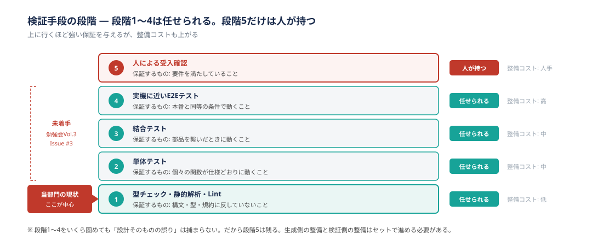

**なぜ効くか**

§1-4 で述べたとおり、AIの回答は「知覚した情報」と「モデルの予測」の組み合わせで作られており、**構造上、誤りが起こりえます。** これに対する現実的な対処は、AIの出力を信じないことではなく、**誤りに気づく手段を用意しておくこと**です。

さらに重要なのは、人が介在しない工程では**誤りが検出されないまま連鎖する**という点です。

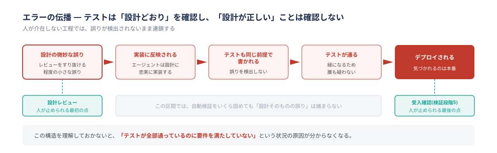

```
設計の微妙な誤り
  → 実装に反映される
    → テストも「設計どおり」に書かれる(誤りを検出しない)
      → テストが通る
        → デプロイされる
```

テストコードもエージェントが生成する場合、テストは**設計どおりであること**を確認しますが、**設計が正しいこと**は確認しません。この構造を理解しておかないと、「テストが全部通っているのに要件を満たしていない」という状況の原因が分からなくなります。

### （1）検証手段の段階を上げる

検証手段には段階があります。上に行くほど強い保証を与えますが、整備コストも上がります。

| 段階 | 手段 | 何を保証するか | 整備コスト |
| --- | --- | --- | --- |
| 1 | 型チェック・静的解析・Lint | 構文・型・規約に反していないこと | 低 |
| 2 | 単体テスト | 個々の関数が仕様どおりに動くこと | 中 |
| 3 | 結合テスト | 部品を繋いだときに動くこと | 中 |
| 4 | 実機に近いE2Eテスト | 本番と同等の条件で動くこと | 高 |
| 5 | 人による受入確認 | **要件を満たしていること** | 人手 |

段階1〜4はエージェント自身に実行させられます。**段階5だけは人が持ちます。** 上の伝播の構造から分かるとおり、段階1〜4をいくら固めても「設計そのものの誤り」は捕まらないためです。

「段階4」の実機に近いE2Eテストとは、当部門の文脈では**顧客環境と同等の構成で動かす検証**を指します。モックやスタブで置き換えた依存を実物に近づけるほど段階が上がる、と理解してください。

### （2）ループを閉じる

段階表を用意するだけでは検証ループになりません。§3-2 で整理したとおり、ループとは**生成 → 検証 → 修正**の循環です。閉じるべき箇所は3つあります。

| 繋ぐ箇所 | 何をするか | 使う仕組み |
| --- | --- | --- |
| 生成 → 検証 | 編集のたびに検証を**確実に**走らせる | hooks（§3-9、§2-9） |
| 検証 → 修正 | 失敗の内容がエージェントに戻り、修正に入る | hooksの出力をセッションに返す（§2-9） |
| ループ → 共通基盤 | 個人環境だけでなく、PR時にも同じ検証を走らせる | CI |

**確実に走らせたい検証はhooksに置いてください。** 「編集したらテストを実行して」とCLAUDE.mdに書いても、毎回確実に実行されるとは限りません。詳しくは §3-9 で扱います。

CIについては、**hooksとの二重化を前提にしてください。** hooksは手元の環境でしか働かないため、hooksを設定していないメンバーの変更や、エージェント以外の経路で入った変更は素通りします。PR時に同じ検証をCIで走らせることで、ループの外から入った変更も捕まります。

### （3）レビューの回し方を変える

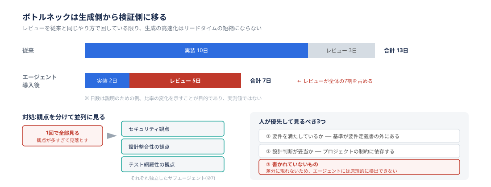

生成が速くなると、工数のボトルネックは**生成側から検証側に移ります。**

実装10日＋レビュー3日で13日かかっていた作業が、実装2日で終わるようになったとします。ただし生成量が増えるためレビューは5日に伸び、全体は7日になります。**実装は5分の1になりましたが、全体は半分にしか減りません。** そしてレビューが全体の7割を占めるようになります。

つまり、レビューを従来と同じやり方で回している限り、**その先の改善余地はほぼレビュー側にしか残りません。**（日数は比率の変化を示すための例であり、実測値ではありません。）

**観点を分けてください。** 1回のレビューで「セキュリティも性能もテスト網羅性も設計整合性も」を見ようとすると、観点が多すぎて重要な問題を見落とします。観点ごとに独立したサブエージェント（§2-8）に割り当てると、それぞれが自分の観点だけに集中できます。

```
変更内容のレビューを、以下の観点ごとに分けて実施してほしい。
観点ごとに独立して見て、最後に統合した結果を出すこと。

1. セキュリティ(認証・認可・入力検証・機密情報の混入)
2. 設計整合性(docs/design/ の方式設計書との齟齬)
3. テスト網羅性(追加された分岐に対応するテストがあるか)

レビュー対象: (コミット範囲やPR番号を明示する)

各指摘には以下を付けること:
- 該当ファイル・行
- なぜ問題か
- 修正案
- 確信度(確実 / 要確認)
```

**「並列」の意味に注意してください。** ここで効いているのは同時実行による速さではなく、**観点ごとにコンテキストを分けること**です（§3-3 と同じ理屈です）。順番に1観点ずつ見ても効果は得られます。

「確信度」を出させるのが実務上効きます。エージェントの指摘には的を外したものが混ざるため、確実なものから順に見られると人のレビュー時間の配分がしやすくなります。

**人が見るべきところ**

| 人が見るべき観点 | なぜエージェントに任せられないか |
| --- | --- |
| 要件を満たしているか | 「正しさ」の基準が要件定義書の外にある（顧客の期待、業務の実態） |
| 設計判断が妥当か | プロジェクトの制約・保守体制という文脈に依存する |
| **書かれていないもの** | 実装されなかった要件、抜けた考慮点は差分に現れない |

3つ目が最も見落とされやすい箇所です。エージェントのレビューは提示された差分に対して行われるため、**「そこにないもの」は原理的に検出できません。** 要件定義書とタスクリストを手元に置いて突き合わせる作業は、人が持つ必要があります。

なお、エージェントにレビューさせた結果を、そのままエージェントに直させないでください。指摘の妥当性を人が判断せずに修正を回すと、的を外した指摘に沿った修正が入り、コードが静かに劣化します。**指摘の採否は人が決めてください。**

**当部門での現状：ここが最も弱い**

正直に書くと、**当部門では検証ループの整備が最も遅れています。**

- 現状：型チェック・静的解析（段階1）が中心
- 未着手：静的解析を超えた、実機に近い検証範囲の確保（勉強会Vol.3 Issue #3）

これは単独の課題ではなく、**§3-4 で挙げた「概要設計の一本化（Issue #1）」の効果を確定させるための前提条件**です。生成量が増えても検証手段が段階1のままなら、通ってはいけないものが通る確率が上がります。

> **なぜ段階1のまま概要設計の一本化を進めているのか**
>
> §3-12 では「信頼が積み上がっているかどうかで自律化の範囲を決める」と述べます。段階1しかない状態で一本化まで進めているのは、一見この原則に反します。
>
> 理由は、**概要設計の成果物がドキュメントであり、レビューが人手で成立する工程だから**です。生成物を人が読んで判断できる範囲では、自動検証が弱くても受入確認（段階5）が機能します。
>
> 一方、**コードの生成量が増える工程では同じ理屈が通りません。** 人が読み切れる量を超えるためです。実装工程まで一本化の範囲を広げる前に、検証手段を段階2以上に上げる必要があります。これがIssue #3を#1と同時に進めるべき理由です。

**Issue #3の扱いは、優先度付けでありがちな失敗の実例でもあります。** 生成側の施策は効果が見えやすいため優先度が上がり、検証側の施策は効果が見えにくいため下がります。しかし前者の効果は後者がないと確定しません。優先度を付け終えたら、「生成側の施策と、その効果を裏付ける検証側の施策が同じ優先度になっているか」を必ず見直してください。

外部でも同じ問題意識が示されています。ある開発者調査では、AIツールを使用中または使用予定と答えた割合が84%（前年76%）に増えた一方、**AIの出力精度を信頼すると答えた割合は29%（前年40%）に下落**し、「AIが生成した、解に近いが的外れなものに悩んでいる」と答えた割合は66%に達したと報告されています。使う量ではなく、**評価・検証できる力**が価値を持つ段階に入っています。

- 出典：Stack Overflow「Developer Survey 2025」（勉強会Vol.3資料経由の二次引用。**原典URLを確認のうえ付記すること**）

**注意点**

**検証方法は、実装前に決めてください。** 実装が終わってから検証方法を考え始めると、テストしにくい設計になっていることに気づき、手戻りが発生します。§3-3 で挙げた「完了条件を機械的に判定できる形で書く」は、この工程のための準備でもあります。

---

## 3-9. CLAUDE.md と hooks を使い分ける

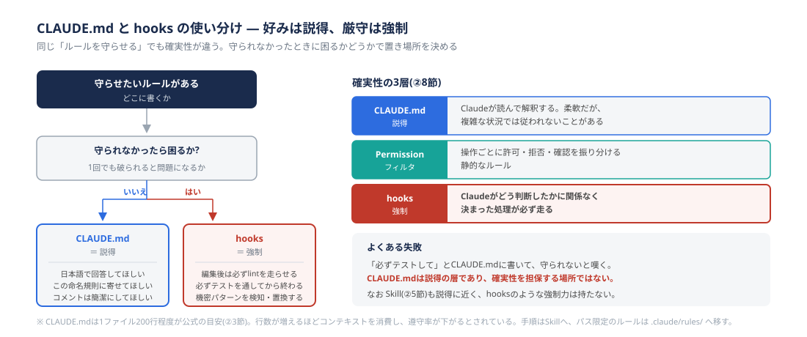

**なぜ効くか**

「編集後は必ずlintを走らせて」とCLAUDE.mdに書いたのに守られない、という不満はよく聞きます。これは書き方の問題ではなく、**置き場所の問題**です。

§2-9 で整理したとおり、Claudeの振る舞いを制約する手段には確実性の3層があります。

| 層 | 手段 | 確実性 |
| --- | --- | --- |
| 説得 | CLAUDE.md（Skillも同様） | Claudeが読んで解釈する。柔軟だが、複雑な状況では従われないことがある |
| フィルタ | Permission | 操作ごとに許可・拒否・確認を振り分ける静的なルール |
| 強制 | hooks | **Claudeがどう判断したかに関係なく、決まった処理が必ず走る** |

**CLAUDE.mdは説得の層であり、確実性を担保する場所ではありません。**

**進め方：判断基準は1つだけ**

置き場所は、次の問いで決まります。

> **守られなかったら困るか？**

| 答え | 置き場所 | 例 |
| --- | --- | --- |
| いいえ（好みの問題） | **CLAUDE.md** | 日本語で回答してほしい／この命名規則に寄せてほしい／コメントは簡潔に |
| はい（1回でも破られると問題） | **hooks** | 編集後は必ずlintを走らせる／必ずテストを通してから終わる／機密パターンを検知・置換する |

**CLAUDE.mdに書くこと**

CLAUDE.mdは**1ファイル200行程度が公式の目安**とされています（§2-4）。行数が増えるほどコンテキストを消費し、指示への遵守率が下がるためです。

書く内容とスコープの対応は §2-4 の表を参照してください。実務上のポイントは、**200行を超えそうになったら中身を移すこと**です。

| 移す先 | 何を移すか |
| --- | --- |
| Skill（§3-4） | 複数ステップにわたる手順 |
| `.claude/rules/` | 特定のパス配下にだけ関係するルール |
| サブディレクトリのCLAUDE.md | モジュール固有の規約 |
| hooks | 「必ず守ってほしい」と書いていたもの |

最後の行が重要です。**CLAUDE.mdに「必ず」「絶対に」と書いてある項目は、hooksに移すべき候補**だと考えてください。書き手が「必ず」と書きたくなった時点で、それは説得では足りないと判断しているということです。

**hooksに置くこと**

hooksは多数のイベント（`PreToolUse`、`PostToolUse`、`UserPromptSubmit`、`Stop`、`SessionStart` 等）ごとに処理を登録できます。イベントの種類は追加されていくため、**利用できるイベントの一覧は §2-9 が挙げている[公式リファレンス](https://code.claude.com/docs/ja/hooks)を正としてください。** 設定の書式も §2-9 にあります。

当部門で優先して検討したいのは次の2つです。

| 目的 | 使うイベント | 何をするか |
| --- | --- | --- |
| 検証を確実に走らせる（§3-8） | `PostToolUse` | 編集後にlint・型チェック・テストを実行し、失敗をセッションに返す |
| 機密情報の送信を防ぐ | `UserPromptSubmit` / `PreToolUse` | メールアドレス・マイナンバー等の構造化パターンを検知・置換する |

後者は章④の「個人情報・機密情報を送信しない」に対する補助的な技術策にあたります。**構造化されたパターンは検知できますが、自然文の機密性は検出できない**という限界があります。行動原則の代わりにはならない、という理解のうえで導入してください。

**注意点**

hooksは**手元の環境でしか働きません。** 設定していないメンバーの変更は素通りするため、チームで守らせたいものはCIとの二重化が前提になります（§3-8）。

hooksはClaudeの判断に関係なく必ず走るため、**重い処理を置くと毎回待たされます。** 全テストを `PostToolUse` に置くと開発のテンポが落ちます。手元では軽い検証（lint・型チェック・関連する単体テスト）に絞り、重い検証はCIに寄せてください。

---

## 3-10. Git worktrees で並列にタスクを実行する

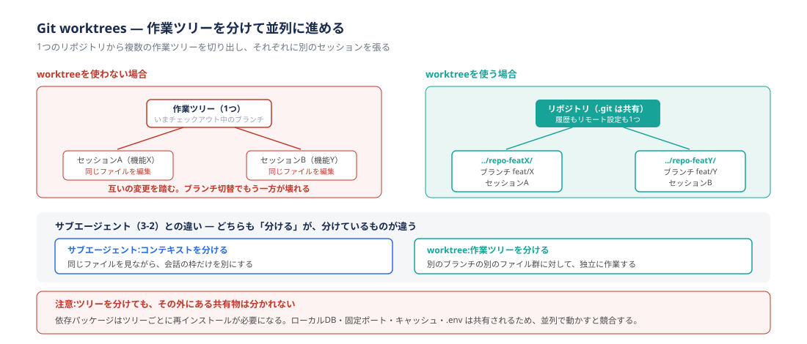

**なぜ効くか**

エージェントの作業時間が人の待機時間より長くなると、「待っている間に別のことをしたい」という状況が生まれます。しかし同じ作業ツリーで2つのセッションを走らせると、**互いの変更を踏みます。** ブランチを切り替えれば、もう一方の作業が壊れます。

`git worktree` は、1つのリポジトリから**複数の作業ツリー**を切り出す機能です。`.git`（履歴・リモート設定）は共有したまま、ツリーだけを分けられます。

```
git worktree add ../repo-featX feat/X
git worktree add ../repo-featY feat/Y
```

これで `../repo-featX` と `../repo-featY` が別のディレクトリとして存在し、それぞれに別のClaude Codeセッションを張れます。

**サブエージェント（§3-3）との違い**

どちらも「分ける」仕組みですが、**分けているものが違います。**

| 仕組み | 分けるもの | 使いどころ |
| --- | --- | --- |
| サブエージェント | **コンテキスト** | 同じファイルを見ながら、会話の枠だけを別にしたい（調査を逃がす等） |
| worktree | **作業ツリー** | 別のブランチの別のファイル群に対して、独立に作業したい |

迷ったら、**「同じブランチの作業か」**で判断してください。同じブランチ内の調査・レビューはサブエージェント、別ブランチの独立した機能開発はworktreeです。

**進め方：効く場面**

| 場面 | なぜ効くか |
| --- | --- |
| 長時間かかる作業と、短い作業を並行させたい | 大きなリファクタリングを投げたまま、別ツリーで小さな修正を進められる |
| レビュー指摘の対応と次の機能開発を並行させたい | ブランチ切替が不要になる |
| 同じ課題を複数の方式で試したい | 2つのツリーで別方式を実装し、比較して選べる |

**注意点：ツリーを分けても、その外にある共有物は分かれません**

ここが実務でつまずく箇所です。

| 共有されるもの | 起きること | 対処 |
| --- | --- | --- |
| 依存パッケージ | ツリーごとに `node_modules` 等が必要 | ツリー作成後に再インストールする |
| ローカルDB | 2つのセッションが同じDBを壊し合う | ツリーごとにDBを分ける、またはコンテナで分離（§3-7） |
| 固定ポート | 開発サーバーが起動できない | ツリーごとにポートを変える |
| `.env` | 片方の設定変更が両方に影響する | ツリーごとに用意する |

**並列にする数は、レビューできる量で決めてください。** worktreeで3つ並列に走らせても、人が3つ分のレビューを同時にこなせないなら、単に未レビューの成果物が積み上がるだけです。§3-8 で述べたとおり、ボトルネックはレビュー側にあります。

なお、IDE拡張では `--worktree` 等のCLI限定機能が使えない場合があります（§2-11）。worktree運用をするならCLIを使ってください。

---

## 3-11. Plan Mode

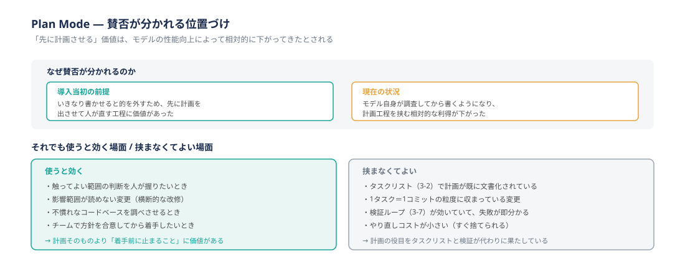

**なぜ賛否が分かれるのか**

Plan Modeは、実装に入る前に計画を出させ、人が承認してから着手させるモードです。**この機能の位置づけは、現在賛否が分かれています。** 本節はどちらかを推奨するものではなく、判断材料を示すものです。

| 時期 | 前提 |
| --- | --- |
| 導入当初 | いきなり書かせると的を外すため、先に計画を出させて人が直す工程に価値があった |
| 現在 | モデル自身が調査してから書くようになり、**計画工程を挟む相対的な利得が下がった**とされる |

つまり、Plan Modeの価値が下がったのではなく、**同じ役目を別の手段が果たすようになった**という理解が実態に近いと考えられます。

**進め方：使うと効く場面 / 挟まなくてよい場面**

| 使うと効く | 理由 |
| --- | --- |
| 触ってよい範囲の判断を人が握りたいとき | 着手前に止まることそのものに価値がある |
| 影響範囲が読めない変更（横断的な改修） | 何を触るつもりかを先に見たい |
| 不慣れなコードベースを調べさせるとき | 人が全体像を掴む手段になる |
| チームで方針を合意してから着手したいとき | 計画が議論の材料になる |

| 挟まなくてよい | 理由 |
| --- | --- |
| タスクリスト（§3-3）で計画が既に文書化されている | 計画の役目をタスクリストが果たしている |
| 1タスク＝1コミットの粒度に収まっている変更 | 読めば分かる規模であり、事前計画の利得が小さい |
| 検証ループ（§3-8）が効いていて、失敗が即分かる | 誤りが早く分かるなら、先に計画するより試すほうが速い |
| やり直しコストが小さい | 捨てて作り直せばよい |

この対比から言えるのは、**Plan Modeを使うかどうかは、他のTipsの整備状況で決まる**ということです。タスクリストと検証ループが整っていれば、Plan Modeを毎回挟む必要は薄くなります。逆に、どちらも整っていない段階では、Plan Modeが唯一の歯止めになります。

**注意点**

Plan Modeで出た計画は、**承認した時点で終わりにせず、必要ならタスクリストに落としてください**（§3-3）。計画が会話の中にしか存在しないと、セッションが切れた時点で失われます。

計画を人が承認する工程は、それ自体がレビューです。**眺めて通すだけになっているなら、その工程には価値がありません。** 触るファイル・変更方針・影響範囲を実際に確認してください。

---

## 3-12. 段階的に自律化する

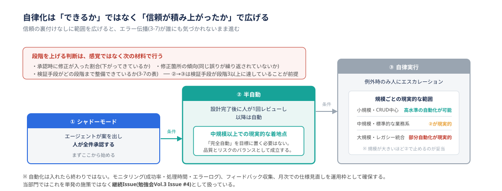

**なぜ効くか**

技術的には、小規模でCRUD中心のシステムなら現時点でも高い水準の自動化が可能です。一方、大規模で複雑なレガシー統合を含むものは、部分的な自動化が現実的な範囲にとどまります。

| システム規模 | 現実的な対応 |
| --- | --- |
| 小規模・CRUD中心 | 高い水準の自動化が可能 |
| 中規模・標準的な業務システム | 設計後に人が1回確認するモデルが現実的 |
| 大規模・複雑なレガシー統合 | 部分自動化が現実的 |

この区分は当部門の見立てであり、外部の実証に基づくものではありません。規模の線引き自体も案件によって変わります。**目安として使い、自案件の実測で上書きしてください。**

ここで重要なのは、**「できるかどうか」ではなく「信頼が積み上がっているかどうか」で自律化の範囲を決める**という点です。信頼の裏付けなしに範囲を広げると、§3-8 で見たエラー伝播が誰にも気づかれないまま進みます。

**進め方**

3段階で広げます。

```
① シャドーモード ── エージェントが案を出し、人が全件承認する
      ↓
② 半自動 ── 設計完了後に人が1回レビューし、以降は自動
      ↓
③ 自律実行 ── 例外時のみ人にエスカレーション
```

**③に上がっても、受入確認（§3-8 の検証段階5）を人が持つことは変わりません。** ③の「例外時のみ」が指しているのは、生成の途中で人が逐一承認する工程を省くという意味であり、成果物が要件を満たしているかの最終確認を省いてよいという意味ではありません。段階5を誰がいつ行うかは、②から③に上げる前に決めておいてください。

段階を上げる判断は、感覚ではなく次の材料で行ってください。**数値は当部門の暫定的な目安であり、案件のリスク許容度に応じて調整してかまいません。ただし「調整した結果の数値」を必ず決めること**が重要です。§3-3 で「完了条件は機械的に判定できる形で書く」と述べている以上、自分たちのゲート基準を定性的なままにしないでください。

| 移行 | 判断材料 | 目安 |
| --- | --- | --- |
| ①→② | 承認時に修正が入った割合 | **直近20件で2割を下回る**。母数が20件に届かないうちは上げない |
| ①→② | 修正が入った箇所の傾向 | **同じ種類の誤りが直近10件で再発していない**（再発するなら、原因はコンテキストか環境の不足であり、段階を上げても解消しない） |
| ①→② | 観測期間 | **4週間以上**。短期間の好調で判断しない |
| ②→③ | 検証手段の段階（§3-8の表） | **段階3以上が自動で走り、失敗が修正に戻る状態**になっている |
| ②→③ | 例外時の経路 | エスカレーション先と判断基準が文書になっている |

観察の記録は、承認・レビューのたびにその場で残してください。後からまとめて思い出すことはできません。PRのレビューコメントやコミットメッセージに「修正あり／なし」と種別を残しておくと、集計が後から可能になります。

中規模以上のシステムでは、**②で止めるのが現実的な着地点**です。「完全自動」を目標に置く必要はありません。

**運用に乗せる**

| やること | 内容 |
| --- | --- |
| モニタリング | 成功率・処理時間・エラーログを観測する。①→②の判断材料（修正率）もここで集計する |
| フィードバック収集 | 実際に使った人の評価、想定外の挙動・判断ミスを記録する |
| 改善サイクル | 月次でレビューし、Skillやhooksの設定を更新する |

**当部門での実例**

当部門では、自動化基盤の継続的改善を単発の施策ではなく**継続Issue（勉強会Vol.3 Issue #4）**として扱っています。内容はドキュメント整備・エッジケース対応・新機能への追従です。Claude Codeは機能追加が速く、半年前の前提が変わっていることが珍しくありません。**基盤を作った時点の設計が最適であり続けない**という前提で運用枠を確保しておく必要があります。

**注意点**

外部の調査でも、組織的な成果はツール導入の有無ではなくプロセス再設計の有無で分かれると報告されています。ある調査では、AIを定期的に活用している組織は88%に達する一方、**ワークフローを根本から再設計できているのは21%にとどまり**、ハイパフォーマー企業はそうでない企業よりワークフロー再設計を行っている割合が2.8倍高いとされています。

- 出典：McKinsey「The State of AI」2025年調査（勉強会Vol.3資料経由の二次引用。**原典URLを確認のうえ付記すること**）

問いは「AIを使っているか」ではなく「**AIを前提にプロセスを組み直しているか**」です。本章で扱ってきた9つのTipsは、その組み直しの具体的な中身にあたります。

---

## 3-13. 症状別・つまずきの早見表

うまくいかないときは、§3-2 で述べた3つの効き所（コンテキスト／環境／検証ループ）のどれの問題かを先に切り分けてください。

| 症状 | 主な原因 | 対処 | 参照 |
| --- | --- | --- | --- |
| 長く使っていると回答精度が落ちてきた | コンテキストが埋まり、自動要約で情報が欠落している | `/context` で内訳を確認し、`/clear`（別作業へ）または `/compact`（流れを保つ）で整理する | §3-3、§2-3 |
| 調査させたら実装の精度が落ちた | 調査結果がコンテキストを占有した | 調査をサブエージェントに切り出し、要約だけを戻す | §3-3、§2-8 |
| 大きなコードベースで作業前に止まる | 指示が曖昧で調査範囲が発散した | 対象ディレクトリ・ファイルパターンを先に指定する | §2-3 |
| メンバーごとに出力の品質がばらつく | チーム共通の前提がコンテキストに載っていない | プロジェクト直下の `CLAUDE.md` に共通規約を集約する | §3-9、§2-4 |
| CLAUDE.mdに書いたのに守られない | CLAUDE.mdは「説得」の層であり強制力がない | 必ず守らせたいものはhooks（強制）に移す | §3-9 |
| CLAUDE.mdが長くなり効かなくなった | 行数が増えるほど遵守率が下がる（§2-4 の目安は200行） | 手順はSkillへ、パス限定のルールは `.claude/rules/` へ移す | §3-4、§3-9 |
| Skillを作ったのに呼び出されない | `description` に「いつ使うか」が書かれていない | 「〜したいとき」という形で呼び出し条件を書く | §3-4 |
| MCPを繋いだらコンテキストが減った | 有効なMCPのツール定義は毎ターン読み込まれる | 使わないサーバーは外す | §3-5、§2-5 |
| 承認プロンプトが多すぎてテンポが悪い | 触れてよい範囲を先に定義していない | Sandboxで境界を定義し、境界内は自動実行を許可する | §3-7、§2-10 |
| Sandboxで通信が止まり作業が進まない | 許可ドメインを設定していない | Sandboxを無効化せず、許可ドメインを設定に追加する | §3-7 |
| セッションをまたぐと前回の続きが分からない | 進捗が会話履歴の中にしかない | タスクリストをファイルに残し、完了条件を機械判定可能な形で書く | §3-3 |
| テストは全部通るのに要件を満たしていない | テストが「設計どおり」を確認しており、設計の誤りは検出しない | 受入確認（検証段階5）を人が持つ。要件定義書と突き合わせる | §3-8 |
| 実装が終わってからテストしにくいと気づいた | 検証方法を後から考えている | 完了条件と検証方法を実装前に決める | §3-3、§3-8 |
| hooksを入れたら毎回待たされる | 重い検証を `PostToolUse` に置いた | 手元は軽い検証に絞り、重い検証はCIに寄せる | §3-9 |
| レビューが追いつかず生成の速さが活きない | 観点を分けずに1回でレビューしている／タスク粒度が大きい／並列で走らせすぎている | 観点別に分けてレビューする。1タスク＝1コミットに戻す。並列数はレビューできる量まで落とす | §3-8、§3-3、§3-10 |
| Skillを増やしたら呼ばれないものが出てきた | 一覧のコンテキスト予算を超え、説明文が省略された | `/doctor` で一覧のコストを確認し、優先度の低いSkillを整理する | §3-4、§2-6 |
| 並列で動かしたら開発サーバーが起動しない | worktreeを分けてもポート・DB・`.env` は共有される | ツリーごとに分ける、またはコンテナで分離する | §3-10、§3-7 |
| 調査結果に実在しない出典が混ざる | 正しい資料を渡しても、生成のしかた自体から誤りは生じる | 「出典URLを必ず添える／見つからなければ出典なしと明記する」を指示に含め、人がURLを開いて確認する | §1-4 |
| 要件定義書のレビューを頼むと綺麗になって返ってくる | 曖昧さを推測で埋めている | 「推測で補完しない。曖昧な点はそのまま指摘する」を指示に含める | §3-3 |
| どこで壊れたか分からない | 一度に大量のファイルが変更された | 1タスク＝1コミットの規律に戻す | §3-3 |
| レビューを通っていない変更が履歴に入る | コミットまでエージェントに任せている | コミットは人が行う | §3-3 |

---

## 3-14. 次に学ぶとよい領域

[章0](00_はじめに.md) の方針に沿い、本章では特定の方法論・型を本文としては扱いませんでした。ここでは、本章の内容を体系化した型として世の中で議論されているものを、参考として挙げます。

**いずれも本ガイドの主張ではなく、当部門の標準として定めたものでもありません。** 提唱者がおり、特定のツールと結びついていることも多く、年単位で入れ替わる領域です。有志が試し、当部門で再現性が確認できたものは、その時点で本文に降ろす方針としています（章0の改訂方針）。

| 領域 | 本章の対応箇所 | 一言でいうと |
| --- | --- | --- |
| コンテキストエンジニアリング | §3-3 | エージェントに何を見せるかを設計対象として扱う考え方。本章では節名としても採用している |
| 仕様駆動開発（SDD: Spec-Driven Development） | §3-3 | 仕様を先に固め、それを入力にコードを生成させる進め方。要件→設計→タスク→実装の各段をファイルとして残す |
| Eval駆動開発 | §3-8 | 評価（Eval）を先に定義し、それを満たすように作る進め方。テスト駆動開発の考え方をAIの出力評価に広げたもの |
| ハーネスエンジニアリング | §3-7、§3-9 | エージェントを動かす実行環境・権限・ツール群を設計対象として扱う考え方 |
| ループエンジニアリング | §3-8、§3-12 | 生成→検証→修正のループ自体を設計対象として扱う考え方 |

なお「コンテキストエンジニアリング」だけは、他の4つと扱いが違います。[章0](00_はじめに.md) の §0-3 は知識を3階層（2段目＝方法論・型、1段目＝仕組みと制約、0段目＝ソフトウェアエンジニアリングの基礎）に分け、本ガイドが扱うのは1段目だと定めています。コンテキストエンジニアリングはこの2つの段にまたがり、**手法名としては2段目ですが、その土台にある「コンテキストとは何で、そこに何が入っているのか」という理解は1段目**です。本章 §3-3 が節名として採用し、まとめで「コンテキストは設計対象です」と踏み込んでいるのは後者の部分であり、**この点については本章の主張として書いています。** 表の他の4つとは異なり、参考にとどめているわけではありません。

**注意点**

これらの用語は定義が固まっていません。同じ言葉が人によって違う範囲を指していることが珍しくありません。**用語を覚えることが目的ではありません。** 本章で扱ったTipsが実際に回るようになれば、これらの型は後から名前がつくだけです。

なお、Claude Code公式ドキュメント（[code.claude.com/docs](https://code.claude.com/docs)）は更新が速く、章②で扱った機能の前提も変わりえます。困ったときは公式ドキュメントを一次情報として確認してください。

---

## まとめ

本章では、Claude Codeを実際の開発で使うための9つのTipsを扱いました。

- Tipsは**コンテキスト・環境・検証ループ**の3つに分類できます。うまくいかないときは、指示の言い回しではなくこの3つのどれの問題かを切り分けてください（§3-2）
- **コンテキストは設計対象です。** 会話を意識的に整理し、調査をサブエージェントに逃がし、上流の文書を「エージェントが読む入力」として書き、タスクリストを作業記憶として使ってください（§3-3）
- **Skillの効き所は個人の時短よりチーム内の手順統一**にあります。手順を人に説明できない作業はSkillにできません（§3-4）
- **MCPは技術の話で終わりません。** 顧客情報を外部AIサービスに渡してよいかは契約次第であり、案件ごとの確認が前提になります（§3-5）
- 入り口が変わっても**同じエンジン・同じ設定であり、章④の行動原則は等しく適用されます**（§3-6）
- 触れてよい範囲を先に定義すれば、境界内での自動実行を安心して許可できます。詰まっても隔離を無効化せず、許可範囲を足してください（§3-7）
- **検証ループが最も後回しにされやすく、当部門でも最も遅れています。** 段階表を用意するだけでなく、hooksで確実に走らせ、CIで二重化してループを閉じてください。生成側のTipsを取り入れたら、必ずここも同時に進めてください（§3-8）
- 置き場所は「**守られなかったら困るか**」で決まります。好みはCLAUDE.md、厳守はhooksです（§3-9）
- worktreeは**作業ツリー**を分ける仕組みで、サブエージェント（コンテキストを分ける）とは別物です。並列にする数は、レビューできる量で決めてください（§3-10）
- **Plan Modeを使うかどうかは、他のTipsの整備状況で決まります。** タスクリストと検証ループが整っていれば毎回挟む必要は薄くなります（§3-11）
- 自律化の範囲は「できるかどうか」ではなく**信頼が積み上がっているかどうか**で広げてください。判断基準は自分たちで数値に落としてください（§3-12）

本章で扱ったのは、成果を出すための工夫です。章④（セキュリティ・ガバナンス／準備中）では、**それを安全にやるための約束事**——当部門が独自に定める行動原則とガバナンスを扱います。§2-12 で見たClaude Code標準の保護機構を土台に、その上に部門として何を積み増すかという構成になります。

---

> **執筆メモ（公開前に解決すること）**
>
> - §3-4 の用語注：AAP／Job搭載、GR PMO の正式名称と補足
> - §3-8・§3-12 の外部引用：原典URLの確認と付記（Stack Overflow Developer Survey 2025、McKinsey「The State of AI」2025）
> - §3-4 の選定基準の数値、§3-12 の昇格判断の数値：最初の1〜2件の実測値で置き換える
> - §3-6：Desktop版・Mobileの実際の運用実績が当部門にあれば実例を追加する
> - §3-11：Plan Modeについて当部門内で賛否の実感があれば、どちらの立場からの声かを添えて追記する
