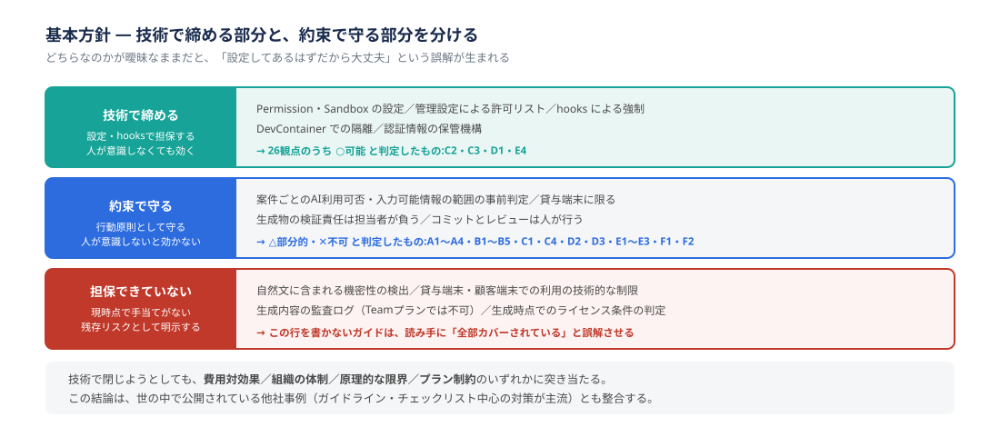
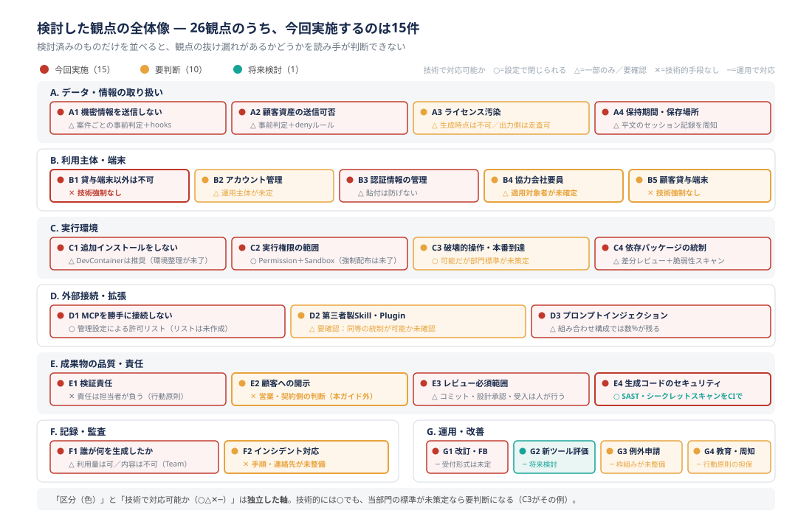

# 章④　セキュリティ・ガバナンス ― 何を守る必要があるのか

> **本章は未公開のドラフトです。** 内容は当部門の検討結果を整理したものであり、**まだ正式な規程として発効していません。** 各観点には「🟡 要判断」として判断が未了のものが含まれ、末尾の執筆メモに公開前に解決すべき事項を列挙しています。現時点では**検討の叩き台**として読んでください。

| 項目 | 内容 |
| --- | --- |
| 版 | ドラフト v0.1 |
| 発効日 | 未定（公開前に確定） |
| 文書オーナー | AI推進WG |
| 適用対象者 | ※要確認（自社社員のみか、協力会社要員を含むか。B4で扱います） |
| 前提プラン | **Claude Team プラン**（本章の技術的制約はこのプランを前提としています） |

---

## 4-1. この章で扱うこと

[章②](02_Claudeの機能一覧.md) の §2-12 では、Claude Codeに**標準で備わっている**保護機構とAnthropicのデータポリシーを扱いました。本章が扱うのは、**その土台の上に当部門が独自に積み増す約束事**です。

**この章は情報システム部門向けの施策文書ではありません。** 想定読者は開発者であり、内容は**現場の行動原則**を中心に構成しています。管理者側の作業には **［管理者作業］** と明記します。

**なぜ行動原則が中心になるのか**

理想は「仕組みで防ぐ」ことです。しかし調査の結果、**多くの観点は技術だけでは閉じない**ことが分かりました。技術で閉じられない部分は、人が守る約束として書くしかありません。この結論は、世の中で公開されている他社事例（ガイドライン・チェックリスト中心の対策が主流）とも整合します。

したがって本章は、**「技術で締める部分」と「約束で守る部分」を明示的に分けて書きます。** どちらなのかが曖昧なままだと、「設定してあるはずだから大丈夫」という誤解が生まれます。

**各観点の書き方**

各観点は次の3行の表で始めます。

| 行 | 意味 |
| --- | --- |
| **目的** | **ツールに依存しない、達成したいこと。** 将来ツールが増えてもこの行は変わりません |
| **技術で対応可能か** | ○△✕ の判定（見方は §4-3） |
| **現時点の実現方法** | **Claude Code での具体策。** ツールが増えたらこの行を追加していきます |

目的と実現方法を分けている理由は、**GitHub Copilot・Codex が利用可能になったときに、目的の行を変えずに実現方法だけを追加できる**ようにするためです（§4-10 の G2 も参照）。

続いて **「開発者がやること」**（【必須】／【推奨】を明記）と **「残存リスク」** を書きます。

**この章の読み方**

- **§4-3の全体像から入ってください。** 検討した観点をすべて並べ、そのうち今回実施する範囲がどこかを示しています
- **明日から何を守るのかだけ知りたい場合は §4-13 のチェックリストへ**進んでください
- [章③](03_開発に役立つTips.md) で扱った技術的な手段の設定方法は、本章では繰り返しません。該当節を参照してください

**この章より優先されるもの**

| 優先されるもの | 理由 |
| --- | --- |
| **顧客との契約・合意事項** | 契約が優先されます。本章より厳しい制約が課される案件があります |
| **全社の情報セキュリティ規程** | 規程が優先されます。本章は規程の範囲内での運用指針です |

本章はこの2つに従属します。**判断に迷う場合は独断で進めず、§4-12 の相談先に確認してください。**

---

## 4-2. 基本方針：仕組みで防ぐことを志向しますが、技術だけでは閉じません

方針は3つあります。

### （1）可能な限り仕組みで防ぐ

現場の自主性に委ねると目的達成が難しくなります。設定で防げるものは設定で防ぎます。

これは §3-9 で述べた確実性の3層（説得＝CLAUDE.md／フィルタ＝Permission／強制＝hooks）の考え方と同じです。**「必ず守ってほしい」と書きたくなったら、それは説得では足りないというサイン**だと考えてください。

**ただし、現時点ではこの方針を徹底できていません。** 設定で閉じられると判定した観点であっても、管理設定（managed settings）による全員への強制配布が未了のため、**実効性は各開発者が設定するかどうかに依存しています。** これは C3・G3 の判断待ち事項です。

### （2）完全な技術強制は目指さない

技術で閉じようとすると、次のいずれかに突き当たります。

| 突き当たる壁 | 例 |
| --- | --- |
| 費用対効果が悪い | 全文の自動マスキングは、現場に工数負担をかける割に効果が限定的です |
| 組織の体制上できない | SSO統合は全社クラウド基盤側の対応が必要で、現時点では困難です |
| 原理的に検出できない | 自然文に含まれる機密性、生成時点でのライセンス条件の判定 |
| プラン制約 | 内容込みの監査ログは Enterprise 限定機能で、**当部門の Team プランでは取得できません** |

**技術で閉じないものを「対策済み」と書かないこと。** これが本章で最も重視している点です。

### （3）技術と約束の役割を明示的に分ける

各観点について、次の3つを分けて書きます。

- **技術で締める部分** ── 設定・hooksで担保します。設定さえすれば人が意識しなくても効きます
- **約束で守る部分** ── 行動原則として守ります。人が意識しないと効きません
- **担保できていない部分** ── **全観点に「残存リスク」として明記します**

3つ目を書くことが重要です。**残存リスクを明示しないガイドは、読み手に「全部カバーされている」と誤解させます。**

---

## 4-3. 観点の全体像 ― 何を検討し、今回どこまで実施するか

**まず観点を網羅的に並べます。** 検討済みのものだけを列挙すると、観点の抜け漏れがあるかどうかを読み手が判断できないためです。

### 2つの軸を混同しないでください

本章の表には**独立した2つの軸**があります。

| 軸 | 意味 |
| --- | --- |
| **区分**（🔴🟡🟢） | 当部門が**今回どこまでやるか**。組織の意思決定の話です |
| **技術で対応可能か**（○△✕─） | **技術的に閉じられるか**。製品・環境の性質の話です |

この2つは独立です。**「技術的には○だが、標準が未策定なので🟡」**という組み合わせがあり得ます（C3がその例）。

### 区分（🔴🟡🟢）の意味

| 区分 | 意味 |
| --- | --- |
| 🔴 **今回実施** | 本章で行動原則・設定方針を定めます |
| 🟡 **要判断** | 観点として認識していますが、実施するかの判断が未了です。判断者と論点、**決まるまでの暫定運用**を明示します |
| 🟢 **将来検討** | 今回のスコープ外です。理由を明示します |

### 「技術で対応可能か」（○△✕─）の意味

| 表記 | 意味 |
| --- | --- |
| ○ **可能** | 設定で閉じられます。**設定すれば**人が意識しなくても効きます |
| △ **部分的** | 一部は設定で閉じられますが、残りは行動原則が必要です |
| ✕ **不可** | 現時点で技術的手段がありません。行動原則のみで担保します |
| △ **要確認** | 技術的手段の有無自体が未確認です |
| ─ **該当なし** | 技術ではなく、運用・手続きの整備で対応する観点です |

### 全26観点

| # | 観点 | 技術で対応可能か | 区分 | 節 |
| --- | --- | --- | --- | --- |
| **A. データ・情報の取り扱い** | | | | |
| A1 | 個人情報・機密情報を送信しない | △ 部分的 | 🔴 今回実施 | §4-4 |
| A2 | 顧客資産（コード・設計書・受領データ）の外部送信可否 | △ 部分的 | 🔴 今回実施 | §4-4 |
| A3 | 生成物のライセンス汚染を防ぐ | △ 部分的 | 🟡 要判断 | §4-4 |
| A4 | データの保持期間・保存場所を把握する | △ 部分的 | 🔴 今回実施 | §4-4 |
| **B. 利用主体・端末** | | | | |
| B1 | 貸与端末以外での利用・私的利用をしない | **✕ 不可** | 🔴 今回実施 | §4-5 |
| B2 | アカウントの発行・削除を管理する | △ 部分的 | 🟡 要判断 | §4-5 |
| B3 | 認証情報を安全に管理する | △ 部分的 | 🔴 今回実施 | §4-5 |
| B4 | 協力会社・業務委託要員の利用可否を定める | △ 部分的 | 🟡 要判断 | §4-5 |
| B5 | 顧客貸与端末・顧客環境での利用可否を定める | **✕ 不可** | 🟡 要判断 | §4-5 |
| **C. 実行環境** | | | | |
| C1 | ローカル端末への追加インストールをしない | △ 部分的 | 🔴 今回実施 | §4-6 |
| C2 | 実行権限の範囲を定める | ○ 可能 | 🔴 今回実施 | §4-6 |
| C3 | 破壊的操作・本番環境への到達を防ぐ | ○ 可能 | 🟡 要判断 | §4-6 |
| C4 | エージェントが追加する依存パッケージを統制する | △ 部分的 | 🔴 今回実施 | §4-6 |
| **D. 外部接続・拡張** | | | | |
| D1 | 外部サービス（MCP）を勝手に接続・操作しない | ○ 可能 | 🔴 今回実施 | §4-7 |
| D2 | 第三者製のSkill・Pluginを無検証で持ち込まない | △ 要確認 | 🟡 要判断 | §4-7 |
| D3 | プロンプトインジェクションに備える | △ 部分的 | 🔴 今回実施 | §4-7 |
| **E. 成果物の品質・責任** | | | | |
| E1 | 生成物の検証責任を明確にする | ✕ 不可 | 🔴 今回実施 | §4-8 |
| E2 | 生成物であることを顧客に開示するか | ✕ 不可 | 🟡 要判断 | §4-8 |
| E3 | レビュー必須の範囲を定める | △ 部分的 | 🔴 今回実施 | §4-8 |
| E4 | 生成コードのセキュリティ品質を担保する | ○ 可能 | 🔴 今回実施 | §4-8 |
| **F. 記録・監査** | | | | |
| F1 | 誰が・どのモデルで・何を生成したかを追える | △ 部分的 | 🔴 今回実施 | §4-9 |
| F2 | インシデント発生時の対応手順を持つ | ✕ 不可 | 🟡 要判断 | §4-9 |
| **G. 運用・改善** | | | | |
| G1 | ガイドを改訂し、フィードバックを受け付ける | ─ 該当なし | 🔴 今回実施 | §4-10 |
| G2 | 新しいツールを追加するときの評価手順を持つ | ─ 該当なし | 🟢 将来検討 | §4-10 |
| G3 | 例外申請・逸脱管理の仕組みを持つ | ─ 該当なし | 🟡 要判断 | §4-10 |
| G4 | 利用開始前の教育・周知を行う | ─ 該当なし | 🟡 要判断 | §4-10 |

### 区分の集計

| 区分 | 件数 | 観点 |
| --- | --- | --- |
| 🔴 今回実施 | **15** | A1・A2・A4・B1・B3・C1・C2・C4・D1・D3・E1・E3・E4・F1・G1 |
| 🟡 要判断 | **10** | A3・B2・B4・B5・C3・D2・E2・F2・G3・G4 |
| 🟢 将来検討 | **1** | G2 |
| **計** | **26** | |

### 🟡 要判断の10観点について

**これらは当部門の企画段階では検討が及んでいなかった、または判断者が本ガイドの範囲外にある観点です。** 本章では観点として提示し、判断に必要な論点と**決まるまでの暫定運用**を整理するにとどめます。実施するかどうかは、計画へのブレイクダウン時に決定します。

**暫定運用の原則は1つです。**

> **判断が未了の領域では、迷ったら止めて §4-12 に相談してください。**「明示的に禁止されていないから可」とは読まないでください。

### 本章に入れていない観点

網羅性の判断材料として、**検討したが本章に節を立てていない観点**も挙げておきます。いずれも今後の追加候補です。

| 観点 | 本章で扱わない理由 |
| --- | --- |
| 個人データの越境移転・第三者提供（法令要件） | 全社の情報セキュリティ規程および法務の領域です。案件ごとの判定（A1・A2）で個別に確認します |
| 端末側の前提コントロール（ディスク暗号化・MDM・リモートワイプ） | 全社の端末管理施策の領域です。ただしA4の平文セッション記録はこれに依存します |
| 利用上限・濫用防止（暴走ループによる大量課金） | F1の利用実績確認で検知する想定です。閾値・停止条件は未整備です |
| 顧客からのデータ削除請求への対応 | F2のインシデント対応と併せて整理が必要です |
| 退職・離任時のローカルデータ（セッション記録）の消去 | B2のアカウント管理とA4を繋ぐ論点です。未整理です |
| 証跡（Gitの履歴・文書）の保存期間と保全責任 | F1の追跡可能性の前提ですが、案件の文書管理規定に従う想定です |

---

## 4-4. 【A】データ・情報の取り扱い

### A1. 個人情報・機密情報を送信しない　🔴 今回実施

| | |
| --- | --- |
| **目的** | AIサービスに送信してよい情報の範囲を守る |
| **技術で対応可能か** | △ 部分的（構造化パターンのみ。自然文は不可） |
| **現時点の実現方法** | 案件ごとの事前判定を軸とし、hooksによる構造化パターンの検知を補助に使う |

**なぜ全文マスキングを採用しないのか**

送信内容**全体**を自動でマスキングする方式は検討しましたが、**費用対効果が悪く、現場に工数負担をかける**ため見送りました。誤検知による作業中断とマスキング漏れの両方が発生し、「マスキングがあるから安心」という誤った安心感だけが残るおそれがあります。

**これは後述の hooks によるパターン置換とは別の話です。** 違いは対象範囲です。

| 方式 | 対象 | 判定 |
| --- | --- | --- |
| 全文の自動マスキング | プロンプト全体を意味解析して機密性を判定 | **見送り。**誤検知が多く工数負担が大きい |
| hooksによるパターン置換 | メールアドレス等の**書式が決まった文字列のみ** | **採用（推奨）。**判定が確定的で誤検知が少ない |

軸とするのは、**案件（契約）ごとにAI利用可否と入力可能な情報の範囲を事前に判定する運用**です。判断基準には顧客のセキュリティ規約と、自社の **ISC**（※正式名称を要確認）相談資料を用います。

これは [章0](00_はじめに.md) の §0-5 が本章に委ねた論点です。「利用が認められているサービスに、業務情報やソースコードをどこまで入力してよいか」への回答がここにあたります。

**開発者がやること**

1. **【必須】案件に入ったら、AI利用の可否と入力可能な情報の範囲を確認します。** 確認していない状態で使い始めないでください
2. **【必須】判断がつかない情報が出てきたら、送信せずに §4-12 に相談します**
3. **【推奨】判定結果をプロジェクト内で共有します**（CLAUDE.mdに書くのは有効ですが、§3-9 のとおりCLAUDE.mdは説得の層です。判定そのものは人が守ります）
4. **【推奨】hooksによるパターン置換を導入します**（下記）

**hooksによるパターン置換（推奨）**

hooks（§3-9）の `UserPromptSubmit` / `PreToolUse` を使い、構造化されたパターンを自動検知・置換できます。

| 検知できるもの | 検知できないもの |
| --- | --- |
| メールアドレス、電話番号、マイナンバー等の**書式が決まった情報** | 自然文に含まれる機密性（「A社の来期の方針は〜」等） |

導入を【必須】ではなく【推奨】としているのは、テンプレートの整備が未了だからです（執筆メモ参照）。整備後に【必須】へ格上げすることを想定しています。

**［管理者作業］** hooksテンプレートの整備と配布。管理設定による全員への強制配布を行うかは G3 の判断事項です。

**残存リスク**

- **自然文に含まれる機密情報の送信は、技術的に防げていません。** ここは完全に行動原則に依存しています
- hooks は【推奨】であるため、**既定の状態では技術的に何も閉じていません**
- 案件ごとの判定の**成果物・記録先・有効期間が未定義**です。案件途中でスコープが変わった場合の再判定の要否も定めていません（執筆メモ参照）

---

### A2. 顧客資産の外部送信可否　🔴 今回実施

| | |
| --- | --- |
| **目的** | 顧客から預かったコード・設計書・データを、契約の範囲を超えて外部に出さない |
| **技術で対応可能か** | △ 部分的（指定したパスのみ拒否できる） |
| **現時点の実現方法** | A1と同じ案件ごとの事前判定。加えてワークツリーの内容管理とPermissionの `deny` ルール |

**A1と分けている理由**

A1は「個人情報・機密情報」という情報の**性質**の話ですが、A2は**所有者が顧客である**ことが論点です。個人情報を含まないソースコードであっても、顧客資産であれば送信可否は契約次第です。

さらにClaude Codeの場合、**エージェントはワークツリー内のファイルを読みます。** 「送信しないつもりだった」ファイルが、調査の過程で読み込まれて送信される、という経路があります。

**「顧客資産」に含まれるもの**

判断に迷いやすいため、範囲を明示します。以下はすべて顧客資産として扱ってください。

- 受領したソースコード・設計書・データ
- 顧客環境で取得したログ・画面キャプチャ・エラーメッセージ
- 打合せ議事録、顧客の内部方針が書かれた資料
- 顧客のシステム構成・IPアドレス・ホスト名等の環境情報

**開発者がやること**

1. **【必須】リポジトリに顧客受領データを置かないでください。** 必要な場合は、AI利用可否の判定を受けてから置きます
2. **【必須】`.env`・認証鍵・証明書・接続情報がワークツリーにある場合、`.gitignore` と Permission の `deny` ルールの両方**で対象外にします（§3-7）
3. **【必須】複数案件を掛け持つ場合、案件ごとに作業ディレクトリを分けます。** 1つのディレクトリツリーに複数顧客の資産を同居させないでください

**残存リスク**

- **`deny` ルールは指定したパスにしか効きません。** 想定していない場所に置かれた顧客資産は読まれます。ワークツリーの中身を把握しているのは人だけです
- 部門標準の `deny` ルールセットが未策定のため（C3）、**各開発者が自分でルールを書いている状態です**

---

### A3. 生成物のライセンス汚染を防ぐ　🟡 要判断

| | |
| --- | --- |
| **目的** | 納品物に、ライセンス条件のあるコードが意図せず混入することを防ぐ |
| **技術で対応可能か** | △ 部分的（**生成時点の判定は不可。出力側の走査は可能**） |
| **現時点の実現方法** | 未定。既存のライセンススキャン工程への組み込みが候補 |

**なぜ観点として挙げるのか**

エージェントが生成したコードが、学習データに由来する特定のライセンス下のコードと実質的に同一である可能性を、**生成する瞬間に**検出する手段はありません。一方、**出来上がったコードに対するライセンススキャンは技術的に可能**です。判定を △ としているのはこの非対称性のためです。

**SI業務では納品物の権利関係が契約上の問題になりうるため、観点として認識しておく必要があります。**

**判断が必要な論点**

| 論点 | 判断者 |
| --- | --- |
| このリスクを当部門として管理対象とするか | 部門・法務 |
| 管理するなら、既存のOSSライセンスチェック工程に載せるか、別途手段を用意するか | 部門・案件 |
| 顧客との契約でAI生成物の権利について取り決めがあるか | 営業・契約 |

**決まるまでの暫定運用**

**【必須】案件で既にOSSライセンスチェックの工程がある場合は、AIが生成したコードもその対象に含めてください。** 工程がない案件では、新たに立てる必要はありません（判断が未了のため）。

判定の線引きが主観的になる点は認識しています。「特徴的なアルゴリズム実装」といった基準では判断できないという指摘は妥当であり、**具体的な判定基準の策定は判断事項に含めます。**

**残存リスク**

- **生成時点での検出手段はありません。** 出力側のスキャンに依存します
- スキャン工程がない案件では**何も担保されていません**
- 発覚が納品後になりうる点は F2 の想定事象に含めています

---

### A4. データの保持期間・保存場所を把握する　🔴 今回実施

| | |
| --- | --- |
| **目的** | 送信した情報がいつまで残るかを把握し、説明できる状態にする |
| **技術で対応可能か** | △ 部分的 |
| **現時点の実現方法** | §2-12 のポリシーを前提とし、ローカルのセッション記録を運用対象として扱う |

§2-12 で扱ったとおり、次の状態にあります。

| 対象 | 状態 |
| --- | --- |
| モデルの学習利用 | Team/Enterpriseプランでは、組織が明示的に同意しない限り学習に利用されません（**当部門はTeamプランのため、同意しない限り学習されません**） |
| ローカルのセッション記録 | `~/.claude/projects/` 配下に**平文で保存**され、既定では30日間保持されます |
| ZDR（Zero Data Retention） | **Enterpriseプラン限定**の機能で、組織単位のリクエストにより有効化します。**当部門はTeamプランのため、現時点では利用できません** |

**保存先（リージョン・国）は本ガイドでは未整理です。** 顧客に「どこに残るか」を説明する必要が生じた場合は、自己判断せず §4-12 に相談してください（執筆メモ参照）。

**開発者がやること**

**ローカルのセッション記録が平文であることを理解してください。** ここには、送信したプロンプト・読み込んだファイルの内容・エージェントの出力が含まれます。

1. **【必須】端末の紛失・盗難時は、セッション記録も漏洩対象として報告します**（F2）
2. **【必須】業務アカウントでログインした端末を他者と共有しないでください**（B1と同じ趣旨です）
3. **【推奨】案件の終了時に、その案件のセッション記録の扱いを §4-12 に確認します**

3番目を【推奨】にとどめているのは、**削除の手順・可否が未整理**だからです。現時点では「30日で自動的に消える」という既定動作に依存しています。

**残存リスク**

- **送信済みの情報は取り消せません。** 誤送信は後から回収できません
- **ローカルの平文セッション記録は、端末が保護されていることを前提としています。** ディスク暗号化・画面ロックは全社の端末管理施策に依存しており、本章では担保していません
- Anthropic側の**保存先（リージョン・越境移転の有無）が未整理**です。顧客監査に出せる状態にありません
- ZDRは Team プランでは利用できません（移行の検討は §4-11）

---

## 4-5. 【B】利用主体・端末

### B1. 貸与端末以外での利用・私的利用をしない　🔴 今回実施

| | |
| --- | --- |
| **目的** | 業務用のAI利用が、管理された端末・ネットワークの範囲内で行われる状態にする |
| **技術で対応可能か** | **✕ 不可（現時点で技術強制がありません）** |
| **現時点の実現方法** | **行動原則のみ。** 技術的な担保は将来の組織課題として切り出します |

**技術的に締められていない、という事実を先に書きます**

Teamプランの認証は**メールアドレスによるOAuth**（※認証方式の詳細は要確認）であり、**端末・ネットワークの制約が技術的にかかっていません。** つまり、貸与端末以外からでも、社内ネットワーク外からでもログインできてしまいます。

理想はSSO（シングルサインオン）の有効化ですが、**全社クラウド基盤へのSSO統合は情報システム部門の体制上、現時点では困難です。**

**判定を ✕ にしている理由**：一部でも設定で閉じられる部分がないため、△（部分的）ではなく ✕ が正確です。**この観点は完全に約束の領域です。**

**開発者がやること**

対象は **Claude Code に限らず、業務用のAIサービス全般**です。

1. **【必須】業務アカウントでのAIサービスの利用は、会社貸与端末に限ります**（Claude Code の CLI・Desktop・IDE拡張・Web・Mobile のいずれも同じです）
2. **【必須】業務アカウントを私的な用途に使わないでください**
3. **【必須】私物端末に業務アカウントでログインしないでください**
4. **【必須】業務アカウントでログインした端末を他者と共有しないでください**

§3-6 で述べたとおり、**Desktop版・Mobileはどの端末からでも使えてしまいます。** 入り口が増えるほどこの原則が効きにくくなるため、意識して守る必要があります。**「Desktop版だから」「Mobileだから」という例外はありません。**

**顧客から貸与された端末での利用は B5 で扱います**（判断が未了です）。

**［管理者作業］軽量な代替案**

SSOより軽い手段として、**ドメイン検証のみで完結する「ドメインキャプチャ」機能**（※機能の詳細は要確認）が選択肢として残っています。これが当部門の要件を満たすかは未確認であり、情報システム部門への相談事項としています。

**残存リスク**

- **この観点は技術的に何も担保されていません。** 破られても検知する手段がありません
- 「業務時間外の自己学習は私的利用にあたるか」といった**「私的利用」の定義が未整理**です（執筆メモ参照）

---

### B2. アカウントの発行・削除を管理する　🟡 要判断

| | |
| --- | --- |
| **目的** | 利用資格のない者がアクセスできる状態を残さない |
| **技術で対応可能か** | △ 部分的（**削除操作は可能。いつ削除するかは運用**） |
| **現時点の実現方法** | 未定。運用主体と手順が定まっていません |

**なぜ観点として挙げるのか**

B1で述べたとおり、認証はメールアドレスによるOAuthです。**退職・異動・案件離任時にアカウントを無効化する運用がないと、アクセス可能な状態が残ります。**

**判断が必要な論点**

| 論点 | 判断者 |
| --- | --- |
| アカウントの発行・削除を誰が行うか | 部門・情報システム部門 |
| 人事異動情報とどう連動させるか（手動運用か、定期棚卸しか） | 部門 |
| 案件離任時にアカウントを維持するか、案件単位で管理するか | 部門 |
| 退職・離任時に端末上のセッション記録（A4）をどう扱うか | 部門 |

**決まるまでの暫定運用**

**【必須】異動・離任・退職の際は、自分のアカウントの扱いを §4-12 に申し出てください。** 運用が未整備であるため、本人からの申し出が唯一の起点になります。

**［管理者作業］** この観点は主に管理者側の運用です。

**残存リスク**

- **棚卸しの運用がないため、申し出のないアカウントは残り続けます**
- 端末上のローカルデータ（A4）の消去は観点として立っていません

---

### B3. 認証情報を安全に管理する　🔴 今回実施

| | |
| --- | --- |
| **目的** | AIサービスおよび連携先の認証情報が漏洩しない状態にする |
| **技術で対応可能か** | △ 部分的（**保管は製品が担保。プロンプトへの貼付は防げません**） |
| **現時点の実現方法** | 製品標準の保管機構を使い、設定ファイルに直接書かない |

§2-12 のとおり、Claude Code自身のAPIキー等は**macOSではKeychain、Windows/Linuxではファイル権限で保護されます。** ここは製品が面倒を見てくれる部分です。

問題になるのは、**開発者が自分で追加する認証情報**です。**プロンプトに貼り付けた認証情報を設定で防ぐ手段はないため、判定は ○ ではなく △ です。**

**開発者がやること**

| 対象 | やること |
| --- | --- |
| MCPサーバーの認証トークン | **【必須】** `.mcp.json` に直接書かず、環境変数経由で参照します（§3-5） |
| `.env` 等の接続情報 | **【必須】** `.gitignore` と Permission の `deny` ルールの両方で対象外にします（§3-7） |
| DevContainer | **【必須】** 認証情報をイメージに焼き込まず、マウントで渡します（§3-7） |
| プロンプト | **【必須】** 認証情報をプロンプトに貼らないでください |

最後の行が見落とされやすい箇所です。**「一度だけ貼って試した」認証情報は、`~/.claude/projects/` 配下に平文で残ります**（A4）。

**残存リスク**

- **プロンプトへの貼り付けは技術的に防げません。** 完全に行動原則に依存しています
- 貼ってしまった場合、セッション記録から消す手順が未整理です（A4）

---

### B4. 協力会社・業務委託要員の利用可否を定める　🟡 要判断

| | |
| --- | --- |
| **目的** | AIエージェントを使える人の範囲を、契約と秘密保持の連鎖の中で整合させる |
| **技術で対応可能か** | △ 部分的（アカウント発行を絞れば締まるが、判断は運用） |
| **現時点の実現方法** | 未定。**本章の適用対象者そのものが確定していません** |

**なぜ観点として挙げるのか**

当部門のSI業務では、協力会社・業務委託・派遣の要員が開発に参画します。**この観点が定まっていないと、本章の行動原則が誰に適用されるのかが決まりません。** 冒頭の文書メタ情報で「適用対象者：※要確認」としているのはこのためです。

さらに、再委託と秘密保持の連鎖に直結します。顧客資産（A2）を扱う要員が、当部門の管理外のアカウントでAIサービスを使う経路が残っていると、A1・A2の判定が実質的に機能しません。

**判断が必要な論点**

| 論点 | 判断者 |
| --- | --- |
| 協力会社要員に当部門のアカウントを貸与するか | 部門・契約 |
| 要員が自社（協力会社側）のAI契約を使うことを認めるか | 部門・契約・顧客 |
| 認める場合、本章の行動原則をどう遵守させるか（契約に織り込むか） | 契約・法務 |
| 顧客との契約で再委託先のAI利用が制限されていないか | 営業・契約 |

**決まるまでの暫定運用**

**【必須】協力会社・業務委託要員にAIエージェントを使わせる場合は、事前に §4-12 に相談してください。** 判断が未了のため、「明示的に禁止されていないから可」とは読まないでください。

**残存リスク**

- **本章の適用対象者が未確定です。** 協力会社要員が本章を守る義務があるのかどうかが定まっていません
- 要員が自社契約のAIサービスを使う経路は、当部門から把握・統制できません

---

### B5. 顧客貸与端末・顧客環境での利用可否を定める　🟡 要判断

| | |
| --- | --- |
| **目的** | 顧客の管理下にある端末・ネットワーク・テナントでのAI利用を、顧客との合意の範囲に収める |
| **技術で対応可能か** | **✕ 不可**（B1と同じ理由。端末を技術的に区別できません） |
| **現時点の実現方法** | 未定 |

**なぜ観点として挙げるのか**

B1は「**自社**貸与端末に限る」という原則ですが、SI業務では**顧客から端末を貸与される**、顧客のVDI・顧客クラウドテナント上で作業する、という形態が日常的に発生します。B1の原則はこのケースに答えていません。

論点はB1と逆向きです。B1は「管理された端末で使う」ことが目的ですが、顧客貸与端末は**顧客の管理下**にあり、当部門の統制も顧客の統制も中途半端に効く状態になります。

**判断が必要な論点**

| 論点 | 判断者 |
| --- | --- |
| 顧客貸与端末での業務アカウント利用を認めるか | 部門・営業・顧客 |
| 顧客のネットワーク・テナント上での利用を認めるか | 部門・営業・顧客 |
| 顧客側の資産管理・ソフトウェア持ち込み規定との整合をどう取るか | 案件・営業 |
| 認める場合、顧客の明示的な合意を必須とするか | 営業・契約 |

**決まるまでの暫定運用**

**【必須】顧客貸与端末・顧客環境でAIエージェントを使う場合は、事前に §4-12 と営業に相談してください。** これは A1・A2 の案件ごとの判定と同じタイミングで確認できます。

**残存リスク**

- **技術的に区別できません。** 顧客貸与端末でログインしても検知されません
- 顧客側の規定に違反した場合、契約上の問題に直結します

---

## 4-6. 【C】実行環境

### C1. ローカル端末への追加インストールをしない　🔴 今回実施

| | |
| --- | --- |
| **目的** | ホスト端末の資産管理を維持したまま、開発を停滞させない |
| **技術で対応可能か** | △ 部分的（**Permissionでインストールコマンドを制限できますが、推奨と承認判断に依存します**） |
| **現時点の実現方法** | DevContainer（開発コンテナ）での実行を推奨し、Permissionでホスト側のインストールを `ask` にする |

**なぜこの観点が必要になるのか**

Claude Codeは、作業に必要なツールが不足していると**自分でインストールしようとします。** これはホスト端末の資産管理（許可されたソフトウェアのみを入れる運用）と正面から衝突します。

止めるだけでは開発が停滞します。**ホスト側は統制を維持し、コンテナ内では必要なツールを自由に導入できる**という形にするのが、統制と開発速度の両立になります。

**開発者がやること**

1. **【推奨】DevContainerを使います。** 設定方法・前提ソフト・社内プロキシの扱いは §3-7 を参照してください
2. **【必須】ホスト側に開発ツールを追加インストールしないでください**
3. **【必須】エージェントがホスト側へのインストールを提案してきたら、承認しないでください。** コンテナ側で解決します

**DevContainerを【必須】ではなく【推奨】にしている理由**

**実行環境の整理が未了です。** DevContainerには Docker Desktop 等の環境構築が必要であり、**企業規模によっては有償ライセンスが発生します。** 無償の代替構成も存在しますが、当部門としてどれを使うかが決まっていません（執筆メモ参照）。

**整理が完了するまでは、2番目・3番目の【必須】だけを守ってください。** DevContainerが使えない環境では、必要なツールの導入を案件のインフラ担当に依頼する形になります。

**残存リスク**

- **DevContainerが【推奨】であるため、ホスト側で作業している開発者に対しては、承認判断（3番目）だけが歯止めになっています**
- 実行環境（ライセンス）の整理が未了のため、**明日から全員が実行できる状態にありません**

---

### C2. 実行権限の範囲を定める　🔴 今回実施

| | |
| --- | --- |
| **目的** | エージェントが触れてよい範囲を、作業前に定めた境界の中に収める |
| **技術で対応可能か** | ○ 可能 |
| **現時点の実現方法** | Permission と Sandbox を組み合わせます（§2-10、§3-7） |

**当部門の方針**

| 項目 | 方針 | 区別 |
| --- | --- | --- |
| Permission | 常に設定します。すべての土台です | **【必須】** |
| Sandbox | 有効化します | **【必須】** |
| 詰まったときの対処 | 無効化せず、許可ドメインを設定に追加します | **【必須】** |
| `--dangerously-skip-permissions` 等の全許可オプション | 対話利用では使いません | **【必須】** |
| 許可ドメインの一覧 | Git管理してレビュー対象にします | **【推奨】** |

**許可ドメインの一覧のGit管理を【推奨】にしているのは、実施主体（個人／プロジェクト／部門）が定まっていないためです。** プロジェクト単位で運用する場合はリポジトリの `.claude/settings.json` に置き、レビュー対象に含めるのが現実的です。

**CI・ヘッドレス実行の扱い**

`--dangerously-skip-permissions` の禁止は**対話利用を前提とした原則**です。CI（GitHub Actions等）での非対話実行では対話承認が成立しないため、この原則をそのまま適用できません。

**【必須】CI・ヘッドレスでエージェントを実行する場合は、事前に §4-12 に相談してください。** 本章はCI利用の統制を整理できていません（G3の例外申請の枠組みが必要な領域です）。

**Sandboxの限界を理解してください**

§2-10 のとおり、**Sandboxの対象はBashツールのみ**であり、`Read`・`Write`・`Edit` は対象外です。この差はPermissionで埋めます。「Sandboxを有効にしたからファイルは安全」ではありません。

また、通信がブロックされた際に**「Sandboxing機能を無効にしますか」という選択肢が提示される**ことが報告されています。**安全のために入れた機能が、詰まった瞬間に無効化という抜け道を提示してきます。**

**［管理者作業］** 管理設定（managed settings）による設定の強制配布を行うかは G3 の判断事項です。

**残存リスク**

- **管理設定による強制配布が未了のため、実効性は各開発者が設定するかどうかに依存しています。** ○（設定で閉じられる）という判定は「設定すれば効く」という意味であり、「全員に効いている」という意味ではありません
- **具体的に何を `deny` するかの標準が未策定です**（C3）
- CI・ヘッドレス利用の統制が未整理です

---

### C3. 破壊的操作・本番環境への到達を防ぐ　🟡 要判断

| | |
| --- | --- |
| **目的** | 取り返しのつかない操作、および本番環境への到達を防ぐ |
| **技術で対応可能か** | ○ 可能（Permission の `deny` と Sandbox の通信制限） |
| **現時点の実現方法** | 未定。**部門標準の `deny` ルールセットが定まっていません** |

**技術的には ○ ですが、区分は 🟡 です。** 手段はあるが、当部門としての標準を決めていないためです（§4-3 の「2つの軸」を参照）。

**なぜ観点として挙げるのか**

C2で権限の枠組みは定めましたが、**「具体的に何を拒否するか」の標準がありません。** 個々の開発者が自分で `deny` ルールを書いている状態では、抜けが生じます。

**候補となる対策（案）**

| 対象 | 手段 |
| --- | --- |
| `git push --force`、ブランチ削除、履歴改変 | Permission の `deny` ルール |
| 本番環境のエンドポイントへの通信 | Sandbox の `network.allowedDomains` に含めない |
| 本番の接続情報 | エージェントの手が届く場所に置かない（A2・B3と重なります） |
| データベースの破壊的操作 | 接続情報を渡さない。渡す場合は読み取り専用の資格情報にする |

**判断が必要な論点**

| 論点 | 判断者 |
| --- | --- |
| 部門標準の `deny` ルールセットを定めるか、案件ごとに任せるか | 部門 |
| 定めるなら、管理設定で配布して個人が緩められないようにするか | 部門・管理者 |
| 本番環境へのアクセスを伴う作業で、エージェントの利用を認めるか | 部門・案件 |

**決まるまでの暫定運用**

1. **【必須】本番環境の接続情報を、エージェントが読める場所に置かないでください。** これは設定がなくても今日から守れる原則です
2. **【必須】本番環境に接続した状態でエージェントを動かす場合は、事前に §4-12 に相談してください**

標準が来るまで各開発者が `deny` ルールをゼロから設計するのは現実的でないという指摘は妥当です。**上記2点だけを暫定の必須とし、ルールセットの策定を判断事項に含めます。**

**残存リスク**

- **標準が未策定のため、`deny` ルールの網羅性は担保されていません**
- 各開発者の設定に依存するため、抜けが生じることを前提としています

---

### C4. エージェントが追加する依存パッケージを統制する　🔴 今回実施

| | |
| --- | --- |
| **目的** | エージェントが追加した依存関係が、サプライチェーン上のリスクにならない状態にする |
| **技術で対応可能か** | △ 部分的（差分レビューと既存のスキャンで対応。追加自体は止めにくい） |
| **現時点の実現方法** | 依存ファイルの差分を人がレビューし、既存の脆弱性スキャンの対象に含める |

**なぜ観点として挙げるのか**

C1が扱うのは**ホスト端末へのインストール**ですが、エージェントは `package.json`・`requirements.txt`・`go.mod` 等に**依存を追加します。** これは別の経路です。

AIエージェント特有のリスクが2つあります。

| リスク | 内容 |
| --- | --- |
| **存在しないパッケージ名の提案** | ①4節のハルシネーションにより、実在しないパッケージ名を提案することがあります |
| **タイポスクワッティング** | 実在する著名パッケージに似た名前の悪意あるパッケージを掴む可能性があります |

D3で「悪意あるnpmパッケージ」を脅威として挙げている一方、**その侵入経路であるパッケージ追加を統制しないのは筋が通りません。** そのため観点として立てています。

**開発者がやること**

1. **【必須】依存ファイル（`package.json`・`package-lock.json` 等）の差分を、人がレビューします。** §3-3 の「1タスク＝1コミット」を守っていれば、追加が差分として見えます
2. **【必須】追加されたパッケージ名を確認します。** 見慣れない名前は、公開元・ダウンロード数・最終更新を確認してください
3. **【推奨】依存脆弱性スキャンをCIで実行します**（E4と同じ仕組みに乗せられます）

**残存リスク**

- **エージェントによる依存追加そのものを止める設定は用意していません。** レビューでの検出に依存しています
- レビューが形式的になれば機能しません（E3と同じ構造の問題です）

---

## 4-7. 【D】外部接続・拡張

### D1. 外部サービス（MCP）を勝手に接続・操作しない　🔴 今回実施

| | |
| --- | --- |
| **目的** | 業務データを持つ外部サービスへの接続を、組織が把握・許可した範囲に限る |
| **技術で対応可能か** | ○ 可能 |
| **現時点の実現方法** | 管理設定（managed settings）による許可リスト運用 |

**統制の本質はどこにあるのか**

個別のMCP接続は認証情報が必要なため、認証情報を持たない者は実行できません。したがって、本質的な対策は**「どのMCPサーバーを追加登録できるか」自体の制限**です。ここを管理設定の許可リストで締めます。

**［管理者作業］** 許可リストの作成と、管理設定による配布。**この作業は未了です。**

**開発者がやること**

1. **【必須】業務で使うMCPサーバーを追加する前に、§4-12 に確認してください。** 許可リストが未整備のため、現時点では個別確認が唯一の手段です
2. **【必須】顧客側のJira・Google Drive等を繋ぐ場合、A1・A2の案件ごとの判定を先に受けてください。** 技術的に接続できることと、接続してよいことは別問題です
3. **【推奨】使わなくなったMCPサーバーは外します**（§3-5。コンテキスト消費の観点でもあります）

**接続先の信頼性を確認してください**

外部コンテンツを取得するMCPサーバーは、**プロンプトインジェクションの経路になりえます**（D3）。公式ドキュメントでも接続前に信頼できるサーバーかどうかを確認するよう注意喚起されています（§2-5）。

サードパーティの一覧サイトに掲載されていることは、信頼性の保証になりません。

**残存リスク**

- **許可リストがまだ存在しません。** 「許可リストにないものを追加しない」という原則は、リストが整備されるまで運用できないため、暫定として個別確認としています
- 管理設定の配布が未了のため、技術的な強制は効いていません

---

### D2. 第三者製のSkill・Pluginを無検証で持ち込まない　🟡 要判断

| | |
| --- | --- |
| **目的** | 外部から持ち込んだ拡張が、統制の抜け穴にならない状態にする |
| **技術で対応可能か** | △ 要確認（MCPと同等の管理設定で統制できるかが**未確認**） |
| **現時点の実現方法** | 未定 |

**なぜ観点として挙げるのか**

D1でMCPを許可リストで締めても、**Plugin経由で同じことができるなら穴になります。** §2-7 のとおり、**PluginはSkill・Subagent・Hooks・MCPサーバーをまとめて配布する単位**です。つまりPluginを1つ入れると、MCPサーバーとhooksが同時に入りえます。

hooksは §3-9 で述べたとおり**強制の層**であり、Claudeの判断に関係なく必ず実行されます。第三者製のhooksを無検証で入れることは、任意のコマンドの自動実行を許すことに近い行為です。

**判断が必要な論点**

| 論点 | 判断者 |
| --- | --- |
| MCPと同じ管理設定でPlugin・Skillの導入を制限できるか（**技術的に未確認**） | 部門・管理者 |
| 制限できない場合、行動原則のみで担保するか | 部門 |
| 社内マーケットプレイスを設けて、審査済みのものだけを配る運用にするか | 部門 |
| 第三者製Pluginの審査基準をどう定めるか | 部門 |

**決まるまでの暫定運用**

**【必須】第三者製のPlugin・Skillを業務環境に入れる前に、§4-12 に相談してください。**

「中身を確認してください」という指示にとどめない理由は、**hooksの内容から安全性を判定する基準を本章が示せていない**ためです。判定基準がないまま「確認した」ことにするのは実効性がありません。**審査基準の策定を判断事項に含めます。**

自作・社内製のSkillについては、**【推奨】内容が読める状態でチームに共有してください**（§3-4）。

**残存リスク**

- **技術的な統制手段の有無が未確認です**
- 審査基準がないため、判断は §4-12 への個別相談に依存しています

---

### D3. プロンプトインジェクションに備える　🔴 今回実施

| | |
| --- | --- |
| **目的** | 外部から取り込んだ内容に含まれる悪意ある指示に、エージェントが従わない状態にする |
| **技術で対応可能か** | △ 部分的（製品標準の防御はあるが、完全ではありません） |
| **現時点の実現方法** | 製品標準の防御機構（§2-12）を前提とし、リスクの高い構成を避けます |

§2-12 のとおり、Claude Codeには標準で防御機構が組み込まれています（文脈を見た判断、Web fetch専用の分離コンテキストウィンドウ、初回のコードベース・MCPサーバー追加時の信頼確認、コマンドインジェクション検知など）。

**ただしこれらは万能ではありません。** §2-12 で紹介されている第三者の実測では、コーディング作業のみの環境では成功率がほぼゼロですが、**MCPサーバー・Web取得・ブラウザ操作を組み合わせる構成では、対策を講じても数%の成功率が残る**とされています。

**開発者がやること**

| 場面 | やること |
| --- | --- |
| 外部のリポジトリ・READMEを読ませる | **【必須】** 初めて開くコードベースの信頼確認（起動時に表示される確認）を飛ばさないでください |
| Web取得・ブラウザ操作・MCPを組み合わせる | **【必須】** リスクが上がることを認識し、必要な場面に限ります |
| 外部から取り込んだ内容に基づく提案 | **【必須】** 指示が混ざっていないかを人が確認します。特に「設定を変更する」「認証情報を読む」「パッケージを追加する」提案です |

**ユーザー単位のCLAUDE.mdに注意してください**

§2-12 で紹介されているとおり、`~/.claude/CLAUDE.md` はホームディレクトリ直下にあり、**同じユーザー権限で動作するプロセス（悪意あるnpmパッケージ等）から書き換えられうる**という指摘があります。書き換えられると、**以後の全セッションで悪意ある指示が読み込まれ続けます。**

C1のDevContainer推奨と C4の依存パッケージ統制は、この経路に対しても効きます。

**残存リスク**

- **組み合わせ構成での数%は、技術的に残っています。** この残存リスクは、E1・E3・E4の「人が検証する」「機械的に走査する」で受け止める設計です
- `~/.claude/CLAUDE.md` の書き換えを検知する手段を用意していません

---

## 4-8. 【E】成果物の品質・責任

### E1. 生成物の検証責任を明確にする　🔴 今回実施

| | |
| --- | --- |
| **目的** | 生成物の品質に対する責任の所在を曖昧にしない |
| **技術で対応可能か** | ✕ 不可 |
| **現時点の実現方法** | 行動原則として明記します |

**原則**

> **エージェントが生成したものであっても、成果物の責任は担当者が負います。**

当たり前に見えますが、明記しておく必要があります。生成量が増えると、**「AIが書いたので分かりません」という状態が発生しうる**ためです。

**開発者がやること**

1. **【必須】自分が説明できないコードをコミットしないでください。** 説明できるまで読む、または作り直します
2. **【必須】エージェントの指摘の採否は人が決めます**（§3-8）。そのままエージェントに直させないでください
3. **【推奨】検証手段（§3-8 の段階表）が弱い領域では、人のレビュー量を増やします**

**1番目の適用範囲**

「説明できる」の対象は、**変更の意図と影響範囲**です。1行ずつ暗記する必要はありません。具体的には次を説明できる状態を指します。

- この変更が何のために必要か
- どこに影響するか
- なぜこの実装方法を選んだか

生成された定型コード（型定義・boilerplate・設定ファイル）については、**個々の記述ではなく「なぜこの構成にしたか」を説明できれば十分**と考えてください。

**残存リスク**

- **技術的な担保がありません。** 「説明できるか」を検証する手段はレビュー（E3）だけです
- 生成量が増えたときにこの原則が守られるかは、E3のレビュー体制に依存します

---

### E2. 生成物であることを顧客に開示するか　🟡 要判断

| | |
| --- | --- |
| **目的** | 顧客との契約・信頼関係の観点から、AI利用の事実を適切に扱う |
| **技術で対応可能か** | ✕ 不可 |
| **現時点の実現方法** | **未定。本ガイドの作成範囲では判断できません** |

**なぜ観点として挙げるのか**

SI業務では、成果物を顧客に納品します。**AIエージェントを使って生成したことを顧客に開示する義務があるか、開示すべきか**は、次の複数の領域にまたがる論点です。

| 論点 | 判断者 |
| --- | --- |
| 顧客との契約にAI利用の開示・制限に関する条項があるか | 営業・契約 |
| 見積の前提としてAI利用を説明する必要があるか | 営業 |
| 開示する場合、どの粒度で行うか（利用の有無／範囲／生成箇所の特定） | 営業・部門 |
| 顧客が明示的に禁止している場合の扱い | 営業・案件 |

**この観点は本ガイドの作成範囲では判断できません。** 技術・開発の判断ではなく、契約と営業方針の判断です。本章では観点として提示し、判断を営業・契約側に委ねます。

**決まるまでの暫定運用**

**【必須】顧客がAI利用について何か取り決めをしているかを、案件参画時に営業に確認してください。** これはA1・A2の案件ごとの判定と同じタイミングで行えます。**取り決めが不明な場合は、開示・非開示を自分で判断しないでください。**

**残存リスク**

- **判断者が本ガイドの範囲外にあり、方針が定まっていません**
- 生成箇所を後から特定する手段がありません（F1の内容込み監査ログがないため）

---

### E3. レビュー必須の範囲を定める　🔴 今回実施

| | |
| --- | --- |
| **目的** | 人の目を通さずに成果物が先に進む経路をつくらない |
| **技術で対応可能か** | △ 部分的（Git・CIで手続きは締められますが、レビューの質は担保できません） |
| **現時点の実現方法** | 行動原則と、Git・CIでの手続き的な担保 |

**原則**

| 対象 | レビュー | 区別 |
| --- | --- | --- |
| コミット | 人が行います。エージェントに任せません（§3-3） | **【必須】** |
| 設計・方式の決定 | 人が承認します。ここを通した誤りは以降すべてに伝播します（§3-8） | **【必須】** |
| 要件を満たしているかの確認（受入確認） | 人が行います。自動検証では捕まりません（§3-8） | **【必須】** |

**自律化の範囲は段階的に広げます**

§3-12 で述べたとおり、シャドーモード（エージェントが案を出し人が全件承認する段階）→ 半自動 → 自律実行の順に、**信頼が積み上がった分だけ**広げます。**中規模以上のシステムでは「設計後に人が1回確認する」で止めるのが現実的な着地点**です。「完全自動」を目標に置く必要はありません。

**レビューが追いつかない場合の対処**

§3-8 で述べたとおり、**生成が速くなるとボトルネックはレビュー側に移ります。** レビューが追いつかない状態を放置すると、実質的に無レビューと変わらなくなります。この破綻は予測できるため、対処を先に決めておきます。

- **レビュー工数を、生成が速くなる前と同じ比率で確保しないでください。** 全体工数に対するレビューの比率は上がります（§3-8）
- **レビューが追いつかないと感じたら、生成量を落とします。** タスクの粒度を戻す（§3-3）ほうが、レビューを薄くするより安全です
- **観点を分けてエージェントにも一次レビューをさせます**（§3-8）。ただし採否は人が決めます（E1）

**残存リスク**

- **レビューが形式的になれば意味を失います。** 「レビュー済み」という記録は、質を保証しません
- レビュー工数の確保は案件の見積に依存しており、本章では担保できません

---

### E4. 生成コードのセキュリティ品質を担保する　🔴 今回実施

| | |
| --- | --- |
| **目的** | 生成されたコードに脆弱性・機密情報の混入がない状態で納品する |
| **技術で対応可能か** | ○ 可能（静的解析・シークレットスキャンをCIで必須化できます） |
| **現時点の実現方法** | 既存の静的解析・シークレットスキャンをCIで実行し、§3-8 の検証手段に組み込む |

**なぜ観点として挙げるのか**

E1・E3は「責任」と「レビュー手続き」の観点ですが、**生成されたコード自体が脆弱である**というリスクは別に立てる必要があります。これはAIコーディングエージェント固有の代表的なリスクです。

エージェントは動作するコードを速く書きますが、**セキュリティ上の考慮は明示的に指示しないと落ちることがあります。** 典型的には次のようなものです。

| 種類 | 例 |
| --- | --- |
| 入力検証の欠落 | SQLインジェクション、コマンドインジェクション、パストラバーサル |
| 認証・認可の欠落 | 認可チェックのない管理系エンドポイント |
| 危険なデフォルト | CORSの全許可、デバッグモードの有効化、TLS検証の無効化 |
| 古い暗号・ハッシュ | 非推奨のアルゴリズムの使用 |
| 機密情報の混入 | ハードコードされたAPIキー・パスワード |

**開発者がやること**

1. **【必須】静的解析（SAST）とシークレットスキャンをCIで実行し、AIが生成したコードもその対象に含めます**
2. **【必須】検出された指摘は、AIが生成したものであっても人が対応します**（E1）
3. **【推奨】§3-8 の検証手段の段階表に、セキュリティ観点の走査を組み込みます**
4. **【推奨】レビューの観点分割（§3-8）に「セキュリティ」を必ず含めます**

**この観点だけは ○ です**

本章の観点の多くは技術で閉じませんが、**E4は既存の仕組み（CIでのスキャン）に乗せられるため ○ です。** 検証ループ（§3-8）が整備されていれば、そこに追加するだけで済みます。

**残存リスク**

- **静的解析は設計レベルの脆弱性（認可設計の誤りなど）を検出できません。** ここはレビュー（E3）に依存します
- 既存のCI・スキャン工程がない案件では、**新たに整備する必要があります**

---

## 4-9. 【F】記録・監査

### F1. 誰が・どのモデルで・何を生成したかを追える　🔴 今回実施

| | |
| --- | --- |
| **目的** | 利用実態を把握し、問題が起きたときに追跡できる状態にする |
| **技術で対応可能か** | △ 部分的（利用量は取得可能。**生成内容は取得不可**） |
| **現時点の実現方法** | 利用実績の定期確認までを運用範囲とし、内容の追跡はGitの履歴と文書で代替します |

**何が見えて、何が見えないのか**

| 見えるもの | 見えないもの |
| --- | --- |
| 利用者、リクエスト数、トークン消費量（Teamプランの管理コンソール） | **何を生成したか（内容）** |

§2-13 で扱ったAnalyticsも、利用者数・PR数・採用率といった指標であり、**会話内容までは含まれません。** 内容込みの監査ログは**Enterprise限定機能**であるため、**当部門のTeamプランでは取得できません。**

**開発者がやること**

内容の監査ができないぶん、**追跡可能性は成果物側で担保します。**

1. **【必須】1タスク＝1コミット**を守ります（§3-3）。何がいつ入ったかが履歴に残ります
2. **【必須】タスクリストをGit管理します**（§3-3）。何を作ろうとしたかが残ります
3. **【推奨】方式設計書に採らなかった方式とその理由を残します**（§3-3）。なぜそうしたかが残ります

**これらは章③では「開発効率のため」と説明しましたが、記録・追跡の観点でも効きます。** 内容込みの監査ログがない状況では、Gitの履歴と文書が唯一の追跡手段になります。

**［管理者作業］** 利用実績の定期確認。頻度・実施者・確認項目・逸脱時の対応は未整備です（執筆メモ参照）。

**残存リスク**

- **「誰がどのプロンプトを送ったか」は組織として把握できていません。** ローカルのセッション記録（A4）は各端末にしかなく、組織から参照できません
- **証跡（Gitの履歴・文書）の保存期間と保全責任を定めていません。** 監査で追跡可能性を主張する根拠としては弱い状態です
- 利用実績の確認の運用（頻度・閾値・逸脱時の対応）が未整備です

---

### F2. インシデント発生時の対応手順を持つ　🟡 要判断

| | |
| --- | --- |
| **目的** | 機密情報の誤送信・端末紛失等が起きたときに、迷わず動ける |
| **技術で対応可能か** | ✕ 不可（手順の整備で対応する観点です） |
| **現時点の実現方法** | 未定。手順が定まっていません |

**なぜ観点として挙げるのか**

A1・B1・B5で述べたとおり、**技術的に防げていない経路が残っています。** 防げないものは起きます。起きたときの手順がないと、報告の遅れによって被害が広がります。

**想定すべき事象（案）**

| 事象 | 特有の論点 |
| --- | --- |
| 機密情報を誤ってプロンプトに送信した | 送信済みの情報を取り消せません。**ローカルのセッション記録にも平文で残ります**（A4） |
| 端末を紛失・盗難した | セッション記録（平文）も漏洩対象に含める必要があります（A4） |
| 私物端末・顧客貸与端末で業務アカウントを使っていたことが判明した | B1・B5が破られた場合の扱い |
| 第三者製のPlugin・MCPが不審な挙動をした | 影響範囲の特定手段がありません（D2） |
| 納品物にライセンス条件のあるコードが混入していた | 発覚が納品後になりえます（A3） |
| 生成コードの脆弱性が本番で発現した | 通常のセキュリティインシデントとして扱うか、AI起因として別に扱うか（E4） |

**判断が必要な論点**

| 論点 | 判断者 |
| --- | --- |
| 全社のインシデント報告フローに乗せるか、部門で別に持つか | 部門・情報システム部門 |
| AI利用特有の事象（誤送信、セッション記録）を報告対象として明記するか | 部門 |
| 一次報告の窓口と連絡手段をどこにするか | 部門 |

**決まるまでの暫定運用**

**【必須】判断がつかない事象が起きた場合は、§4-12 の相談先にまず連絡してください。** 手順が未整備であっても、**報告を遅らせないでください。** 「これは報告対象か」を自分で判断して黙るのが最も避けたい対応です。

**残存リスク**

- **手順が未整備です。** 特に**一次連絡先の連絡手段が確定していません**（執筆メモ参照）。これは本章の中で最も早く解決すべき事項です
- 誤送信した情報の回収手段はありません

---

## 4-10. 【G】運用・改善

### G1. ガイドを改訂し、フィードバックを受け付ける　🔴 今回実施

| | |
| --- | --- |
| **目的** | ガイドの内容が実態から乖離した状態を放置しない |
| **技術で対応可能か** | ─ 該当なし |
| **現時点の実現方法** | Markdownを正とした版管理と、フィードバックの受け皿 |

**本章の内容は、現時点では検証されていない仮説です。** 課題設定から対応案に至るまで、実際に運用して確かめたものではありません。だからこそ、検証・是正の仕組みを最初から組み込みます。

| 仕組み | 状態 |
| --- | --- |
| 版管理 | **確定。** Markdownを正とし、Gitで版管理します |
| 記載への指摘 | **確定。** Markdown側への修正提案として受け付けます |
| フィードバックの受け皿 | **未定。** 問い合わせ・要望を受け付ける形式（フォーム等）が決まっていません |
| 効果測定の指標 | **未定。** 下記の候補から選定します |

**効果測定の指標（候補）**

企画段階では「利用者ごとの利用量をガイド公開の前後で計測する」という案が挙がっていました。ただしこれは**利用促進の指標**であり、セキュリティ・ガバナンスの達成度を測るものではありません。本章の観点では次を併せて追う必要があります。

| 指標 | 何を測るか |
| --- | --- |
| 🟡 要判断10観点の解消件数 | 未決事項が減っているか |
| §4-12 への相談件数と内容 | 判断に迷う箇所がどこに集中しているか |
| インシデント報告件数（F2） | 事象が起きているか、報告されているか |
| 案件ごとのAI利用可否判定の実施率（A1） | 最も重要な運用が回っているか |

**開発者にお願いしたいこと**

**本章の内容に無理がある、実態と合わない、と感じたら指摘してください。** 特に次の箇所は指摘が欲しい部分です。

- 🟡 要判断とした10観点について、現場の実態から見た優先度
- 【必須】としたもののうち、守るのが現実的に困難なもの
- 本章に無い観点（§4-3 の「本章に入れていない観点」も参照してください）

**残存リスク**

- **フィードバックの受け皿の形式が未定です。** 現時点では §4-12 経由の口頭・個別連絡に依存しています
- 効果測定の指標が未確定のため、**本章が機能しているかを測れない状態です**

---

### G2. 新しいツールを追加するときの評価手順を持つ　🟢 将来検討

| | |
| --- | --- |
| **目的** | 新しいAIエージェントを導入する際に、同じ観点で評価できる |
| **技術で対応可能か** | ─ 該当なし |
| **現時点の実現方法** | 今回のスコープ外です |

§0-5 のとおり、GitHub Copilot・Codex は整備中であり、**今後利用可能なツールは複数になっていく見込み**です。そのたびに観点を立て直すのは非効率であるため、評価手順として整備する価値があります。

ただし、**まず1ツール（Claude Code）で本章の観点が機能するかを確かめるのが先**であるため、今回のスコープ外とします。§4-3 の観点表がそのまま評価チェックリストとして使える形になっているため、そこから発展させればよいと考えています。

各観点を「目的 → 実現方法」の形で書いているのは、このためです。ツールが増えたときに、**目的の行を変えずに実現方法の列を追加する**だけで拡張できます。

**残存リスク**

- 手順がないため、**新ツールが導入される際に本章の観点が参照されない可能性があります**

---

### G3. 例外申請・逸脱管理の仕組みを持つ　🟡 要判断

| | |
| --- | --- |
| **目的** | 原則を守れない事情がある場合に、無承認の逸脱ではなく承認された例外として扱う |
| **技術で対応可能か** | ─ 該当なし |
| **現時点の実現方法** | 未定 |

**なぜ観点として挙げるのか**

本章には【必須】の原則が多数あります。しかし、次のような状況が現実に発生します。

- CI・ヘッドレス実行で対話承認が成立しない（C2）
- 案件の制約でDevContainerが使えない（C1）
- 顧客の環境で作業する必要がある（B5）

**例外の枠組みがないと、現場は「無承認で破る」しかありません。** これは原則がないより悪い状態です。原則を守れているかどうかが把握できなくなるためです。

**判断が必要な論点**

| 論点 | 判断者 |
| --- | --- |
| 例外申請の枠組みを設けるか（申請先・承認者・記録） | 部門 |
| 管理設定による強制配布を行うか（強制するなら例外の仕組みが必須になります） | 部門・管理者 |
| 原則に違反した場合の取り扱い（報告義務の有無、罰則の有無） | 部門・人事 |

**決まるまでの暫定運用**

**【必須】本章の【必須】項目を守れない事情がある場合は、破る前に §4-12 に相談してください。** 承認の枠組みが未整備であるため、相談の記録が実質的な例外申請の代わりになります。

**残存リスク**

- **枠組みがないため、現時点では逸脱が把握できません**
- 違反時の取り扱いが定まっていないため、原則の実効性が担保されていません

---

### G4. 利用開始前の教育・周知を行う　🟡 要判断

| | |
| --- | --- |
| **目的** | 行動原則が読まれ、理解された状態で利用が始まる |
| **技術で対応可能か** | ─ 該当なし |
| **現時点の実現方法** | 未定 |

**なぜ観点として挙げるのか**

本章は**行動原則を中心に設計しています**（§4-1）。技術で締められない部分が多いということは、**「読んで理解していること」が唯一の担保**だということです。

ところが、読んだかどうかを確認する仕組みがありません。**行動原則中心の設計にとっては、これは構造的な欠落です。**

**判断が必要な論点**

| 論点 | 判断者 |
| --- | --- |
| 利用開始前に本章の通読を必須とするか | 部門 |
| 通読・理解の確認をどう行うか（同意の記録、確認テスト、勉強会） | 部門 |
| 既に利用しているメンバーへの周知をどう行うか | 部門・AI推進WG |
| 改訂時の再周知をどう行うか | AI推進WG |

企画段階の内部レビューでも「読者が実際に利用できる環境をあわせて用意すべき」という指摘が出ています。**利用経験がない状態でガイドを読んでも理解できず、関心も湧かない**という論点は、この観点と対になります。

**決まるまでの暫定運用**

**【推奨】チーム内で本章を読み合わせてください。** §4-13 のチェックリストを使うと、確認すべき項目が把握しやすくなります。

**残存リスク**

- **読んでいない人がいることを前提にせざるを得ません。** 行動原則の実効性は、この観点が解消されるまで担保されません

---

## 4-11. 将来検討事項

今回のスコープ外としますが、提言として記載します。

### Claude Enterprise + ZDR（Zero Data Retention）契約への移行

| | |
| --- | --- |
| **できること** | サーバ側のデータ保持をゼロにできます。**F1の「内容込みの監査ログ」も取得可能になります** |
| **解決しないこと** | **ローカルの平文セッション記録（A4）は残ります。** ZDRはサーバ側の保持を対象とするためです |
| **見送る理由** | 案件ごとのAIエージェント利用コスト計上の観点から、現時点では見送ります |

**§4-2 の「プラン制約」との関係**：監査ログが取得できないのは、**技術的には Enterprise で可能だが、当部門は Team プランのため現時点では不可**という状態です。移行しない理由は技術ではなくコスト計上の都合であり、**「できない」ではなく「今はやらない」**という位置づけです。

### AI DLP／AIガバナンス専業SaaSの導入検討

| | |
| --- | --- |
| **できること** | プロンプト単位でのリアルタイム検知・ブロック。**A1の残存リスク（自然文の機密性）に効く可能性があります** |
| **候補** | Nightfall、Harmonic Security 等（DLP＝Data Loss Prevention、情報漏洩対策） |
| **見送る理由** | 導入コストが発生するため、中長期の検討事項とします |

### SSO統合

| | |
| --- | --- |
| **できること** | **B1・B5の残存リスク（技術強制がない）を解消できます** |
| **見送る理由** | 全社クラウド基盤へのSSO統合は、情報システム部門の体制上、現時点では困難です |
| **軽量な代替** | ドメイン検証のみで完結する「ドメインキャプチャ」機能。当部門の要件を満たすかは未確認です |

---

## 4-12. 判断に迷ったときの相談先

本章は**判断基準を示すものであり、すべての場面を網羅していません。**

> ### 相談先：AI推進WG
> **※ 連絡手段（担当者・チャネル・メールアドレス）は公開前に確定させます。** 現時点では未確定であり、これは本章の最も優先度の高い未解決事項です（執筆メモ参照）。

### 相談すべき場面

| 場面 | 相談先 |
| --- | --- |
| 案件でのAI利用可否、入力可能な情報の範囲が判断できない（A1・A2） | AI推進WG |
| 顧客との契約でAI利用がどう扱われているか分からない（E2） | **営業** |
| 協力会社・業務委託要員に使わせてよいか（B4） | AI推進WG |
| 顧客貸与端末・顧客環境で使ってよいか（B5） | AI推進WG と **営業** |
| MCPサーバー・第三者製Plugin を追加してよいか（D1・D2） | AI推進WG |
| 本番環境に接続した状態で使ってよいか（C3） | AI推進WG |
| CI・ヘッドレスで実行してよいか（C2） | AI推進WG |
| 【必須】項目を守れない事情がある（G3） | AI推進WG（**破る前に**） |
| インシデントが起きた、または起きたかもしれない（F2） | AI推進WG に、**まず連絡してください** |

### 上の表に当てはまらない場合の原則

> **迷ったら止めて、相談してください。**「明示的に禁止されていないから可」とは読まないでください。

特に 🟡 要判断とした10観点の領域では、当部門としての判断が未了です。**判断が未了であることは「自由にやってよい」という意味ではありません。**

**「これは相談すべきか」を自分で判断して黙るのが、最も避けたい対応です。**

---

## 4-13. 開発者向けチェックリスト

本章の【必須】項目を、使う場面ごとに並べたものです。**本章を通読しない場合は、ここだけでも確認してください。**

### 案件に参画したとき

- [ ] AI利用の可否と、入力可能な情報の範囲を確認した（A1）
- [ ] 顧客がAI利用について取り決めをしていないか、営業に確認した（E2）
- [ ] 協力会社・業務委託要員に使わせる予定がある場合、相談した（B4）
- [ ] 顧客貸与端末・顧客環境で使う予定がある場合、相談した（B5）
- [ ] 本番環境への接続を伴う作業がある場合、相談した（C3）

### 環境を用意するとき

- [ ] Permission を設定した（C2）
- [ ] Sandbox を有効化した（C2）
- [ ] `.env`・認証鍵・証明書を `.gitignore` と Permission の `deny` の両方で除外した（A2・B3）
- [ ] 本番環境の接続情報が、エージェントが読める場所にないことを確認した（C3）
- [ ] 案件ごとに作業ディレクトリを分けた（A2）
- [ ] MCPサーバーを追加する場合、相談した（D1）
- [ ] 第三者製のPlugin・Skillを入れる場合、相談した（D2）

### 日々の作業で

- [ ] 会社貸与端末で、業務アカウントで使っている（B1）
- [ ] 認証情報をプロンプトに貼っていない（B3）
- [ ] 1タスク＝1コミットを守っている（F1・C4）
- [ ] コミットは自分で行っている（E3）
- [ ] 依存ファイルの差分を確認している（C4）
- [ ] 説明できないコードをコミットしていない（E1）
- [ ] エージェントの指摘の採否を自分で判断している（E1）
- [ ] 初めて開くコードベースの信頼確認を飛ばしていない（D3）
- [ ] 外部由来の内容に基づく提案に、指示が混ざっていないか確認している（D3）
- [ ] ホスト端末への追加インストールを承認していない（C1）
- [ ] Sandboxが詰まったとき、無効化ではなく許可ドメインの追加で対処している（C2）

### 節目で

- [ ] 静的解析・シークレットスキャンがCIで動いており、生成コードも対象になっている（E4）
- [ ] 設計・方式の決定を人が承認した（E3）
- [ ] 受入確認を人が行った（E3）
- [ ] レビューが追いつかない状態を放置していない（E3）

### 何かあったとき

- [ ] 機密情報を誤送信した／端末を紛失した／不審な挙動があった → **まず AI推進WG に連絡した**（F2）
- [ ] 異動・離任・退職する → アカウントの扱いを申し出た（B2）
- [ ] 【必須】項目を守れない事情がある → **破る前に**相談した（G3）

---

## まとめ

本章では、当部門がAIエージェントを業務利用するうえでの行動原則とガバナンスを扱いました。

- **理想は「仕組みで防ぐ」ことですが、多くの観点は技術だけでは閉じません。** 技術で締める部分・約束で守る部分・担保できていない部分を分けて書きました（§4-2）
- **検討した観点を26件すべて並べ、そのうち今回実施する15件を明示しました**（§4-3）。検討済みのものだけを並べると、抜け漏れの有無が読み手に判断できません。**本章に入れていない観点も併せて挙げています**
- **「区分（🔴🟡🟢）」と「技術で対応可能か（○△✕─）」は独立した軸です。** 技術的には可能でも、当部門の標準が未策定なら 🟡 になります（C3がその例）
- 各観点は「**目的 → 現時点の実現方法**」で記述し、**全観点に残存リスクを明記しました。** GitHub Copilot・Codex が利用可能になった段階で、目的を変えずに実現方法を追加できる形にしています
- **技術的に担保できていない観点を明示しました。** 特に **B1（貸与端末以外での利用）と B5（顧客貸与端末）は技術強制がなく、完全に行動原則に依存しています**
- **🟡 要判断の10観点**については、論点・判断者・**決まるまでの暫定運用**を示しました。判断が未了であることは「自由にやってよい」という意味ではありません
- **E2（顧客への開示）は本ガイドの作成範囲では判断できません。** 契約と営業方針の判断であり、営業・契約側に委ねます
- **本章の内容は検証されていない仮説です。** フィードバックの受け皿と効果測定を組み込みますが、いずれも形式が未確定です（§4-10）

章③で扱ったのは成果を出すための工夫であり、本章で扱ったのはそれを安全にやるための約束事です。両者は対立しません。**触れてよい範囲を先に決めておけば、その中では速く動ける**（§3-7）というのが、本ガイド全体を通じた考え方です。

---

> **執筆メモ（公開前に解決すること）**
>
> **最優先**
> - **§4-12：AI推進WG の連絡手段（担当者・チャネル）の確定。** 本章は全編でここを唯一の逃げ道にしているため、未確定のままでは機能しません
> - **文書メタ情報：適用対象者の確定（B4と連動）、発効日**
>
> **🟡 要判断10観点の決定**
> - A3（ライセンス汚染）／B2（アカウント管理）／B4（協力会社要員）／B5（顧客貸与端末）／C3（破壊的操作）／D2（第三者製Plugin）／E2（顧客への開示）／F2（インシデント対応）／G3（例外申請）／G4（教育）
> - **E2 は営業・契約側への確認が必須。本ガイド内では判断できません**
>
> **技術的な未確認事項**
> - D2：Plugin・SkillをMCPと同じ管理設定で統制できるか
> - B1：Teamプランの認証方式の正確な記述、「ドメインキャプチャ」機能の要件適合性
> - A4：Anthropic側の保存先（リージョン・越境移転）の整理
>
> **未整備の実現方法（🔴 と書いたが実体が伴っていないもの）**
> - C1：DevContainerの実行環境（Docker Desktop の有償ライセンス／無償の代替構成）の整理
> - C3：部門標準の `deny` ルールセットの策定
> - D1：MCP許可リストの作成と管理設定による配布
> - A1：hooksテンプレートの整備（整備後に【推奨】→【必須】へ格上げ）
> - F1：利用実績確認の運用（頻度・実施者・確認項目・逸脱時の対応）
> - §4-10：フィードバック受付の形式と、効果測定の指標の確定
>
> **用語の確認**
> - **ISC**（A1・§4-12 の判定基準）の正式名称と、開発者が参照できる置き場所
> - 「私的利用」「貸与端末」の定義（B1）
